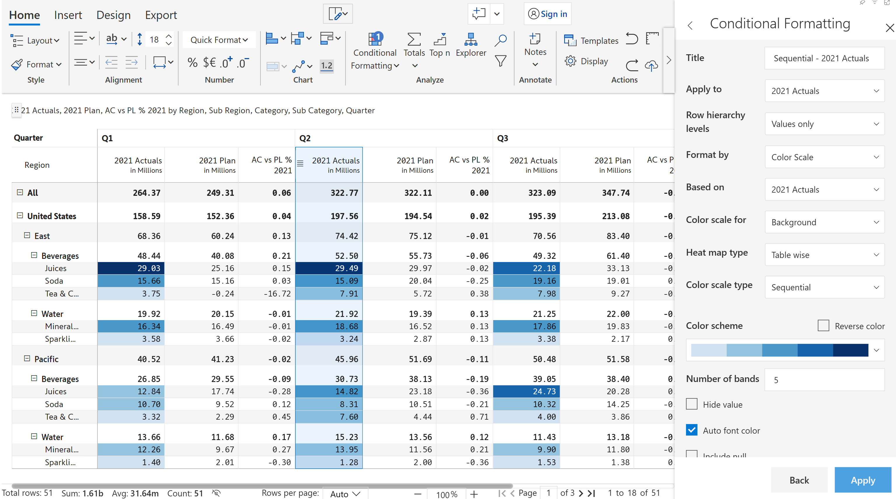

# Color scales

Color scales option makes it very easy to visualize the values in a range of cells by applying a gradient color scale. Color scale can either be applied to the background or font with a single click. Five different formats of color scales are available Sequential, Qualitative, Diverging, Continuous, and Continuous-Diverging.

<figure><figcaption>
Color scale
</figcaption></figure>

Sample image showing the sequential color scale applied for the background. However, you can customize color scales based on different parameters which are explained in detail in [Create Rules](create-rules/) section.&#x20;

<figure><figcaption>
Sequential color scales
</figcaption></figure>
