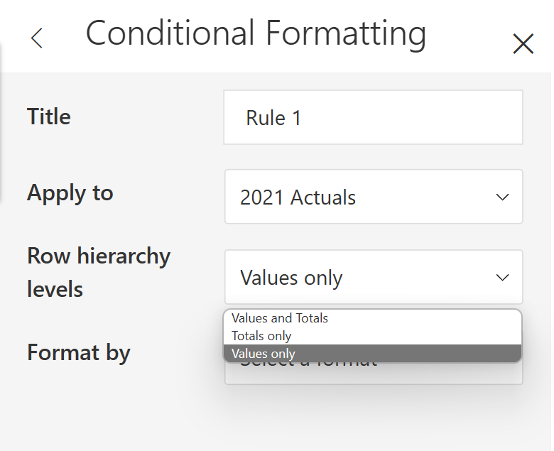
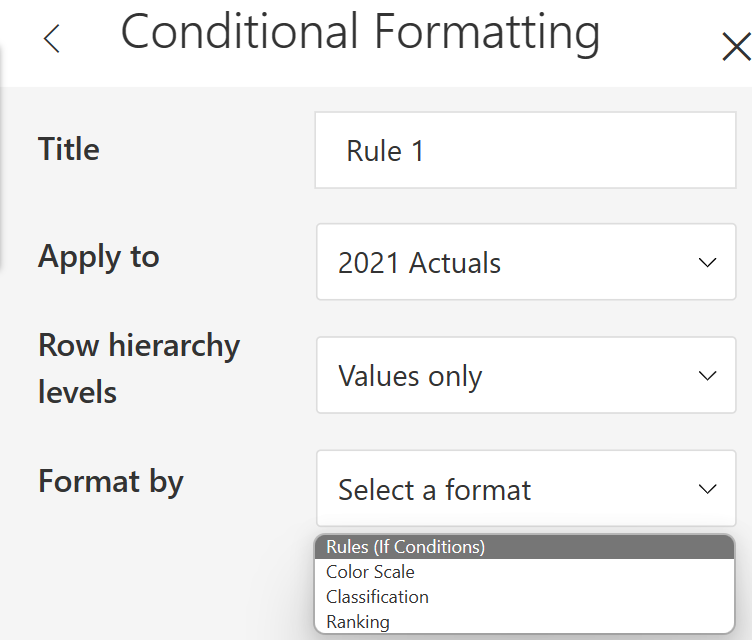

# Create rules

'Create Rules' allows you to build your own formula for a conditional formatting rule and give a power boost to help you do things that built-in rules can’t do.&#x20;

a) To create a new rule, select Home > Conditional Formatting > Create Rule. A conditional formatting window opens as shown in the below image.

<figure><figcaption>
Create rule
</figcaption></figure>

b) Input the Title name for the rule.

c) Choose the measure from the list to apply the rule. You can also apply a rule to the row headers, rows, column headers, or columns/measures in the report.

<figure><figcaption>
Choose measure to apply rule
</figcaption></figure>

d) Select 'Row hierarchy levels' as 'Values and Totals', 'Totals only' or 'Values only'. By default, 'Values only' will be selected.

<figure><figcaption>
Row hierarchy levels
</figcaption></figure>

e) ‘Format by’ specifies the type of conditional formatting that can be applied. It includes the following options:

1. [Rules (If Conditions)](rules-if-conditions.md)
2. [Color Scale](color-scales.md)
3. [Classification](classification.md)
4. [Ranking](ranking.md)

<figure><figcaption>
Format by
</figcaption></figure>
