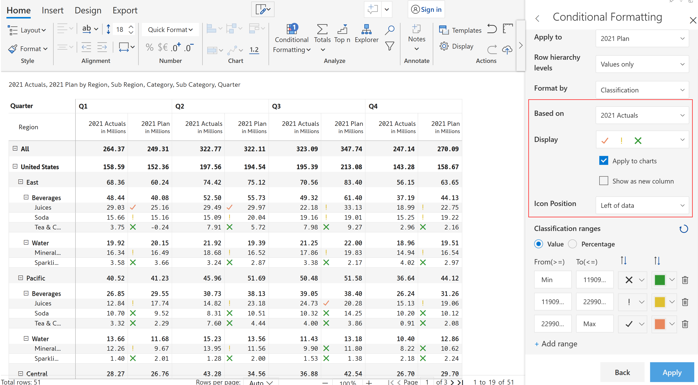
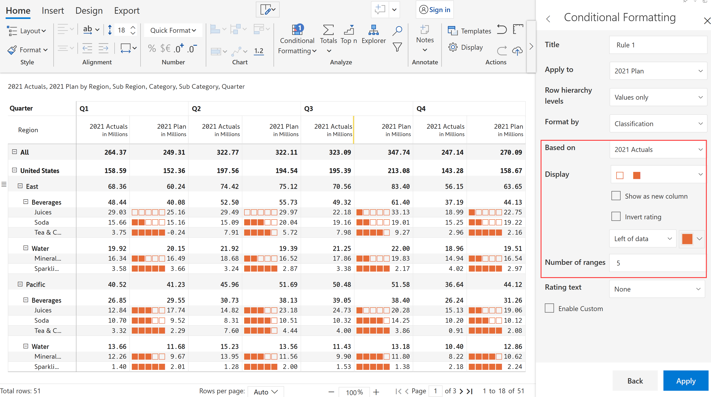
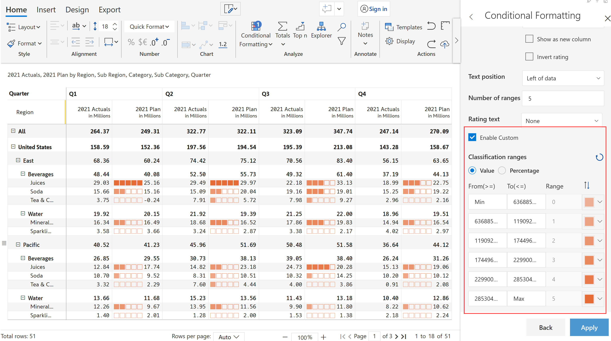

# Classification

Inforiver provides data classification based on ABC analysis, icon-based formatting and rating.

a) Choose the 'Format by option' as 'Classification'.

b) Conditional formatting can be applied to a particular measure, 'Based on' the same measure or different measures.

c) You can apply conditional formatting based on text, icon set or rating.

.png>)

d) You can also have classifications appear along with the charts or in a separate column if required.

e) Classification text/icon position can be set as per the requirement - to the left, right or only text/icon.

f) Percentage text gets enabled only for the display text option, it is used for displaying the percentage.

### 1. ABC classification

Conditional formatting 'A B C' classification has been applied to 2021 Actuals, based on measure '2021 Plan'.

<figure><figcaption>
ABC classification
</figcaption></figure>


You can use Add range option for adding new range&#x20;


### 2. Icon-based classification

Conditional formatting 'Icon set' classification has been applied to 2021 Plan, based on '2021 Actual' measure.

<figure><figcaption>
Icon based classification
</figcaption></figure>

The classification ranges can be chosen as either Value or Percentage. In the below example, Value is chosen as the Classification range.

<figure><figcaption>
Value Classification
</figcaption></figure>

Sample image illustrating Percentage Classification

<figure><figcaption>
Percentage Classification
</figcaption></figure>

### 3. Rating

Conditional formatting 'Rating' scale has been applied to 2021 Plan, based on '2021 Actual' measure. You can customize the number of icons that appear in your scale, this has been set to 5 as default. You can also use star-based ratings.

<figure><figcaption>
Rating
</figcaption></figure>

Rating text option highlights the visual along with the rating number.&#x20;

<figure><figcaption>
Rating text classification
</figcaption></figure>

When custom ranges are enabled, you can configure value ranges for each of the symbol configuration from min to max range.

<figure><figcaption>
Custom rating
</figcaption></figure>


You can also reverse the rating order by selecting Invert rating option.

Reset option allows you to reset the range values to default.

