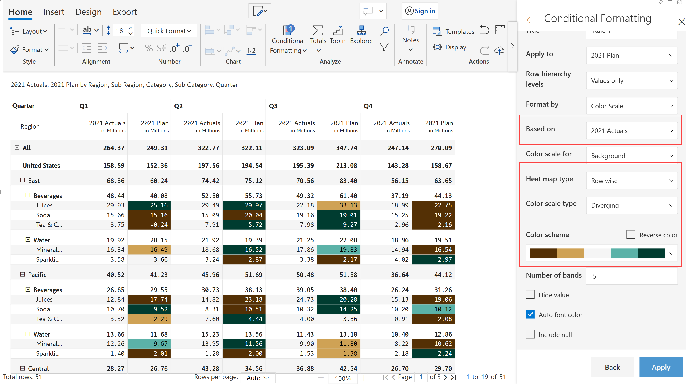

# Color scales

Color scales are used to deliver heatmaps where the values are encoded in colors to highlight important information.&#x20;

a) Choose the 'Format by option' as 'Color Scale'.

b) Conditional formatting can be applied to a particular measure, 'Based on' the same measure or different measures.

c) Select the 'Color scale for' value whether to be applied to the background, font or data bars.

d) Select the 'Heat map type' as Row/Column/Table wise.

<figure><figcaption>
Color scale
</figcaption></figure>

e) Select the 'Color scale type' from the drop-down as shown in the below image.

.png>)

f) 'Reverse color' option allows you to change the order from light to dark or dark to light based on values.

g) 'Number of Bands' represents the number of color bands ranging from 1 to 20.

h) 'Hide value' checkbox allows you to hide the values in the visual.

i) 'Auto font color' automatically adjusts the font color based on the background so that the values are visible.

h) If there is any null value in the data set, enabling the 'Include null' option, will consider the null values and conditional formatting gets applied. &#x20;

.png>)

#### Examples

1. Conditional formatting 'sequential color scale' has been applied to 2021 Actuals and 'column-wise' heat map option has been chosen.

<figure><figcaption>
Sequential color scale
</figcaption></figure>

2\. Conditional formatting 'diverging color scale' has been applied to '2021 Plan' based on '2021 Actuals' measure and 'row-wise' heat map option has been chosen.

<figure><figcaption>
Diverging color scale
</figcaption></figure>

3\. Custom color scale type allows you to specify the custom range. Custom color ranges can be added based on value or percentage. Conditional formatting 'custom color scale' has been applied to '2021 Actuals' based on '2021 Plan' measure and 'table-wise' heat map option has been chosen.&#x20;

<figure><figcaption>
Custom color scale 
</figcaption></figure>


Reset option allows you to reset the range values to default.


There are various color scale types available that can be selected based on the requirement.
