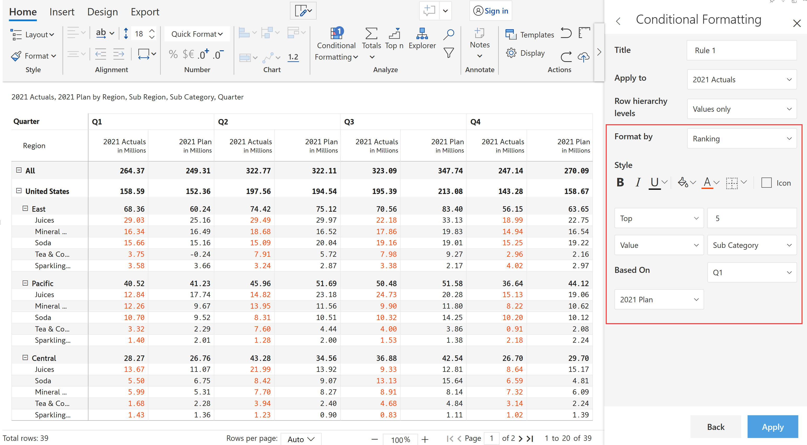

# Ranking

Ranking highlights the visual based on Top/bottom N ranking.

a) Choose the 'Format by' option as Ranking.

b) Style can be used to format the text, and background or to add icons.&#x20;

c) Select the ranking format whether to be Top, Bottom or Both and provide the number of values to be ranked.

d) Select whether it is value or percentage ranking and based on what value ranking to be done.

Conditional formatting 'ranking' of top 5 values has been applied to 2021 Actuals.

<figure><figcaption>
Ranking
</figcaption></figure>

Conditional formatting 'ranking' of top 2 values with icons has been applied to 2021 Actuals.

<figure><figcaption>
Ranking with icon
</figcaption></figure>
