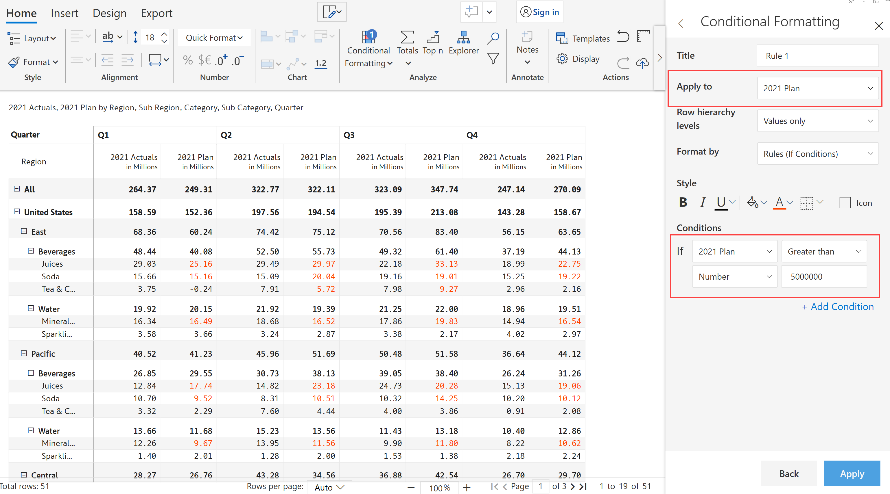
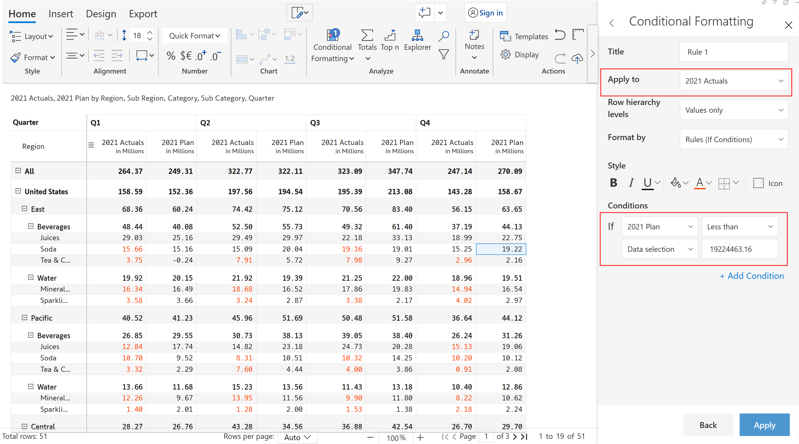
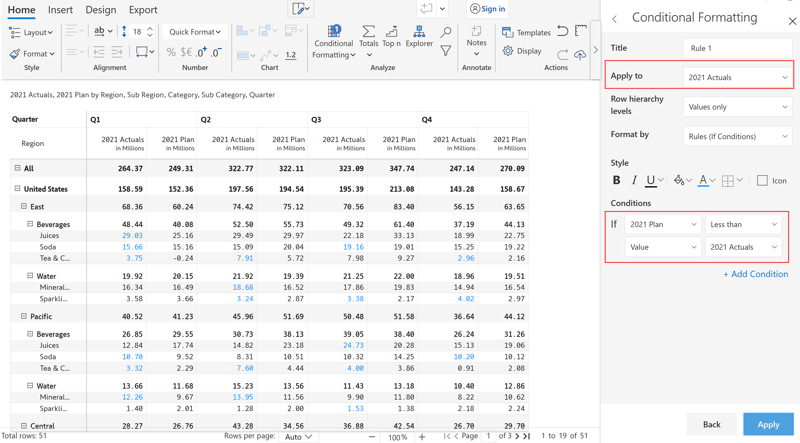
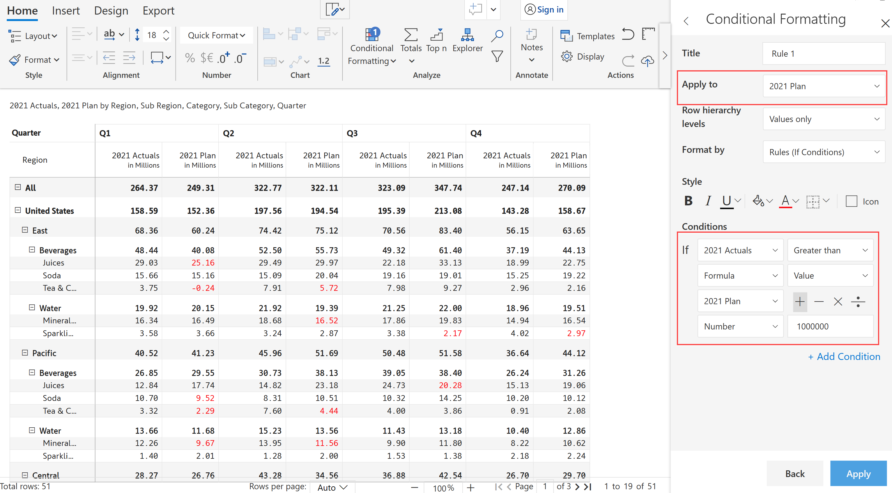
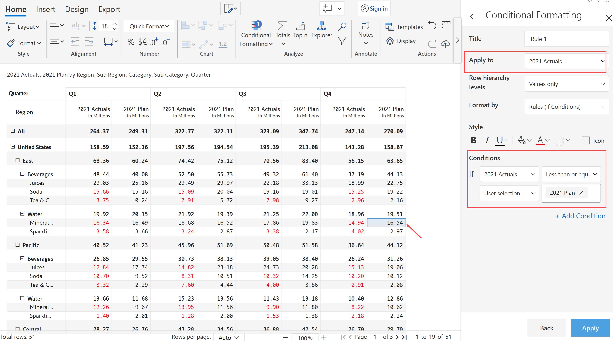
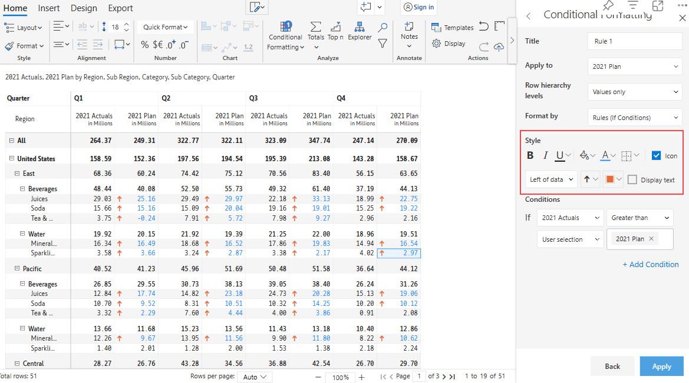

# Rules (If conditions)

IF condition allows you to run a logical test that returns a TRUE **** or False value based on the expression and conditional formatting helps us apply specific formatting to the results.

a) Choose the 'Format by option' as 'Rules (If conditions)'.

b) Style can be used to format the text, background or to add icons.&#x20;

c) Under the Conditions section, you can apply If conditions with respect to Number, Data selection, Values, Formula and User Selection.

<figure><figcaption>
Format by rules
</figcaption></figure>

### 1. Number

Let us highlight 2021 Plan when the value is greater than 5 million.

<figure><figcaption>
If condition with respect to number
</figcaption></figure>

### 2. Data selection

Let us highlight 2021 Actuals when the value is less than the data selected in the visual.

<figure><figcaption>
If condition with respect to data selection
</figcaption></figure>

### 3. Value

Let us highlight 2021 Actuals when the value '2021 Plan' is less than the value of '2021 Actuals'.

<figure><figcaption>
If condition with respect to value
</figcaption></figure>

### 4. Formula

Let us highlight 2021 Plan with respect to Formula 'If 2021 Actual values greater than values of (2021 Plan + 1000000)

<figure><figcaption>
If condition with respect to formula
</figcaption></figure>

### 5.  User selection

Let us highlight 2021 Actuals when the value is less than or equal to the user-selected value in the visual.

<figure><figcaption>
If condition with respect to user selection
</figcaption></figure>

Icons can also be used to emphasize the values in the visual. Select the Icon checkbox and the fields highlighted in the image get enabled where you can set the icon preferences as required.&#x20;

.png>)

You can select the position and color of the icon. Various icons are available, you can select from the drop-down or there is also an option to upload icons.&#x20;

<figure><figcaption>
Format by icon
</figcaption></figure>

Customized text can also be displayed as an icon by selecting the Display text checkbox. Once the checkbox is selected, the text box appears where you can type the text as required.

<figure><figcaption>
Format by text
</figcaption></figure>

### Nested conditions

You can create more than a rule using nested AND/ OR conditions.&#x20;

a) Create a rule. Click on Add condition to add another rule.

b) Select ADD/OR condition as required.

c) Click Apply.

d) The added condition can be easily deleted using the corresponding delete button.

<figure><figcaption>
Nested condition
</figcaption></figure>
