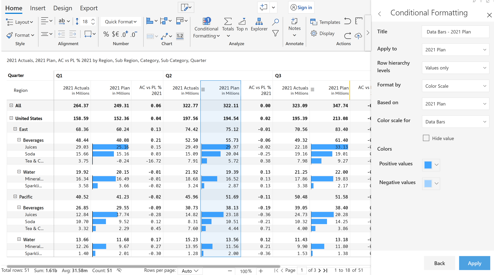

# Data bars

Data bars is a single-click conditional formatting option that allows you to insert a data bar for highlighting the cell value in a visual based on some conditions.&#x20;

<figure><figcaption>
Data bars
</figcaption></figure>

Sample image showing the data bars in the visual. However, you can customize the data bars based on different parameters which are explained in detail in [Create Rules](create-rules/) section.&#x20;

<figure><figcaption>
Blue data bars
</figcaption></figure>
