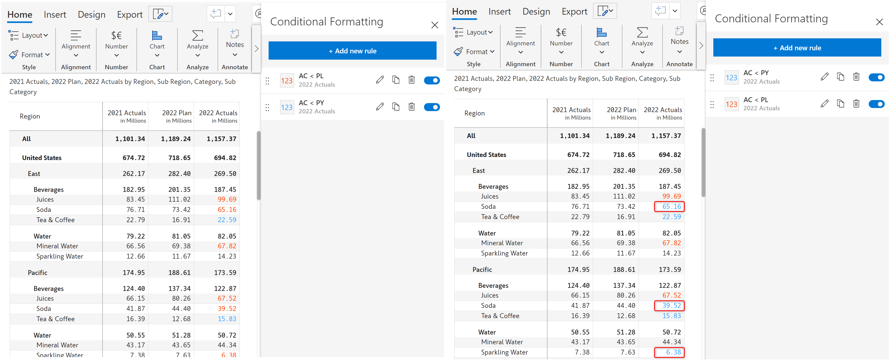

# Manage rules

With Manage rules, you have an effortless way to check and manage all the conditional formatting rules. In this section, you can also create, edit and delete the user-defined rules.

<figure><figcaption>
Manage rule
</figcaption></figure>

a) Edit the existing rules using the Pencil icon.

b) You can use the duplicate icon, to create a copy of the existing rules and thus you can edit it as required.

c) Delete the rules using the corresponding delete icon.

d) Using the on/off toggle, you can enable/disable the rules.

e) You can reorder and prioritize the rules to be applied using the gripper.

For example, as shown in the below image, if AC < PY rule is executed first, you can see the values matching the condition change to blue while if AC < PL condition is executed, the values matching the condition change to red. Similarly, we can prioritize conditional formatting rules using the gripper.

<figure><figcaption>
Reorder/Prioritize CF Rule
</figcaption></figure>


You cannot duplicate conditional formatting types such as quick rules, heat maps, and classifications.

