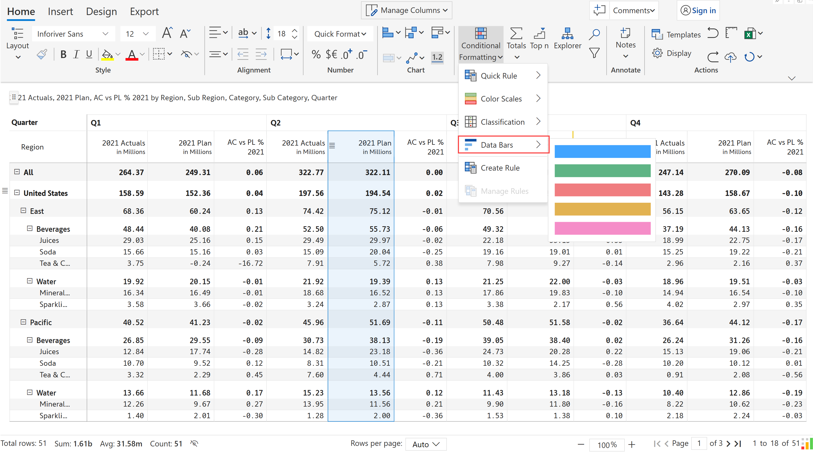
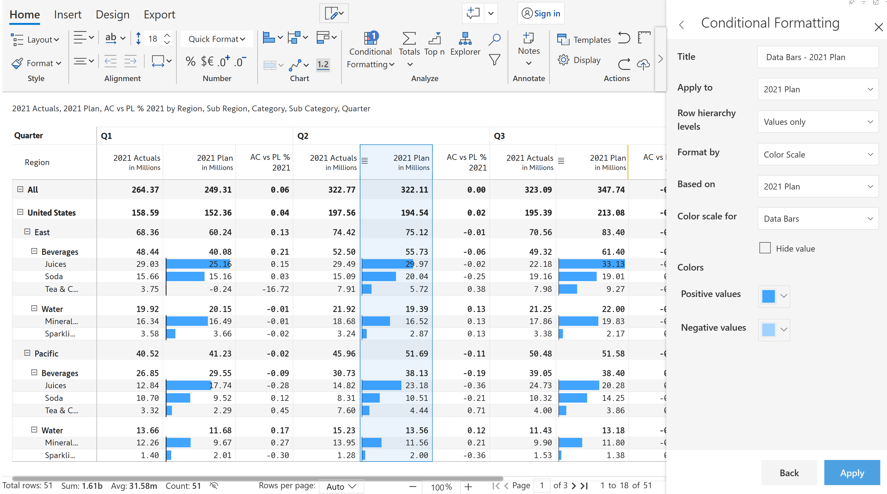

# One-click options

With Inforiver, you can perform various conditional formatting actions in a single click. Options include semantic formatting, color scales, segmentation, icons, ratings, data bars and many more.

A big benefit of the one-click setting is that you do not need to create rules from scratch. After you create a quick rule, you will have the option to customize it in a detailed manner if your report requires it.

### 1. Quick rule

Quick rule allows you to highlight the positive and negative values in the visual in a single click. Under 'Quick rule', there are two options - 'Positive' and 'Negative'.

<figure><figcaption>
Quick rule
</figcaption></figure>


The one-click conditional formatting options are enabled only if a cell/column is selected.


a) Select a column. You can highlight values greater than or equal to zero in green by clicking on the 'Positive' option. &#x20;

<figure><figcaption>
Highlight positive values
</figcaption></figure>

b) Similarly, you can highlight values lesser than or equal to zero in red by clicking on the 'Negative' option.&#x20;

<figure><figcaption>
Highlight negative values
</figcaption></figure>

### 2. Color scales

A wide variety of color scales such as sequential, qualitative, diverging, continuous and continuous-diverging can be applied in a single click. Choose any column or cell and click on Conditional Formatting -> Color scales.&#x20;

<figure><figcaption>
Color scales
</figcaption></figure>

Choose any of the color scales shown. A sample heatmap using the sequential color scale is shown below. Notice that the font colors are automatically adjusted to be in contrast with their backgrounds for enhanced readability.

<figure><figcaption>
Sequential color scale
</figcaption></figure>

### 3. Classification

You can apply conditional formatting based on icons/ratings and even deliver ABC segmentations in a single click. As you click on 'Classification', you can see the following options.&#x20;

<figure><figcaption>
Classification
</figcaption></figure>

Let's look at an example for the three categories - Text, Icon set and Rating.

a) **Text**: Text-based classification is commonly used to categorize performance. A sample report with ABC classification is shown in the below image.

<figure><figcaption>
ABC classification
</figcaption></figure>

b) **Icons**: You can deliver conditional formatting using icons in a few clicks. Here is an example where items that contribute the most to sales are highlighted.

<figure><figcaption>
Icon-based conditional formatting
</figcaption></figure>

c) **Ratings**: You can use ratings such as the star-based ratings commonly seen in e-commerce sites in the product feedback section.&#x20;

<figure><figcaption>
Star-based ratings
</figcaption></figure>

### 4. Data bars

Data bars can be used to insert colored bars inside a cell to show how a given cell value compares to others. On clicking 'Data bars', you can see the following options. Select any of the options.

<figure><figcaption>
Data bars
</figcaption></figure>

Data bar gets added as shown in the image making it easy to spot the highest and lowest values at a glance.

<figure><figcaption>
Data bars
</figcaption></figure>

You can use the side panel to further customize your rules. In the next section, we'll look at the [advanced options](https://app.gitbook.com/o/Bi5mNLq31yHE9Ep9vISb/s/EbkCXCUXmtUq5tcnUtZE/\~/changes/1HoYGlKZdGmcMoD9YKsh/working-with-inforiver/5.-conditional-formatting/advanced-options).
