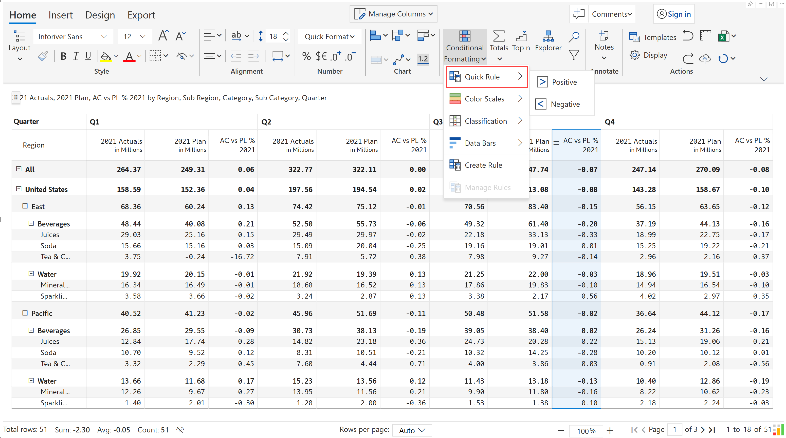

# Quick rule

Quick Rule is a single-click option that allows you to highlight the positive and negative values in the visual.

<figure><figcaption>
Quick rule
</figcaption></figure>

Upon clicking the >positive option, the values greater than or equal to zero, get highlighted in green, and clicking \<negative option, changes the values less than zero, to red as shown in the sample image. However, you can customize the quick rule based on different parameters which are explained in detail in [Create Rules ](create-rules/)section.

<figure><figcaption>
Conditional formatting based on quick rules
</figcaption></figure>
