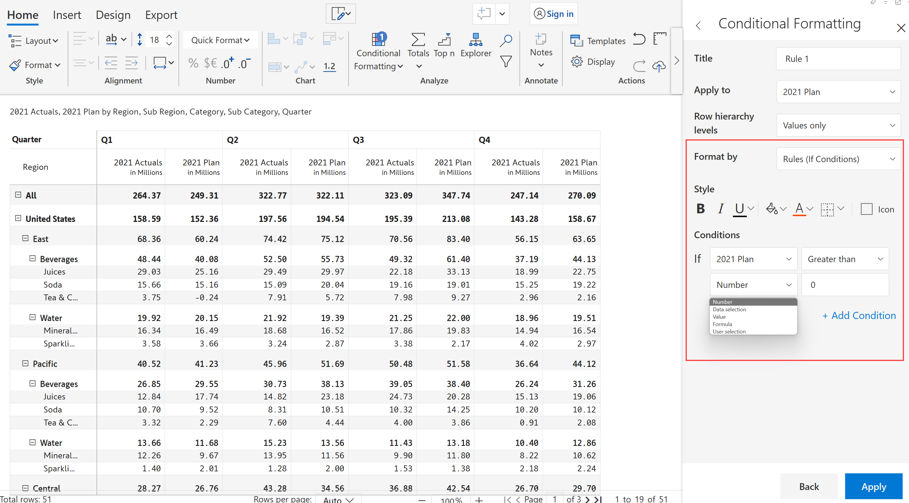
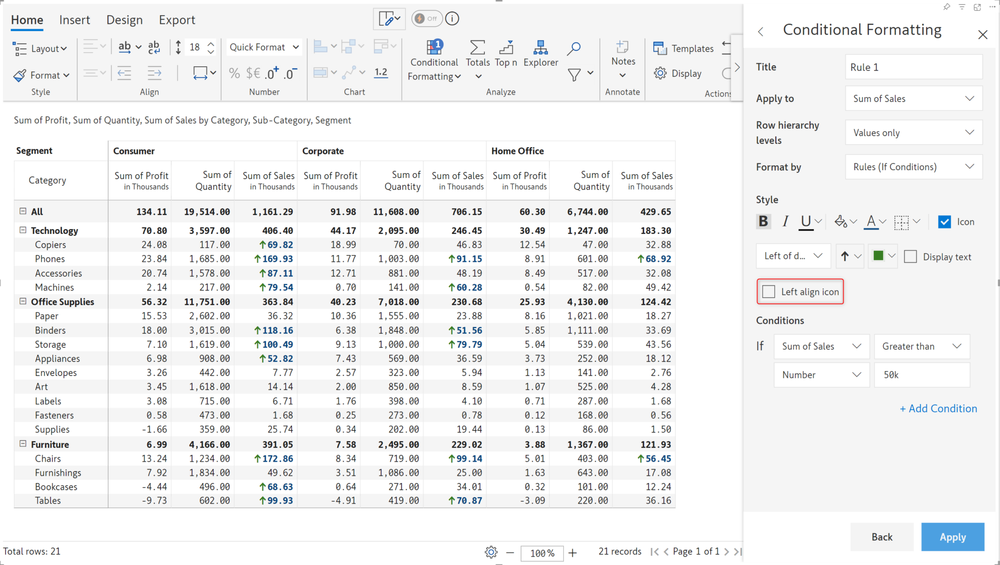

# Rules (If conditions)

You can apply conditional formatting using font color, style, icons, or background based on one or more IF conditions.

Refer to the [Create Rule](create-rule-basic-settings.md) section to get started. Once the rule is created and you can see the Conditional Formatting side panel, follow the below steps.

**STEP 1:** Choose 'Rules (If conditions)' in the **Format by** dropdown. You can see two sections - Style and Conditions.

<figure><figcaption>
Choosing Rules (If conditions)
</figcaption></figure>

**STEP 2:** Using the **Style** section, you can format text based on color/style, apply a background color, or select icons.&#x20;

**STEP 3:** In the 'Conditions' section, you can define conditions using options such as Number, Data selection, Values, Formula, and User Selection.

<figure><figcaption>
Format by rules
</figcaption></figure>

**STEP 4:** When you have inline charts in your reports, conditional formatting rules can be applied to the chart labels or the chart itself. Select the desired option(s) from the **Impact on** lis&#x74;**.** Notice how the bars for subcategories with sales > 20k are highlighted in blue.

<figure><figcaption>
Impact on
</figcaption></figure>

Let's look at examples for each of these options.

## Style

* **Font style: bold, italic, underline**

Set the font style based on conditional formatting rules. Notice how we've applied Bold, Italics, and Underlined the values that satisfy the condition. Click on the icon to apply a color for the underline.

<figure><figcaption>
Font style
</figcaption></figure>

* **Cell background**

Highlight the cells that match a conditional formatting rule by applying a background color.

<figure><figcaption>
Cell background
</figcaption></figure>

* **Font color**

Apply a custom font color when a conditional formatting rule is met.

<figure><figcaption>
Font color
</figcaption></figure>

* **Cell borders**

Highlight cells that satisfy the conditional formatting rule by setting a custom border. You can choose the border color by clicking the icon.

<figure><figcaption>
Applying borders
</figcaption></figure>

* **Adding icons or text**

Display icons to apply conditional formatting on your data. You can also use custom icons by clicking the Upload Icon link.

<figure><figcaption>
Applying icons
</figcaption></figure>

You can position the text/icons with respect to the cell values. You can also choose to display only the icons or text and hide the cell values.

<figure><figcaption>
Using icons and text
</figcaption></figure>

When you use icons, you have an additional option to align your icons in the grid. By default, the icons are left aligned.

<figure><figcaption>
Aligning icons
</figcaption></figure> <figure><figcaption>
Left-align option disabled
</figcaption></figure>

* **Hiding values**

Business reporting may require withholding certain information to protect strategic interests. You can use conditional formatting rules to mask values based on specific criteria.

<figure><figcaption>
Hiding values
</figcaption></figure>

* **Hatched fill pattern**

Highlight your data with hatched cell backgrounds – this feature allows you to spotlight your data with hatched styling.

<figure><figcaption>
Hatched CF
</figcaption></figure>

## Conditions

### 1. Number

In this example, we are highlighting the subcategories where 2021 Actuals are greater than 10 million. Note that we have selected 'Bold' and selected 'Green' as the font color. The numbers field supports scaled entries such as 10m. Click 'Apply' once the changes are done.

<figure><figcaption>
Conditional formatting based on a numeric input
</figcaption></figure>

### 2. Data selection

You can also use a cell value in the condition.&#x20;

2.1. Select 'Data selection', click on the 'Set value' field and select a cell in the report.

<figure><figcaption>
Applying background color to values and totals
</figcaption></figure>

Note:&#x20;

* In this example, we have used 'Values and Totals' as the 'Row hierarchy levels'. You can see a new field where you can choose whether conditional formatting needs to be applied to the row grand total or not.&#x20;
* We are also using a background color for the formatting.

2.2. Click on the 'select value from' field and click on a cell in the report. The value gets populated automatically. Click 'Apply'.

<figure><figcaption>
Selecting data from the report 
</figcaption></figure>

2.3. The formatting is applied to all the hierarchy levels where 2021 Actuals are greater than the selected value.

<figure><figcaption>
Conditional formatting based on data selection
</figcaption></figure>

### 3. Value

You can apply conditional formatting based on another measure in the visual. Let's highlight 2021 Actuals when it is greater than the 2021 Plan.


Measures that were added from the data source, auto-calculated variances, columns/measures created using calculations, data input and simulations can all be used in the IF condition.


3.1. Click on the highlighted dropdown and select 2021 Plan. Click 'Apply'.

<figure><figcaption>
Conditional formatting based on another measure 
</figcaption></figure>

3.2. Note that conditional formatting is applied only to the totals - Categories, Regions, and Subregions since we have chosen 'Row hierarchy levels' as 'Totals' and included 'Row grand total'.

<figure><figcaption>
Conditional formatting when 2021 Actuals > 2021 Plan
</figcaption></figure>

### 4. Formula

You can create simple formulas using either numeric values or measures. Let's highlight the records where 2021 Actuals are greater than the 2021 Plan by at least 5m. Configure as shown in the below image and click 'Apply'.  &#x20;

<figure><figcaption>
Conditional formatting based on formula
</figcaption></figure>

Tea & coffee in the East subregion is the only record that matches the given condition.

<figure><figcaption>
Conditional formatting based on formula
</figcaption></figure>

The '**Add condition**' option lets you create nested AND/OR conditions.&#x20;

Let's consider another example where the conditions are Q4 2021 Actuals greater than 10m, the Category is Beverages and the Sub-regions are Pacific and East.

**STEP 1:** Configure the settings as shown below for the first condition. Click on 'Add condition'.

<figure><figcaption>
Nested conditions
</figcaption></figure>

**STEP 2:** You can see another condition with default selections and an option to select AND/OR. Let's select 'AND' and 'Category' from the highlighted dropdown.

<figure><figcaption>
Adding an AND condition
</figcaption></figure>

**STEP 3:** You can see several options as shown in the below image. Let's go with the default option.

<figure><figcaption>
Options for category
</figcaption></figure>

**STEP 4:** In the 'Choose members' dropdown, select 'Beverages'.

<figure><figcaption>
Selecting a category
</figcaption></figure>

**STEP 5:** Let's now add the third condition. Click on 'Add condition'. In the highlighted dropdown (2021 Plan), select 'Sub Region'.

<figure><figcaption>
Adding a third condition
</figcaption></figure>

**STEP 6:** Select Pacific and East in the dropdown as shown below. Click 'Apply'.

<figure><figcaption>
Selecting multiple regions
</figcaption></figure>

**STEP 7:** You can see that the rows for Juices and Soda for East and Pacific are highlighted based on the three conditions.

<figure><figcaption>
Conditional formatting based on nested conditions
</figcaption></figure>

### 5. User selection

You can apply conditional formatting based on a selection during runtime ie. in the reading view. Let's consider a case where we want conditional formatting to be applied to 2021 Actuals based on a Variance value selected during runtime.

**STEP 1:** Configure as shown in the below image. Note that 2021 Actuals is set in the 'Apply to' field and 'Variance' in the IF condition. Click on the dropdown and select 'Variance'.&#x20;

<figure><figcaption>
Conditional formatting based on user selection
</figcaption></figure>

**STEP 2:** Let's also add an icon. Click on the 'Icon' checkbox. There are several customization options.

<figure><figcaption>
Adding an icon
</figcaption></figure>

**STEP 3:** Click on the icon dropdown and choose the flag icon.

<figure><figcaption>
Customizing the icon
</figcaption></figure>

**STEP 4:** Change the flag color to green and the font color to black. Click 'Apply'.

<figure><figcaption>
Customizing the icon color
</figcaption></figure>

**STEP 5:** Click on a value in any of the variance columns. You can see flag icons in the 2021 Actuals column where the variance is greater than the selected variance.

<figure><figcaption>
Conditional formatting based on user selection
</figcaption></figure>

### 6. Dates

With Inforiver, you can compare date dimensions in rows and columns and automatically format cells based on the comparison. Let's add date dimensions in the row and column parameters. To compare two date dimensions, select the **Compare Date** option. In the example below, we used conditional formatting to highlight the cells where the order date exceeds the ship date.

<figure><figcaption>
Compare date dimensions
</figcaption></figure>

In the example above, we compared each ship date against each order date and highlighted the cells with the order date greater than the ship date. Instead of comparing each cell, you can also compare a date dimension with the minimum or maximum value of another date dimension. To demonstrate this, let's highlight the cells with the order date greater than the minimum ship date.

<figure><figcaption>
Highlight cells with order date greater than minimum of ship date
</figcaption></figure>

You can compare date dimensions against static dates using the Selected Date option and specify the date to be compared against.

<figure><figcaption>
Compare against static dates
</figcaption></figure>

### 7. Conditional formatting for data input fields

Highlight your data input fields like number, dropdown, and person columns with conditional formatting. When users enter values, you can specify rules to automatically apply formatting when the rules are satisfied e.g. spotlight the cells when the budget entered exceeds a certain limit.

<figure><figcaption>
Conditional formatting for data input fields
</figcaption></figure>

### 8. Rules for non-numeric measures

You can apply conditional formatting to non-numeric measures using conditions like **is blank/is not blank/contains/does not contain,** etc. In this example, we've set a hatched background for the cells with blank customer names.

<figure><figcaption></figcaption></figure>

In the next section, we'll be covering [Color scale](color-scale.md).
