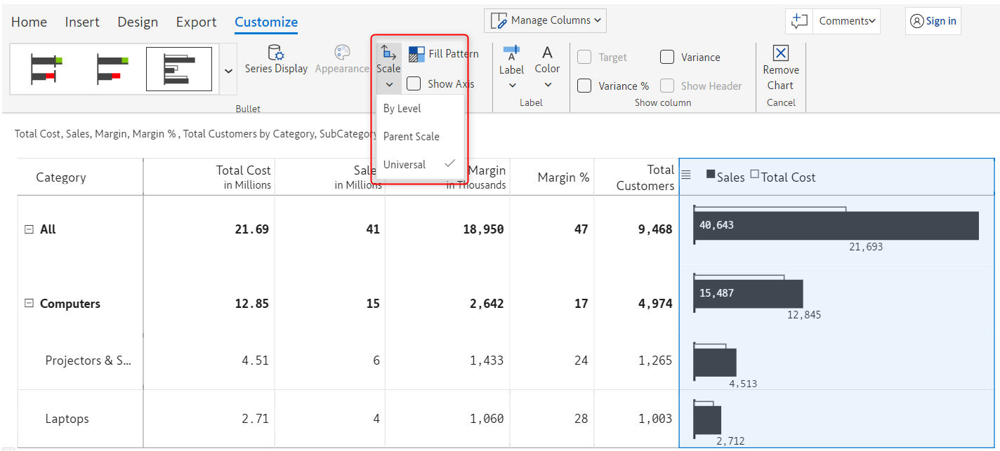
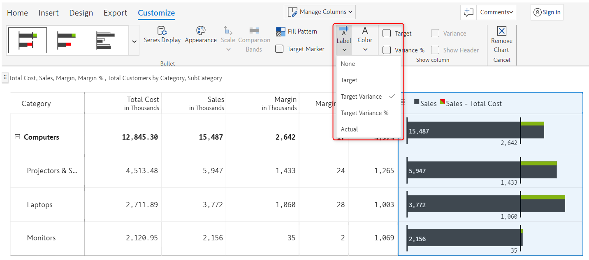
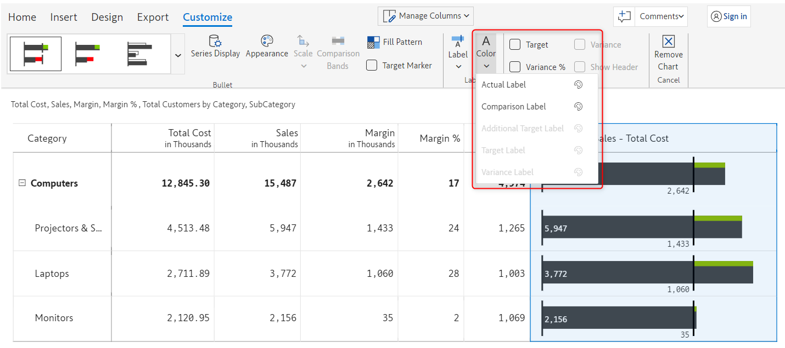
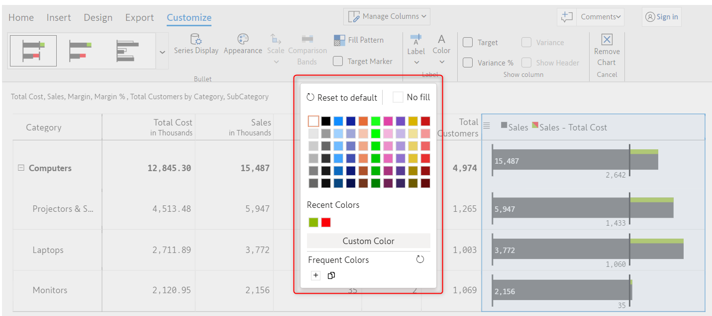
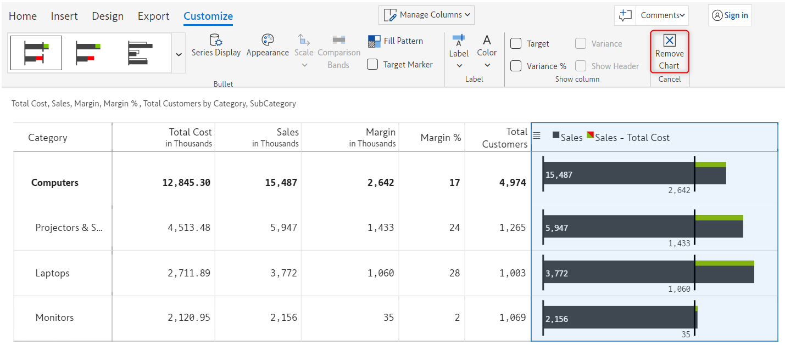

# 6. Working with charts

With Inforiver, you can include a wide variety of charts and visualizations in your matrix reports in a single click. For a quick look at all the charts and visualizations available in Inforiver, refer to [basic inline charts](2.-displaying-information/add-basic-inline-charts.md).

A detailed explanation of every chart type along with their corresponding customization options has been elaborated in the upcoming sections.&#x20;

Apart from the customization options that are available for specific chart types and variations, there are certain customization options that are common for all chart types.

## 1. Overview

* **Sparklines** - Incorporate [sparklines](6.-working-with-charts/sparkline-charts.md), spark columns, and their variants such as the win-loss trend to capture performance over time
* **Bullet charts & clustered bars** - Utilize different types of [bullet charts](6.-working-with-charts/bullet-charts-and-clustered-bar-charts.md#i-2-value-bullet-charts), including the normalized bullet visualization (proposed by International Business Communication Standards) and [clustered bars](6.-working-with-charts/bullet-charts-and-clustered-bar-charts.md#iii-clustered-bars) for tracking performance
* **Stacked charts** - Highlight distribution across categories using [stacked charts](6.-working-with-charts/stacked-charts.md)&#x20;
* **Waterfall charts** - Visualize the breakdown of the total change in a value, such as a financial metric like net income or cash flow using [waterfall charts](6.-working-with-charts/waterfall-charts.md)
* **Bar & pin charts** - Deliver [bar](6.-working-with-charts/bar-and-pin-charts.md#i-bar-charts) and [lollipop/pin](6.-working-with-charts/bar-and-pin-charts.md#ii-pin-charts) charts for highlighting the magnitude and significance and also to compare multiple measures and visualize absolute and relative variances&#x20;
* **Changes/deviation** charts - Track changes over time or with respect to benchmark by using [dot plot, arrow plot, dumbbell plot & range plots](6.-working-with-charts/change-deviation-charts.md)

## 2. Basic customizations

Here we have listed down the common customization options and their functionalities.

### i) Scale&#x20;

Using this option you can configure the scaling of the data label. The available scaling options are

* **Universal** - This is the default option and it indicates the contribution of the value to the grand total.
* **By level** - Whereas 'By level' indicates the contribution of the value to its parent level or category.
* **Parent scale** -&#x20;

<figure><figcaption>
Scaling option
</figcaption></figure>

### ii) Label

This option lets you display data labels for all measures, specific measures, or none.

<figure><figcaption>
Label option
</figcaption></figure>

### iii) Color

This option lets you change the color of the data label of individual measures.

<figure><figcaption>
Color option
</figcaption></figure>

Clicking on the 'Color palette' icon to the right of a measure name will open up a 'Color picker' modal in which you can select the color of the data label of chosen measure.

<figure><figcaption>
Color picker
</figcaption></figure>

### iv) Remove chart

Clicking on this option will remove the inserted chart from the report.

<figure><figcaption>
Remove chart option
</figcaption></figure>

Navigate to the next section to learn more about [sparkline charts.](https://inforiver.gitbook.io/inforiver/working-with-inforiver/6.-working-with-charts/sparkline-charts)\
