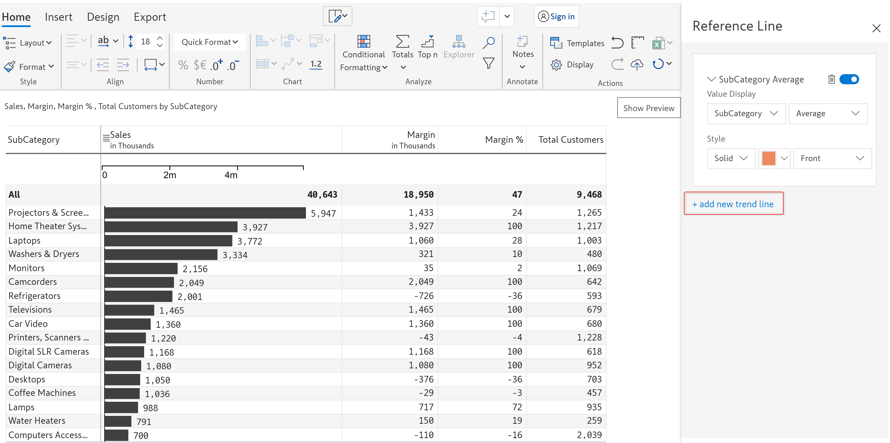

# Bar and pin charts

Bar charts and pin charts are commonly used to display and compare data.

Bar charts are used to show the distribution of data within a set of categories or groups. Pin charts, also known as lollipop charts, are a variation of bar charts where a dot represents the data point and a segment connects it to the X-axis. It is often used to visualize data where the length of the bar is not as important as the value itself.&#x20;

## 1. Adding the chart

### i) Bar charts

Inforiver offers three variants of bar charts: _Solid bar, Colored bar,_ and _Invert-color bar._

In this example, we will visualize the magnitude of sales of the categories using a bar chart.

a) We have added 'Sub Category' in the 'Rows' field, and 'Sales', 'Margin', 'Margin %', and 'Total Customers' in the 'Values (AC)' field in the visualization pane.

<figure><figcaption>
Data mapping
</figcaption></figure>

b) Select the column for which you want to insert the bar chart. In the following image, the sales column has been selected.

The bar chart option gets enabled. From the 'Bar chart' drop-down, select the 'Solid bar chart'. i

<figure><figcaption>
Column and chart type selection
</figcaption></figure>

c) The solid bar chart gets inserted as shown below. You can see the 'Customize' tab in the toolbar and the following [customization options](bar-and-pin-charts.md#2.-customization-options).

<figure><figcaption>
Inserting a bar chart
</figcaption></figure>

### ii) Pin charts

Inforiver offers three variants of pin charts: _Simple, Bar colored_, and _Marker colored_.

In this example, we will visualize the 'Margin%' using a pin chart.

a) We have added 'Sub Category' in the 'Rows' field, and 'Sales', 'Margin', 'Margin %', and 'Total Customers' in the 'Values (AC)' field in the visualization pane.

<figure><figcaption>
Data mapping
</figcaption></figure>

b) Select the column for which you want to insert the pin chart. In the following image, the margin % column has been selected.

The pin chart option gets enabled. From the 'Pin chart' drop-down, select the 'Simple pin chart'.&#x20;

<figure><figcaption>
Column and chart type selection
</figcaption></figure>

c) The simple pin chart gets inserted as shown below. You can see the 'Customize' tab in the toolbar and the following [customization options](bar-and-pin-charts.md#2.-customization-options).

<figure><figcaption>
Inserting a simple pin chart
</figcaption></figure>

## 2. Customization options

Inserting a bar chart or a pin chart will open up the following configuration options.

### **i) Chart type**&#x20;

Here you can change your current chart type.

<figure><figcaption>
Bar chart type options
</figcaption></figure>

### **ii) Axis config**&#x20;

This option lets you configure the axis for the chart. Clicking on the 'Axis Config' option will open up the 'Axis modal' in which you can configure the following properties:

* **Axis direction** - From this drop-down, you can set the direction of the axis to either 'Left to Right' or 'Right to Left'
* **Scaling** - Using this drop-down you can set the scaling option to 'Universal' or 'By level'
* **Show Y Axis** - Enable this check box if you want to display an axis on the Y Coordinate
* **Show X Axis** - Enable this check box if you want to display an axis on the X coordinate
* **Hide ticks** - With this option, you can either show/hide tick intervals

<figure><figcaption>
 Axis config options
</figcaption></figure>

### **iii) Reference line**&#x20;

Reference lines are horizontal or vertical lines that are added to a chart to indicate a specific value or threshold. Using this option, you can add a reference line for values such as average, median or set a custom value.

Clicking on this option will open up a 'Reference line' modal to the right of the report.&#x20;

<figure><figcaption>
Reference line options
</figcaption></figure>

Click on the 'Add New Line' button in the modal. This will open up a toolbar as shown below.

<figure><figcaption>
Reference line toolbar
</figcaption></figure>

You can customize the following options in the reference line modal:

**a) Value display -** This option has two drop-downs.&#x20;

From the first drop-down, you can select the data metric for which you want to display the reference line.&#x20;

And the second drop-down lets you select the value at which the reference line needs to be inserted. You can select from the following values:

1. **Average -** Inserts a reference line at the average value of the data metric
2. **Median -**  Inserts a reference line for the median value of the data metric
3. **Standard deviation -** Inserts a reference line for the standard deviation of the data metric
4. **Mid value -** Inserts a reference line at the mid value of the data metric
5. **Constant -** If you select this option, an additional 'Static value' field becomes available. Using this option, you can set the static/constant value at which you want to insert the reference line.

<figure><figcaption>
Reference line constant option
</figcaption></figure>

**b) Style -** This option has three drop-downs.&#x20;

From the first drop-down, you can choose the style of the reference line. You can choose from any of the following options: _Dotted, Dashed, Solid, Long Dashed,_ or _Double Solid_.&#x20;

From the second drop-down, you can select the color of the reference line.&#x20;

And from the third drop-down, you can choose the position of the reference line. It has the following two options: _Front_ - positions the reference line in front of data values, and _Back_ - positions the reference line to the back of the data values.

<figure><figcaption>
Reference line style options
</figcaption></figure>

After choosing all the customizations, click on 'Apply' to insert a reference line with chosen customization options.

<figure><figcaption>
Reference line apply
</figcaption></figure>

**Add more than one reference line** - To add more than one reference line, you can click on the 'add new trend line' link at the bottom of the toolbar in the reference line modal.

<figure><figcaption>
Add new trend line
</figcaption></figure>

**Delete a reference line** - To delete an existing reference line, click on the trash can/delete icon.

<figure><figcaption>
Delete reference line
</figcaption></figure>

**Disable a reference line** - To disable an existing reference line, click on the toggle switch button.

<figure><figcaption>
Disable a reference line
</figcaption></figure>

### **iv) Reference band**

Reference bands are similar to reference lines, but they are represented as a shaded area between two lines. They are used to indicate a range of values.&#x20;

Clicking on this option will open up a 'Reference Band' modal.

<figure><figcaption>
Reference band options
</figcaption></figure>

From this modal, you can customize the following options

**a) Value Display -** This option has two drop-downs.&#x20;

From the first drop-down, you can select the data metric for which you want to display the reference band.&#x20;

And the second drop-down lets you select the ending value of the reference band. You can select from the following options:

1. **Average -** The average value of the data metric is set as the ending value of the reference band
2. **Median -**  The median value of the data metric is set as the ending value of the reference band
3. **Standard deviation -** The standard deviation of the data metric is set as the ending value of the reference band
4. **Mid value -**&#x54;he mid value of the data metric is set as the ending value of the reference band
5. **Constant -** If you select this option, an additional 'Static Value' field becomes available. Using this option, you can set the static/constant value which is set as the ending value of the reference band.

<figure><figcaption>
Reference band value display
</figcaption></figure>

**b) Start From -** Using this drop-down, you can select the starting value of the reference band. It has the following options:&#x20;

1. **Min** - The minimum value of the data metric becomes the starting value of the reference band
2. **Zero** - Zero becomes the starting value of the reference band

<figure><figcaption>
Reference band start from options
</figcaption></figure>

&#x20;&#x33;**.  Constant** - If you select this option, a new input field becomes available where you can select the constant value which becomes the starting value of the reference band.

<figure><figcaption>
Reference band constant option
</figcaption></figure>

**c) Line Style -** The line style option allows you to set the style and color of the lines that get displayed at the starting and ending value of the reference band.&#x20;

From the first drop-down, you can choose the style of the lines. You can choose from the following options: _Dotted, Dashed, Solid, Long Dashed,_ and _Double Solid_.&#x20;

And, from the second drop-down, you can select the color of the lines.

<figure><figcaption>
Reference band line style options
</figcaption></figure>

**d) Background color** - This color picker lets you choose the color for the shaded area in the reference band.

**Delete reference band** - To delete an inserted reference band, click on the 'Delete' button at the bottom of the 'Reference Band' modal.

<figure><figcaption>
Delete a reference band
</figcaption></figure>

### **v) Comparison band**

The comparison band indicates the state of the measure depending on which band it resides in. They provide a performance rating to the value being measured where each color represents a different state.

<figure><figcaption>
Comparison band options
</figcaption></figure>

You can add comparison bands by clicking on the 'Comparison band&#x73;**'** icon. The following properties are available:

* **Compared series** - This drop-down lets you configure the range of comparison bands as values or percentages.
* **Dynamic** - If you enable this checkbox, then the comparison band range will be added based on individual scaling.

<figure><figcaption>
Dynamic option
</figcaption></figure>

* **Number of bands** - Here you can set the number of bands required.

### **vi) Outliers**

In the case of lollipop/pin charts, you can indicate the outliers that exceed the specified threshold values.&#x20;

You can do this while creating a pin chart, or add them after creating a pin chart through the **Customize** tab.

1. Select the measure and then select the 'Pin Chart' drop-down menu to add any of the pin chart options available. You can also select the measure that already has one.&#x20;

<figure><figcaption>
Click on <strong>Pin Charts</strong> drop-down menu
</figcaption></figure>

2. In the customization menu, click on the **Outliers** option.

<figure><figcaption>
Click <strong>Outliers</strong>
</figcaption></figure>

3. In the Outliers pop-up window, check **Enable Outlier.** If you wish to hide the values, select the option **Disable Label.** Enter the required positive and negative threshold values as shown below and Click **Apply**.

<figure><figcaption>
Custom Outliers
</figcaption></figure>

4. After applying outliers, the report shows below, highlighting the profit values exceeding 15k.

<figure><figcaption>
Outliers
</figcaption></figure>

### **vii) Data label config**&#x20;

This option lets you configure the properties related to the data label. You can configure the following properties:

* **Data label** - This checkbox lets you show/hide data labels. Note that other options become available only if this option is enabled.
* **Bar overlap** - By enabling this option, you can overlap the data labels over the bar. By default, this option is not enabled and the data labels are displayed next to the corresponding bar.
* **Data label flip** - With this option, you can reverse/flip the positions of the data labels. By default, the labels are placed to the right of the bar. By enabling this option you can flip/reverse their position to the left with respect to the bars.

<figure><figcaption>
Data label flip
</figcaption></figure>

* **Show label** - In this drop-down, you can select the format of the data label. You can display the data values as just labels (numbers), as percentages, or as both.
* **Percentage scaling** - This drop-down gets enabled only if you have chosen 'Percentage' or 'Both' as the data format in the show label drop-down. Using this option you can configure the scaling of the percentage data label. The available scaling options are
  1. **Universal -** This is the default option and it indicates the percentage contribution of the value to the grand total.
  2. **By level -** Whereas 'By level' indicates the percentage contribution of the value to its parent level or category.

<figure><figcaption>
Percentage scaling options
</figcaption></figure>

### **viii) Padding**&#x20;

You can configure the inner padding (the space between the bar and the top/bottom border of a cell) with this option. Increasing the padding value will increase the spacing.

<figure><figcaption>
Padding options
</figcaption></figure>

### **ix) Fill pattern**&#x20;

You can customize the fill pattern to any of these IBCS notations: _Solid, Outlined,_ or _Hatched_.

<figure><figcaption>
Fill pattern options
</figcaption></figure>

### x) Appearance

Appearance has two sub-options - Color and Series display.&#x20;

Color is applicable for both the bar and pin charts and lets you define properties such as the bar color, axis color, data label color etc. &#x20;

Series display is only applicable for the pin chart and you can select the marker type and marker size.


Some of these properties/options may or may not be available depending on the inserted chart type and variant.


**A) Colors**

The following options can be accessed by clicking on the 'Colors' option in the case of both bar and pin charts.&#x20;

<figure><figcaption>
Appearance colors option
</figcaption></figure>

**a) Positive color** - Using this option you can customize the positive color of the bar/marker

**b) Negative color** - Using this option you can customize the negative color of the bar/marker

**c) Axis color** - This option lets you set the axis color of the chart

**d) Data label color** - This option lets you set the color of the data labels in the chart

**e) Bar color** - This option is available only for solid bar charts and will let you customize the color of the bar

<figure><figcaption>
Appearance modal
</figcaption></figure>

**f) Gradient** - Enabling this option will allow you to set a gradient color to your bar chart. If you enable this option, the Min and Max color options become available using which you can set the color for the min value and the max value.

<figure><figcaption>
Gradient option
</figcaption></figure>

**B) Series display**

The following options can be accessed by clicking on the 'Series display' option in the case of pin charts.&#x20;

<figure><figcaption>
Series display option in appearance
</figcaption></figure>

**a) Marker type** - You can set the marker type for your pin chart(s) using this option. The marker type drop-down has the following options: _Square, Diamond_, and _Circle_.

**b) Marker size** - This drop-down lets you configure the size of the marker in your pin charts. It has the following options: _Mini, Small, Medium_, and _Large_.

<figure><figcaption>
Marker type and size options
</figcaption></figure>

In this section, we covered bar and lollipop/pin charts. Navigate to the next section to learn more about the [change/deviation charts](change-deviation-charts.md).
