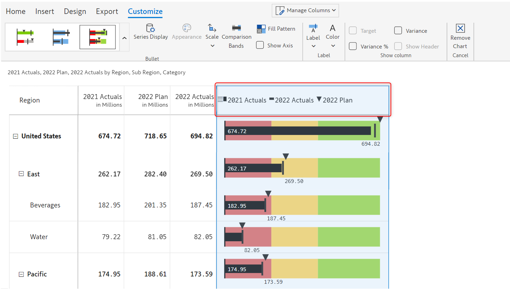
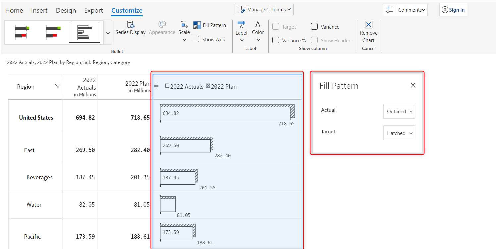

# Bullet charts and clustered bar charts

Performance chart types are used to visually compare multiple measures in dashboard and scorecard applications, where space is limited, and the goal is to present a lot of data in a small, easy-to-read format.&#x20;

Inforiver provides _2 value bullet charts, 3 value bullet charts,_ **** and **** _clustered bar charts._

## 1. Adding the chart&#x20;

### **i) 2-value bullet charts**

These charts are used to compare the performance of **** _two measures_. **** Currently, Inforiver offers six variants of 2-value bullet charts. They are&#x20;

* IBCS bullet
* Integrated variance bar
* Overlapped bar
* Conditional bar
* Comparative bullet
* Stephen Few's bullet

In this example, we have 2022 Actuals and Plan across regions and categories and we want to visualize using a 2-value bullet chart.

a)  We have added '2022 Actuals' in the 'Values (AC)' field and '2022 Plan' in the ' Compare to Prior Period (PY)' field in the visualization pane.

<figure><figcaption>
Data mapping
</figcaption></figure>

b) Select the columns for which you want to insert a 2-value bullet chart. In the following image, the 2022 Actuals and 2022 Plan columns have been selected.

The bullet/stacked chart option gets enabled. From the 'Bullet/Stacked chart' drop-down, select the 'Integrated variance bar chart'.&#x20;

<figure><figcaption>
Columns and chart type selection
</figcaption></figure>

b) The chart gets inserted showing the comparison of the two measures. The variance between actuals and plan is shown in red/green. You can see the 'Customize' tab in the toolbar and the following [customization options](bullet-charts-and-clustered-bar-charts.md#2.-customization-options).

<figure><figcaption>
Inserting an integrated variance bar chart
</figcaption></figure>

### **ii) 3-value bullet charts**

These charts are used to compare the performance of _three measures._ **** Currently, Inforiver offers the following 3-value bullet chart types.

* Integrated variance overlap&#x20;
* Integrated bar with marker&#x20;
* Qualitative bullet marker&#x20;
* Conditional bar with marker&#x20;
* Comparative bullet&#x20;
* Bullet with marker

In this example, we have 2022 Actuals, 2022 Plan, and 2021 Actuals across regions and categories and we want to visualize using a 3-value bullet chart.

a) We have added '2022 Actuals' in the 'Values (AC)' field, '2021 Actuals' in the ' Compare to Prior Period (PY)' field, and '2022 Plan' in the 'Compare to Plan (PL)' field in the visualization pane.

<figure><figcaption>
Data mapping
</figcaption></figure>

b) Select the columns for which you want to insert a 3-value bullet chart. In the following image, the 2022 Actuals, 2021 Actuals, and 2022 Plan columns have been selected.

The bullet/stacked chart option gets enabled. From the 'Bullet/Stacked chart' drop-down, select the 'Bullet with marker chart'.&#x20;

<figure><figcaption>
Columns and chart type selection
</figcaption></figure>

c) The chart gets inserted displaying the comparison band. The legend is highlighted below. You can see the 'Customize' tab in the toolbar and the following [customization options](bullet-charts-and-clustered-bar-charts.md#2.-customization-options).

<figure><figcaption>
Inserting a bullet chart
</figcaption></figure>

### iii) Clustered bars

The clustered bar chart makes it easier to compare multiple measures and is applicable only when using one of these 4 bullet variants:

* Stephen Few's qualitative bullet
* Qualitative bullet with marker
* Comparative bullet
* Bullet with marker


A clustered bar chart is applicable only if any of the _Actual, Target,_ or _Additional target_ types are set to 'Bar'.


In this example, we have 2022 Actuals, 2022 Plan, and 2021 Actuals across regions and categories and we want to visualize using a Clustered bar chart.

a) We have added '2022 Actuals' in the 'Values (AC)' field, '2021 Actuals' in the ' Compare to Prior Period (PY)' field, and '2022 Plan' in the 'Compare to Plan (PL)' field in the visualization pane.

<figure><figcaption>
Data mapping
</figcaption></figure>

b) Select the columns for which you want to insert a clustered. In the following image, the 2022 Actuals, 2021 Actuals, and 2022 Plan columns have been selected.

The bullet/stacked chart option gets enabled. From the 'Bullet/Stacked chart' drop-down, select the 'Bullet with marker chart'.&#x20;

<figure><figcaption>
Inserting a bullet with marker chart
</figcaption></figure>

c) A bullet with marker chart gets inserted.

<figure><figcaption>
Bullet with marker chart
</figcaption></figure>

d) To display a clustered bar chart, click on the **'**Series display**'** option under the 'Customize' tab. In the 'Serial Display' modal that opens up, enable the 'Clustered bar' check box and set the 'Target' and 'Additional target' types as 'Bar'.

This displays the clustered bar as shown in the below image.

<figure><figcaption>
Clustered bar chart
</figcaption></figure>

## 2. Customization options

Inserting a bullet chart or a clustered chart will open up the following configuration options.


Depending on the type of bullet chart chosen, some of these options may or may not be available.


### **i) Bullet types**&#x20;

You can change your current bullet chart type from this drop-down.

<figure><figcaption>
Bullet chart customization option
</figcaption></figure>

### **ii) Fill pattern**&#x20;

This option lets you customize the fill pattern/style of the bar. You can set the fill pattern to any of the three relevant IBCS notations: _Solid, Hatched,_ or _Outlined._ In the following image, the fill pattern of 'Actual' has been changed to _Outlined_ and that of 'Target' has been changed to _Hatched_.

<figure><figcaption>
Bullet chart fill pattern option
</figcaption></figure>

### **iii) Show axis**&#x20;

Enabling this option displays the axis line above the chart.

<figure><figcaption>
Bullet chart show axis option
</figcaption></figure>

### **iv) Series display**&#x20;

This option lets you configure the type, height, and color of the bar/line. Depending on the type of chart inserted, the 'Series display' modal will show different properties which are listed below:

* **Type** - This drop-down lets you choose the type/format using which you want to display the measures. You can set the type to _Marker, Bar, Line_, _Circle, Overlap, or Integrated._&#x20;


The _Overlap_ and _Integrated_ options are available only for the _Integrated bar with marker_, and _Integrated variance overlap_ chart types.


* **Variance bar height** - With this option, you can set the height of the bar that represents the variance/deviation.


The variance bar height option is available only for _Integrated variance overlap, IBCS bullet_, and _Integrated variance bar_ chart types.


* **Marker/line/circle size** - This option lets you set the size of the marker/line/circle. The size can be set to _S(Small), M(Medium), L(Large),_ or _XL(Extra large)._
* **Clustered bar** - Enabling this checkbox will display a clustered bar. You can refer to the [_Clustered Bar_](bullet-charts-and-clustered-bar-charts.md#iii-clustered-bars) section for additional information.
* **Color** - The fill color drop-down lets you choose the color of the bar for every displayed measure.

<figure><figcaption>
Bullet chart series display option
</figcaption></figure>

### **v) Show column**&#x20;

Using this option, you can choose to show data labels for _Target, Variance,_ and/or _Variance %._ Using _Show header,_ the column header can be enabled or disabled to indicate which labels are shown. In the image below, the data labels for _Variance_, and _Variance %_ are shown.&#x20;

<figure><figcaption>
Bullet chart show column option
</figcaption></figure>

### **vi) Target marker** &#x20;

Enabling this option will display a target marker on the chart.

<figure><figcaption>
Bullet chart target marker option
</figcaption></figure>

### **vii) Comparison band**&#x20;

Comparison band indicates the state of the measure depending on which band it resides in. They provide a performance rating to the value being measured where each color represents a different state for e.g. good, average and poor.&#x20;

You can add comparison band by clicking on the 'Comparison bands**'** icon. The following properties are available:

* **Compared series** - This drop-down lets you select the measure based on which you want to insert the comparison bands. You can also choose the maximum value of all the series used in the chart.
* **Dynamic** - If you enable this checkbox, then the comparison band range will be added based on individual scaling.
* **Number of bands** - Here you can set the number of bands required.
* **Set label** - If this checkbox is enabled, you can set labels for the ranges.&#x20;
* **Diverging colors** - If you enable this checkbox, you can set different colors for different bands. By default, sequential colors are used.


This option is available only for '_Bullet with marker_' and '_Qualitative bullet with marker_' charts.


<figure><figcaption>
Bullet chart comparison band option
</figcaption></figure>

### viii) Appearance

This option lets you change the appearance of the bullet charts. Clicking on this option will open up an 'Appearance' model in which you can configure the following properties:

**Positive color** - Using this option you can customize the positive color of the bar/marker

**Negative color** - Using this option you can customize the negative color of the bar/marker

**Axis color** - This option lets you set the axis color of the chart

<figure><figcaption>
Appearance modal
</figcaption></figure>

In this section, we covered bullet and clustered charts. Navigate to the next section to learn more about [stacked charts](stacked-charts.md).
