# Change/deviation charts

Charts such as the dot plot, arrow plot, dumbbell plot & range plot are used to track changes over time or with respect to a benchmark.&#x20;

In the case of the arrow plot, the data points are represented using arrows. The size of the arrow increases with the magnitude of variation. In the case of dot and range plots, circles represent the values of the series whereas the line connecting the circles represents the amount of variation between them. In the case of the range plot, the variation is shown as a bar.

## 1. Adding the chart&#x20;

In this example, let's visualize the pay gap between men and women in the UK and the US using a Dot plot.

a) We have added 'Category' and ‘Occupation’ in the 'Rows' field, ‘Country’ in the ‘Columns’ field, and 'Men average annual salary' and ‘Women average annual salary’ in the 'Values (AC)' field in the visualization pane.

<figure><figcaption>
Data mapping
</figcaption></figure>

b) Select columns for which you want to insert the plot chart. In the following image, the average salary of men and women columns have been selected.

The bullet/stacked chart option gets enabled. From the 'Bullet/Stacked chart' drop-down, select the 'Dot plot' under the 'Others' Category.

<figure>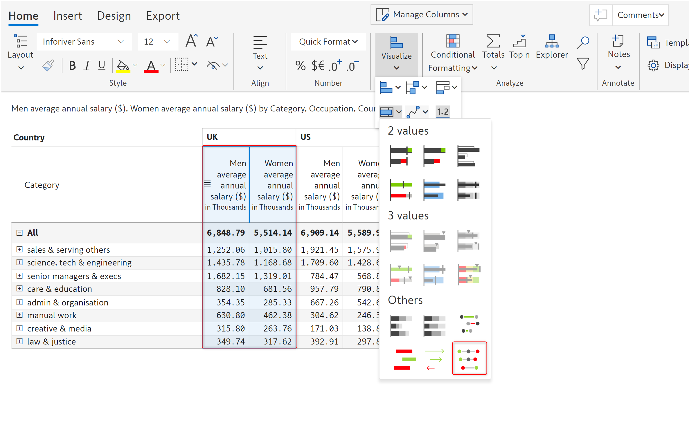<figcaption>
Columns and chart type selection
</figcaption></figure>

c) The dot plot gets inserted as shown below. You can see the 'Customize' tab in the toolbar and the following [customization options](change-deviation-charts.md#2.-customization-options).

<figure>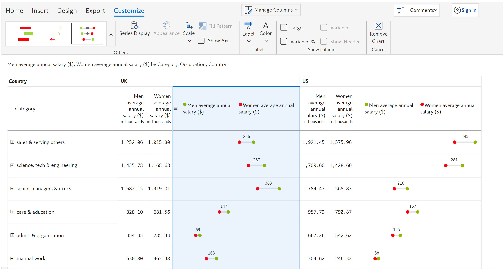<figcaption>
Inserting a dot chart
</figcaption></figure>

## 2. Customization options

The following customization options are available if you insert any of the chart types mentioned in this section.


Some of these customization options may or may not be available, depending on the type of chart inserted.


### **i) Chart type**&#x20;

Here you can change your current chart type.

<figure>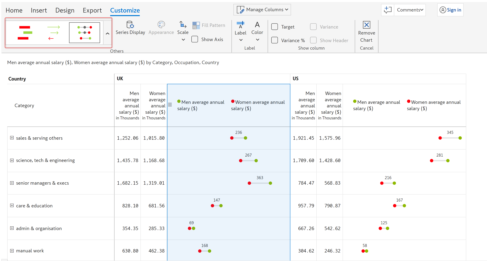<figcaption>
Chart type options
</figcaption></figure>

### ii) Series display

Clicking on this option will open up a 'Series display' modal that lets you configure the type, size, and color of the marker. Depending on the type of chart inserted, the 'Series display' modal will show different properties which are listed below:

<figure>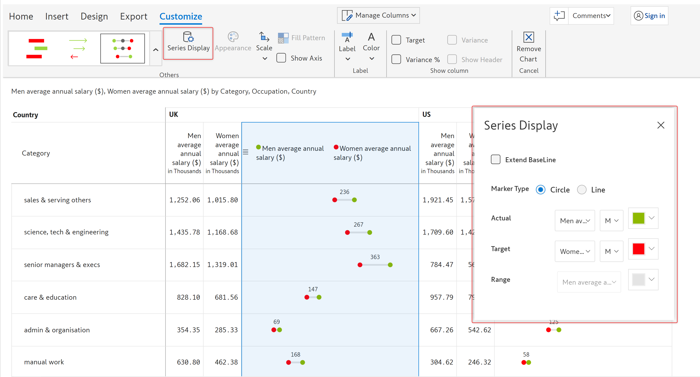<figcaption>
Series display options
</figcaption></figure>

**a) Extend baseline** - Enabling this option will extend the baseline of the dot plot as shown below.

<figure>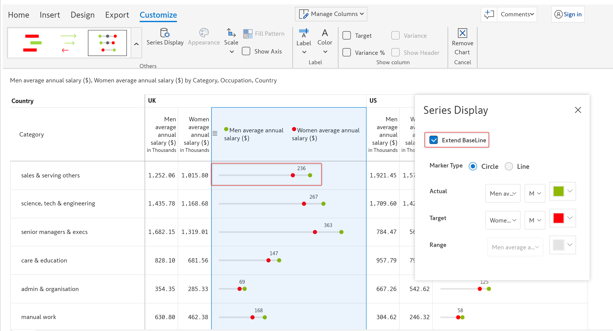<figcaption>
Extend base line option
</figcaption></figure>

**b) Marker type** - Markers are visual elements like dots and lines that are used to represent the data points in the chart. Using this option you can configure the marker type of the chart. The available options are:&#x20;

* **Circle** - Selecting this option will display a dot marker
* **Line** - selecting this option will display a line marker
* **None** - This option is available only for range plots and is selected by default displaying a solid bar as a marker

**c) Marker/line/circle size** - This option lets you set the size of the marker/line/circle. The size can be set to S(Small), M(Medium), L(Large), or XL(Extra large).

**d) Color** - The fill color drop-down lets you choose the color of the markers.

**e) Range** - With this option, you can configure the measure for which the range needs to be displayed as well as the gradient color of the range.

**f) Gradient range** - If you enable this option, you can represent the bars of the **range** plot using gradient colors.&#x20;

<figure>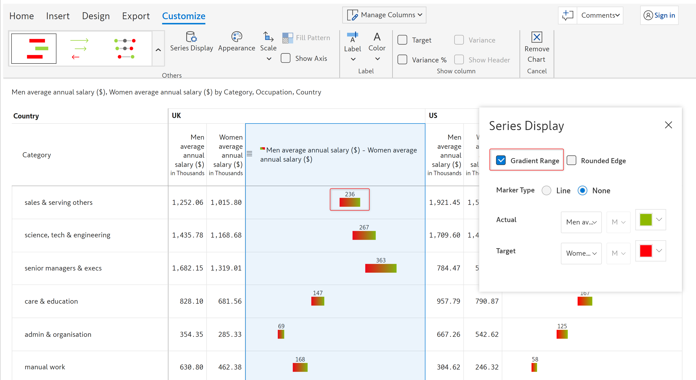<figcaption>
Gradient range option
</figcaption></figure>

**g) Rounded edge** - Enabling this option will display rounded edges to the bars of the **range** and **dumbbell** plots.

<figure>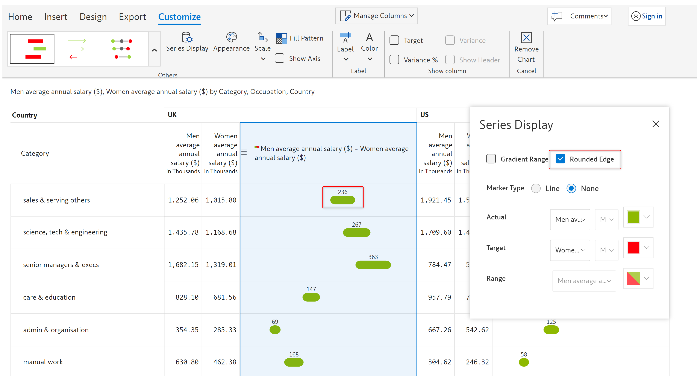<figcaption>
Rounded edge option
</figcaption></figure>


The following two options are available only for arrow charts.


**h) Positive variance and Negative variance** - From this drop-down, you can select the arrow color for the positive and negative variances.

<figure>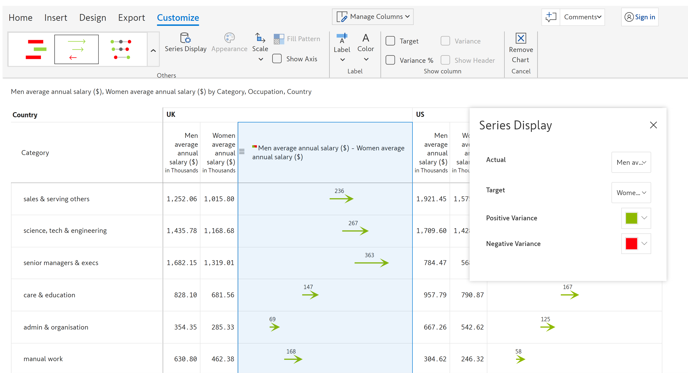<figcaption>
Variance color options
</figcaption></figure>

### iii) Appearance

This option lets you change the appearance of the bar/pin charts. Clicking on this option will open up an Appearance model in which you can configure the following properties:

**Positive color** - Using this option you can customize the positive color of the bar/marker

**Negative color** - Using this option you can customize the negative color of the bar/marker

**Axis color** - This option lets you set the axis color of the chart

<figure>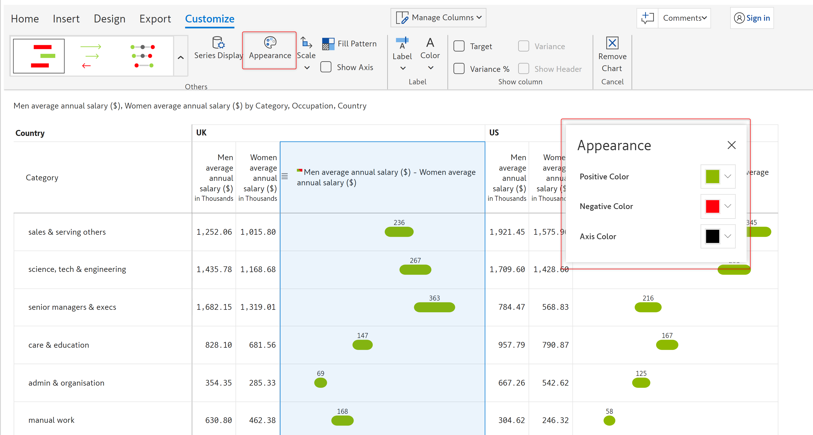<figcaption>
Plot chart appearance options
</figcaption></figure>

### iv) Show axis&#x20;

You can enable this checkbox to display an axis line for reference, above the chart.

<figure><figcaption>
Show axis option
</figcaption></figure>

### v) Fill pattern&#x20;

This option lets you customize the fill pattern/style of the bar and target measure. You can set the fill pattern to any of the three relevant IBCS notations: _Solid, Hatched,_ or _Outlined._&#x20;


This option is available only for the range plot.


<figure>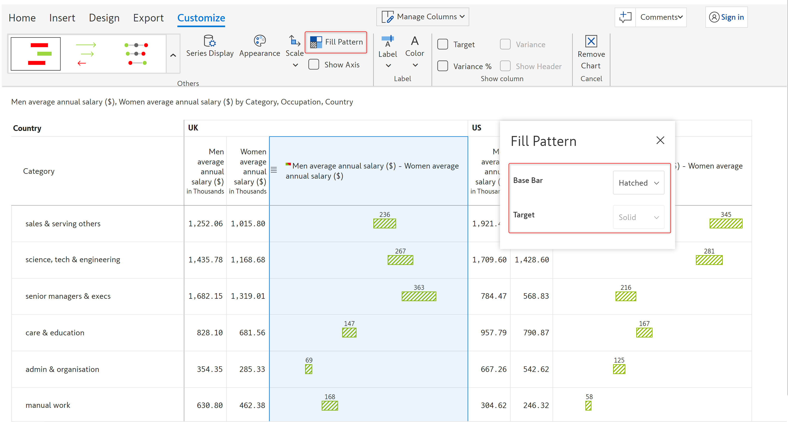<figcaption>
Fill pattern options
</figcaption></figure>

### vi) Show column

Using this option, you can choose to show data labels for _Target, Variance,_ and/or _Variance %_. Using the _Show header_ option, the column header can be enabled or disabled to indicate which labels are shown. In the following image, the _Target_ and _Variance%_ columns are enabled to be shown on the report.

<figure>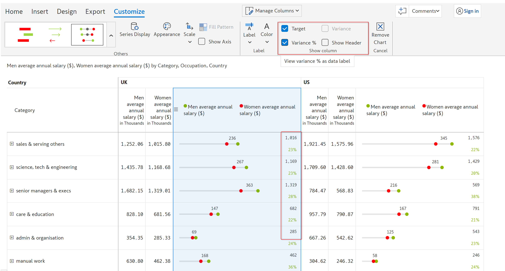<figcaption>
Show column options
</figcaption></figure>

In this section, we covered change/deviation charts. Navigate to the next section to learn more about [planning, budgeting, and forecasting](../7.-planning-budgeting-and-forecasting/).
