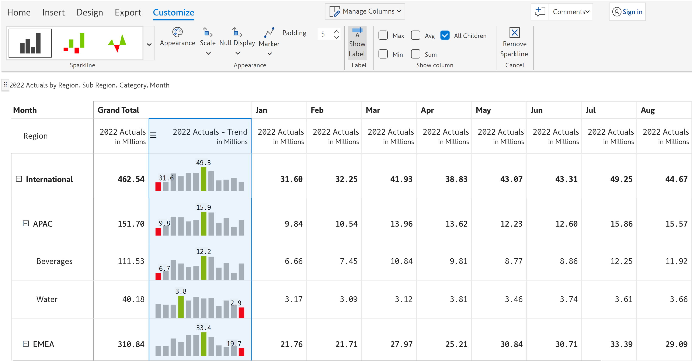
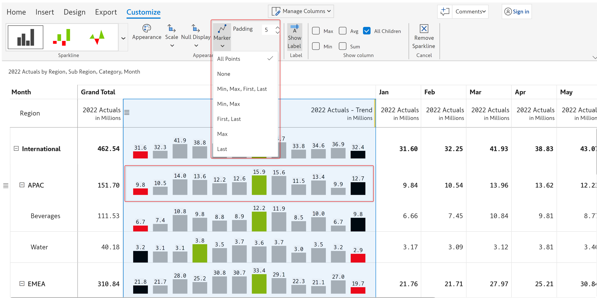
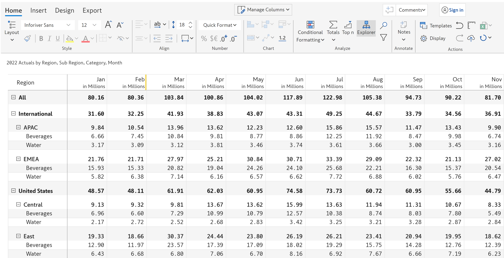

# Sparkline charts

A sparkline is typically used to show trends in a series of values over time, such as stock prices or website traffic. Sparklines are often used in dashboards and other data visualizations to provide a quick and condensed view of a data series.

Inforiver provides _line, area, baseline, column_s, and _win-loss_ sparkline charts.

## 1. Adding the chart

In this example, we have 12 months of data across regions and categories that we want to visualize using a column sparkline chart.

**STEP 1:**  To insert a sparkline chart, you need to add a dimension in the column field. Note that we have added 'Month' in the 'Columns' field in the Visualization pane.&#x20;

<figure><figcaption>
Data mapping
</figcaption></figure>

**STEP 2**:  Select the column for which you want to insert the sparkline chart. In the following image, the 2022 Actuals for the month of January has been selected.&#x20;

The sparkline chart option gets enabled. From the 'Sparkline chart' drop-down, select the _Column_ sparkline chart.&#x20;

<figure><figcaption>
Column and chart type selection
</figcaption></figure>

**STEP 3:** The spark column appears in the grand total column, incorporating data for all the months. You can see the minimum and maximum values for each row highlighted in <mark style="color:red;">red</mark> and <mark style="color:green;">green</mark>. The Customize ribbon is enabled when you insert an inline chart.

<figure><figcaption>
Sparkline customization options
</figcaption></figure>


You can select a **subset of the columns** using Shift/Ctrl + Click if you do not want to visualize all the periods as a sparkline.


## 2. Customization options

The following options are available for customizing a sparkline chart.


Depending on the type of sparkline chart chosen, some of these options may or may not be available.


### **2.1. Sparkline**&#x20;

You can change your current sparkline chart type by clicking the drop-down arrow in the **Sparkline** section. In the image below, we have changed the chart type from _Column_ to _Baseline_.

<figure><figcaption>
Sparkline chart type options
</figcaption></figure>

### **2.1. Appearance**

You can change the colors for the minimum, and maximum bars, variances, and data labels. Click on any of the color boxes to open the color picker.

<figure><figcaption>
Setting colors
</figcaption></figure>

You can also choose the default theme option if you want to use the Power BI theme colors.

<figure><figcaption>
Default theme
</figcaption></figure>

You can increase the thickness of line charts or the border for area charts by setting the Stroke Width.&#x20;

<figure><figcaption>
Stroke width
</figcaption></figure>

For Baseline charts, you can choose to apply a gradient. With this option, you can enable or disable the gradient coloring. If you enable this option, two additional options become available - _Area above 1_ and _Area above 2_ using which you can set the starting and ending colors for the gradient.&#x20;

<figure><figcaption>
Sparkline apply gradient
</figcaption></figure>

You can also set the border colors for the area chart using the **Line Above** and **Line Below** options**. Line Above** - use this option to set the color of the line above the axis and use the **Line Below** option to set the color of the line below the axis.

Similar to border colors, you can set the fill colors for the area above and below the axis - use the **Area Above** and **Area Below** options.

<figure><figcaption>
Sparkline color options
</figcaption></figure>

### **2.2. Null display**&#x20;

Using the 'Null display' option, you can configure how you want to connect the null values in your dataset. In this example, the 2023 Budget for Feb and May is blank.&#x20;

* **Connect over nulls** - If you select this option, then all the null data points in the dataset will be connected over by lines.&#x20;

<figure><figcaption>
Connect over nulls
</figcaption></figure>

* **Consider null as 0** - All the null values in the dataset will be considered '_0' (Zero)_

<figure><figcaption>
Consider null as 0
</figcaption></figure>

* **Skip the nulls** - All the null values will be skipped

### **2.3. Marker**&#x20;

From the 'Marker' drop-down, you can select the type of marker points you want to insert in your chart. Adding marker points in your chart helps you to analyze and understand the data better. You can insert marker for:

* **All points** - All the points in the chart
* **None** - No points at all
* **Min, Max, First, Last** - Only for the minimum, maximum, first, and last values in the chart
* **Min, Max** - Only for the minimum and maximum values
* **First, Last** - Only for the first and last values
* **Max** - Only for the maximum value
* **Last** - Only for the last value

<figure><figcaption>
Sparkline marker type
</figcaption></figure>

### **2.4. Scale bands**&#x20;

'Scale bands' visually display information about the overall distribution of values. If the distribution of values falls in the _first quartile (0-25%)_, then it is represented by a _lighter shade of gray_. However, if the value distribution falls in the _last quartile (75-100%)_, then it is represented by a _darker shade of gray_.&#x20;


The scale bands option is available only if you select any of the standard sparkline chart types (_Line Linear, Line Spline,_ or _Line Stepped_).


<figure><figcaption>
Sparkline scale band
</figcaption></figure>

### **2.5. Show column**&#x20;

From the **Show column** section, you can choose whether to show the _Min, Max, Avg,_ or _Sum_ columns or _All children (enabled by default)._ In the below image, the _Avg_ and _Min_ columns are enabled in the Show Column option, and the report shows the Min and Average columns.

<figure><figcaption>
Sparkline show column
</figcaption></figure>

### **2.6. Axis config**&#x20;

You can configure the type and style of the axis line using the **Axis config** option.


The axis config option is available only for the _baseline_ chart.


<figure><figcaption>
Axis config
</figcaption></figure>

**Type** - An axis in a chart serves as a reference making it easy to interpret other data values with respect to it. Depending on the axis type you choose, the axis will be displayed on the following points:

* **Median** - Median value of the data set
* **Average** - Average value of the data set
* **Mid value** - Mid value of the data set
* **Standard deviation** - Standard deviation of the data set
* **Custom** - When the custom option is chosen, you can define a custom value for the axis as shown below.

<figure><figcaption>
Custom axis configuration
</figcaption></figure>

**Style** - This option lets you configure how the axis line of the chart should look like. You can select any of the following styles for the axis line - Solid, Dotted, Dashed, Long dashed, and Double solid.

### **2.7. Padding**&#x20;

You can change the padding/spacing between the bars using the **Padding** option. The default padding value is 5.


The padding option is available only for the _Column_ and _Win/Loss_ Sparklines.


<figure><figcaption>
Sparkline padding option
</figcaption></figure>

### 2.8. Show label&#x20;

You can configure whether to show or hide data labels using this option. Data labels are shown by default. Clicking on this option once will hide the data labels and clicking again will show the labels.

<figure><figcaption>
Sparkline show label
</figcaption></figure>

### **2.9. Remove sparkline**&#x20;

Clicking on the 'Remove sparkline' option removes the sparkline chart from the report and restores it to the original number format.

<figure><figcaption>
Remove sparkline chart
</figcaption></figure>

<figure><figcaption>
After chart removal
</figcaption></figure>

In this section, we covered the sparkline charts. Navigate to the next section to learn more about [stacked charts](stacked-charts.md).&#x20;
