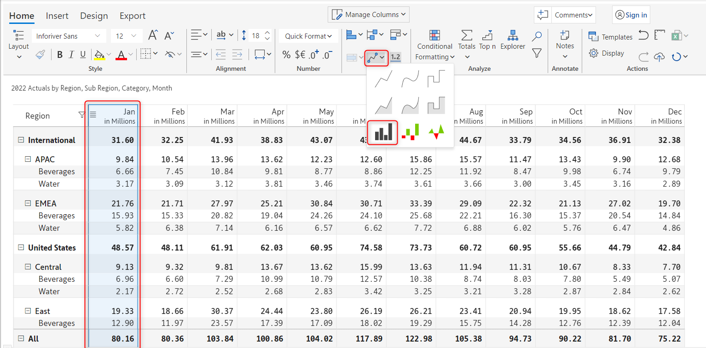
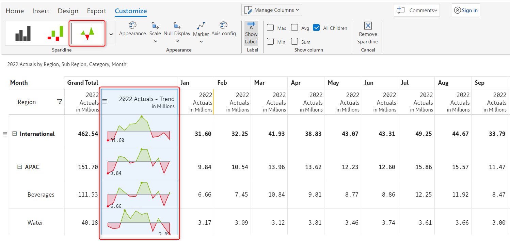
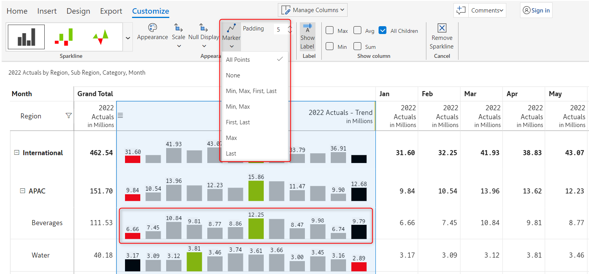
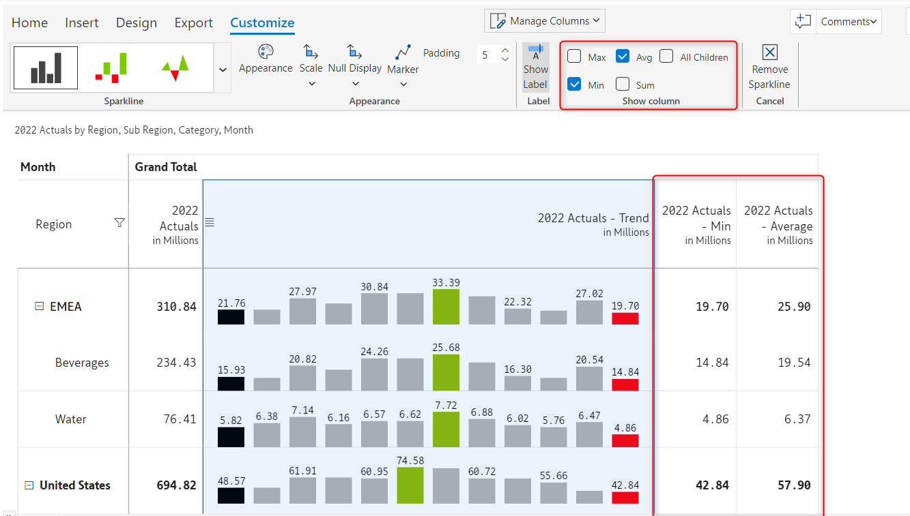
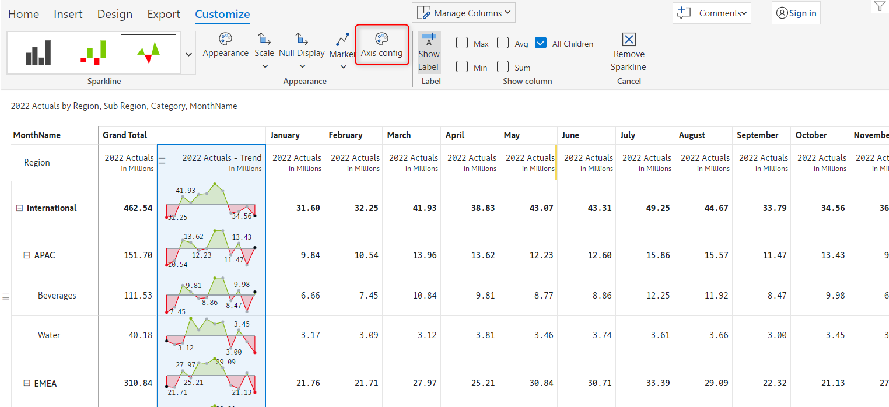
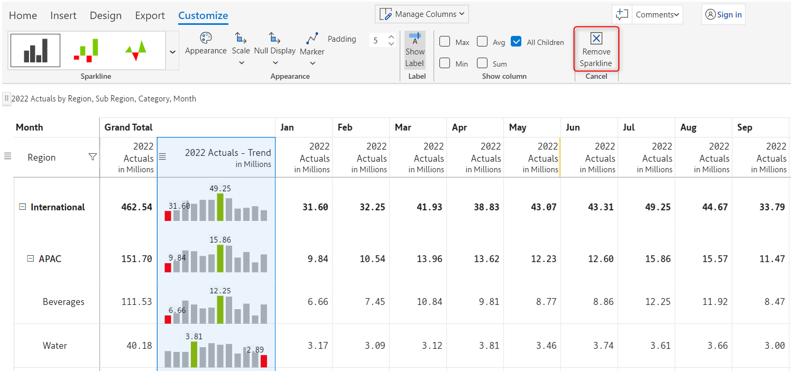
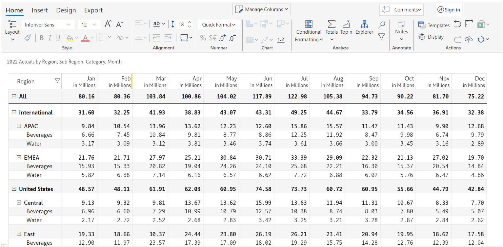

# Sparkline charts

A sparkline is typically used to show trends in a series of values over time, such as stock prices or website traffic. Sparklines are often used in dashboards and other data visualizations to provide a  quick and condensed view of a data series.

Inforiver provides _line, area, baseline, column_s, and _win-loss_ sparkline charts.

## 1. Adding the chart

In this example, we have 12 months of data across regions and categories and we want to visualize using a column sparkline chart.

a) To insert a sparkline chart, you need to add a time dimension in the column field. Note that we have added 'Month' in the 'Columns' field in the Visualization pane.&#x20;

<figure><figcaption>
Data mapping
</figcaption></figure>

b) Select a column for which you want to insert the sparkline chart. In the following image, the 2022 Actuals for the month Jan has been selected.&#x20;

The sparkline chart option gets enabled. From the 'Sparkline chart' drop-down, select the 'Column sparkline chart'.&#x20;

<figure><figcaption>
Selecting column and sparkline chart type
</figcaption></figure>

c) The spark column appears incorporating data for all the months. You can see the _minimum_ and _maximum_ values for each row in _red_ and _green_. You can see the 'Customize' tab in the toolbar and the following [customization options](sparkline-charts.md#2.-customization-options).

<figure><figcaption>
Sparkline customization options
</figcaption></figure>


You can select a **subset of the columns** using Shift/Ctrl + Click if you do not want to visualize all the periods as a sparkline.


## 2. Customization options

The following options are available for customizing a sparkline chart.


Depending on the type of sparkline chart chosen, some of these options may or may not be available.


### **i) Sparkline**&#x20;

You can change your current sparkline chart type by clicking on the drop-down arrow in the 'Sparkline' section. In the image below, we have changed the chart type from '_Column sparkline_' to '_Baseline_'.

<figure><figcaption>
Sparkline chart type customization
</figcaption></figure>

### **ii) Marker**&#x20;

From the 'Marker' drop-down, you can select the type of marker points you want to insert in your chart. Adding marker points in your chart helps you to analyze and understand the data better. You can insert marker for:

* **All points** - All the points in the chart
* **None** - No points at all
* **Min, Max, First, Last** - Only for the minimum, maximum, first, and last values in the chart
* **Min, Max** - Only for the minimum and maximum values
* **First, Last** - Only for the first and last values
* **Max** - Only for the maximum value
* **Last** - Only for the last value

<figure><figcaption>
Sparkline marker points option
</figcaption></figure>

### **iii) Scale bands**&#x20;

'Scale bands' visually display information about the overall distribution of values. If the distribution of values falls in the **** _first quartile (0-25%)_, then it is represented by a _lighter shade of gray_. However, if the value distribution falls in the **** _last quartile (75-100%)_, then it is represented by a _darker shade of gray_.&#x20;


The scale bands option is available only if you select any of the standard sparkline chart types (_Line Linear, Line Spline,_ or _Line Stepped_).


<figure><figcaption>
Sparkline scale band option
</figcaption></figure>

### **iv) Show column**&#x20;

From the 'Show column' section, you can choose whether to show the _Min, Max, Avg,_ or _Sum_ columns or _All children (enabled by default)._ In the below image, the _Avg_ and _Min_ columns are enabled in the Show Column option, and the report shows the Min and Average columns.

<figure><figcaption>
Sparkline show column options
</figcaption></figure>

### **v) Axis config**&#x20;

You can configure the _type_ and _style_ of the axis line from the 'Axis config' option. Clicking on the 'Axis Config' option will open up the Axis config modal, in which you can choose the type and style of the axis.


The axis config option is available only for the _baseline_ chart.


<figure><figcaption>
Sparkline axis config option
</figcaption></figure>

**Type** - An axis in a chart basically serves as a reference making it easy to interpret other data values with respect to it. Depending on the axis type you choose, the axis will get displayed at the

* **Median** - Median value of the data set
* **Average** - Average value of the data set
* **Mid value** - Mid value of the data set
* **Standard deviation** - Standard deviation of the data set
* **Custom** - When the custom option is chosen, you can define a custom value for the axis as shown below.

<figure><figcaption>
Custom axis configuration
</figcaption></figure>

**Style** - This option lets you configure how the axis line of the chart should look like. You can select any of the following styles for the axis line - _Solid, Dotted, Dashed, Long dashed_ and _Double solid._

### **vi) Null display**&#x20;

Using the 'Null display' option, you can configure how you want to connect the null values in your dataset. In this example, the 2023 Budget for Feb and May are blank.&#x20;

* **Connect over nulls** - If you select this option, then all the null data points in the dataset will be connected over by lines.&#x20;

<figure><figcaption>
Connect over nulls
</figcaption></figure>

* **Consider null as 0** - All the null values in the dataset will be considered '_0' (Zero)_

<figure><figcaption>
Consider null as 0
</figcaption></figure>

* **Skip the nulls** - All the null values will be skipped

### **vii) Padding**&#x20;

Using the 'Padding' option, you can change the padding/spacing between the bars. The default padding value is 5.


The padding option is available only for the _Column_ and _Win/Loss_ Sparklines.


<figure><figcaption>
Sparkline padding option
</figcaption></figure>

### viii) Appearance

This option lets you change the appearance of the sparkline charts. Clicking on this option will open up an 'Appearance' model in which you can configure the following properties:

<figure><figcaption>
Sparkline appearance modal
</figcaption></figure>

**a) Apply default theme** - Enabling this option will apply default power BI themes and colors to your sparkline charts

<figure><figcaption>
Apply default theme option
</figcaption></figure>

**b) Stroke width** - With this option, you can configure the width of the stroke of your sparkline charts. The default is 1.

<figure><figcaption>
Stroke width option
</figcaption></figure>

**c) Base color** - Using this option you can configure the base color of the strokes of the sparkline charts

**d) Max** - This option lets you set the color of the maximum point in the chart

**e) Min** - This option lets you configure the color of the minimum point in the chart

**f) Label** - This option lets you configure the color of the data label in the chart

**g) Apply gradient** - With this option, you can enable or disable the gradient coloring. If you enable this option, two additional options become available. The 'Area above 1' and 'Area above 2' using which you can set the starting and ending colors for the area above the axis.

<figure><figcaption>
Apply gradient option
</figcaption></figure>

**h) Line above** - With this option, you can set the color of the line above the axis

**i) Line below** - With this option, you can set the color of the line below the axis

**j) Area above** - With this option you can customize the color of the area above the axis

**k) Area below** - With this option you can customize the color of the area below the axis

<figure><figcaption>
Baseline appearance option
</figcaption></figure>

**l) Axis color** - This option lets you customize the color of the axis line

**m) Positive color** - Using this option you can customize the positive color of the bar

**n) Negative color** - Using this option you can customize the negative color of the bar

<figure><figcaption>
Variance color option
</figcaption></figure>

### viii) Show label&#x20;

You can configure whether to show or hide data labels using this option. Data labels are shown by default. Clicking on this option once will hide the data labels and clicking again will show the labels.

<figure><figcaption>
Show label option
</figcaption></figure>

### **ix) Remove sparkline**&#x20;

Clicking on the 'Remove sparkline' option removes the sparkline chart from the report and restores it to the original number format.

<figure><figcaption>
Removing sparkline
</figcaption></figure>

<figure><figcaption>
After removal
</figcaption></figure>

In this section, we covered the sparkline charts. Navigate to the next section to learn more about [bullet and clustered charts](bullet-charts-and-clustered-bar-charts.md).
