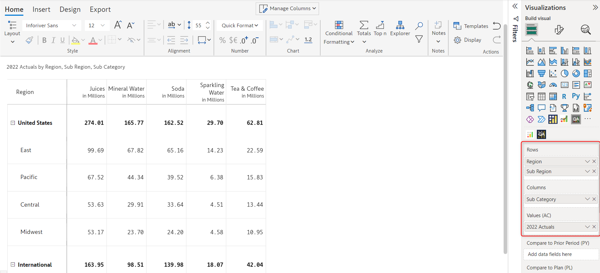
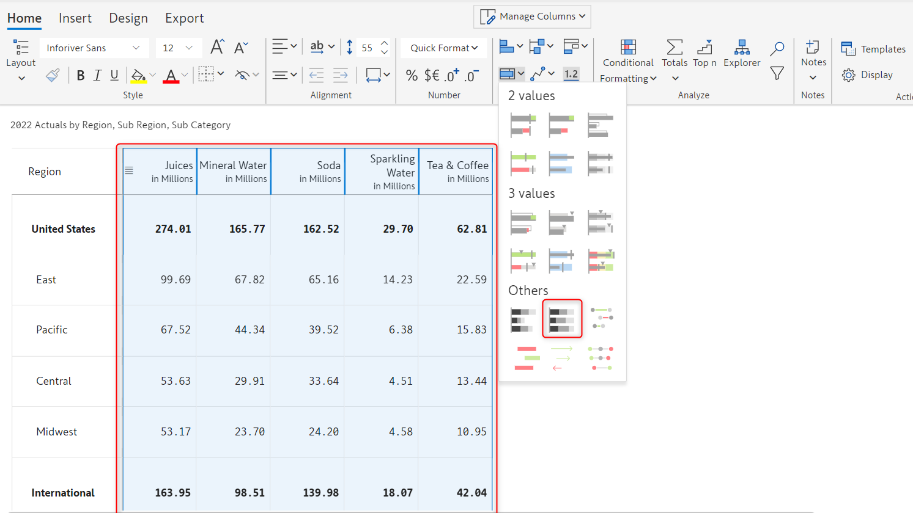
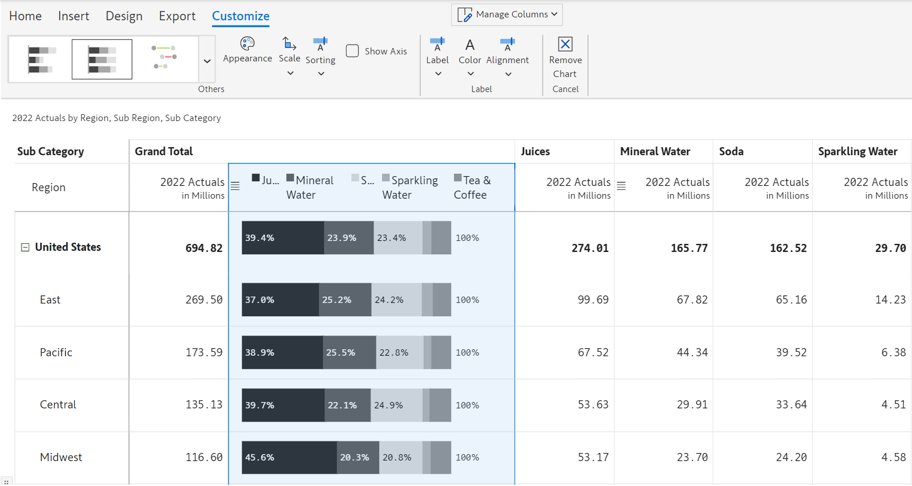
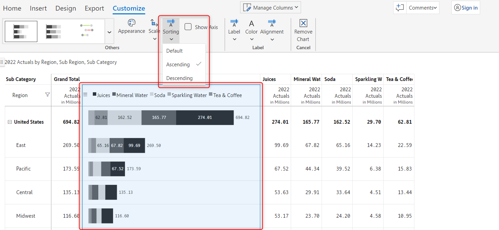

# Stacked charts

In this section, you can learn about the stacked charts in detail. Stacked charts are used when you want to compare the relative proportions of different data series and see how they contribute to the total.

Inforiver offers two variations of stacked charts, they are:

* **Stacked bar chart** - In a stacked bar chart, each section of the bar represents the absolute value of each series.&#x20;
* **Percentage stacked bar chart** - In a percentage stacked bar chart, each section of the bar represents the relative proportions of the data series.&#x20;

## 1. Adding the chart

In this example, we have 2022 Actuals across regions and we want to visualize using a stacked chart.

a) We have added 'Sub Category' in the 'Columns' field, and '2022 Actuals' in the 'Values (AC)' field in the visualization pane.

<figure><figcaption>
Data mapping
</figcaption></figure>

b) Select columns for which you want to insert the stacked/percentage stacked chart. In the following image, all the subcategories columns have been selected.

The bullet/stacked chart option gets enabled. From the 'Bullet/Stacked chart' drop-down, select the 'Percentage stacked chart' under the 'Others' category.&#x20;

<figure><figcaption>
Column and chart type selection
</figcaption></figure>

c) The percentage stacked chart gets inserted as shown below. You can see the 'Customize' tab in the toolbar and the following [customization options](stacked-charts.md#2.-customization-options).

<figure><figcaption>
Inserting a percentage stacked bar chart
</figcaption></figure>

## 2. Customization options

The following customization options are available if you insert either a stacked or a percentage stacked bar chart.


Some of these customization options may or may not be available, depending on the type of stacked chart inserted.


### **i) Sorting**&#x20;

From the 'Sorting' drop-down, you can set the sorting order of the data series in the chart to either _Ascending_ or _Descending_.

<figure><figcaption>
Stacked chart sorting option
</figcaption></figure>

### **ii) Alignment**&#x20;

Using this drop-down, you can set the alignment of the data labels within the bar. You can align the label to the _Left, Center,_ or _Right_ of the bar, the default is Left.

<figure><figcaption>
Stacked chart alignment option
</figcaption></figure>

### **iii) Show axis**&#x20;

You can enable this checkbox to display an axis line for reference, above the chart.

<figure><figcaption>
Stacked chart show axis option
</figcaption></figure>

In this section, we covered stacked charts. Navigate to the next section to learn more about waterfall charts.
