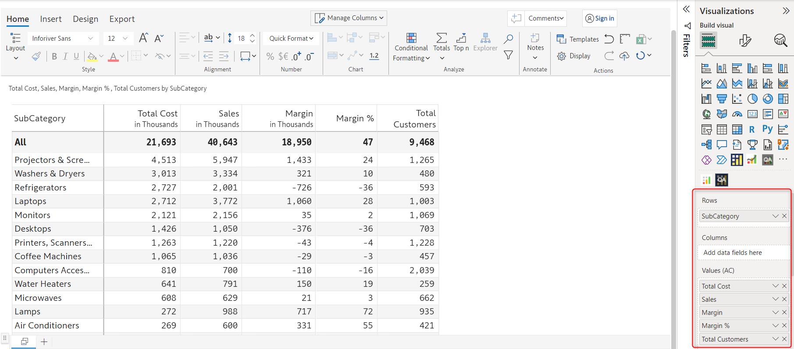
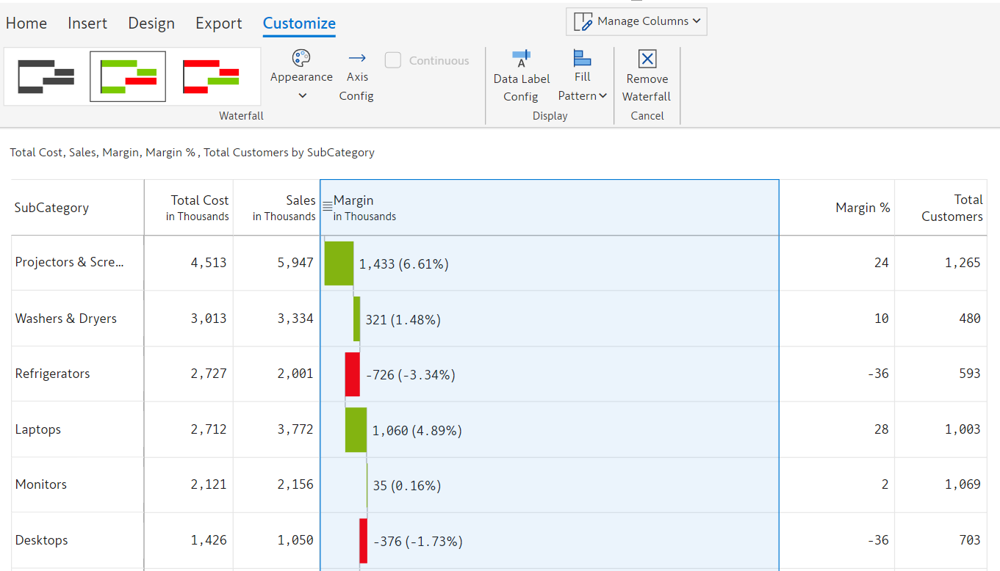
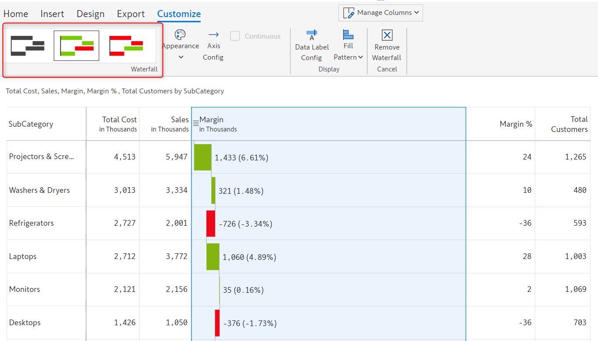
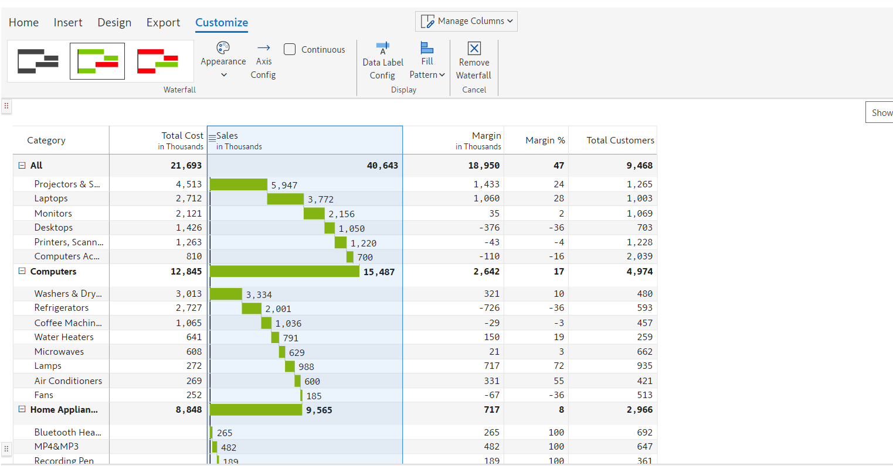
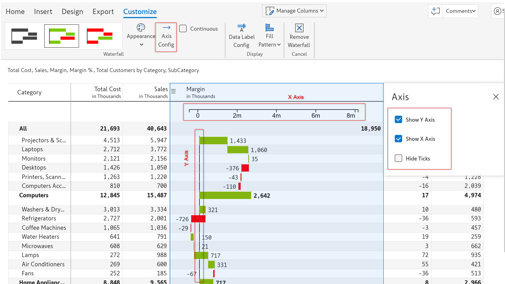
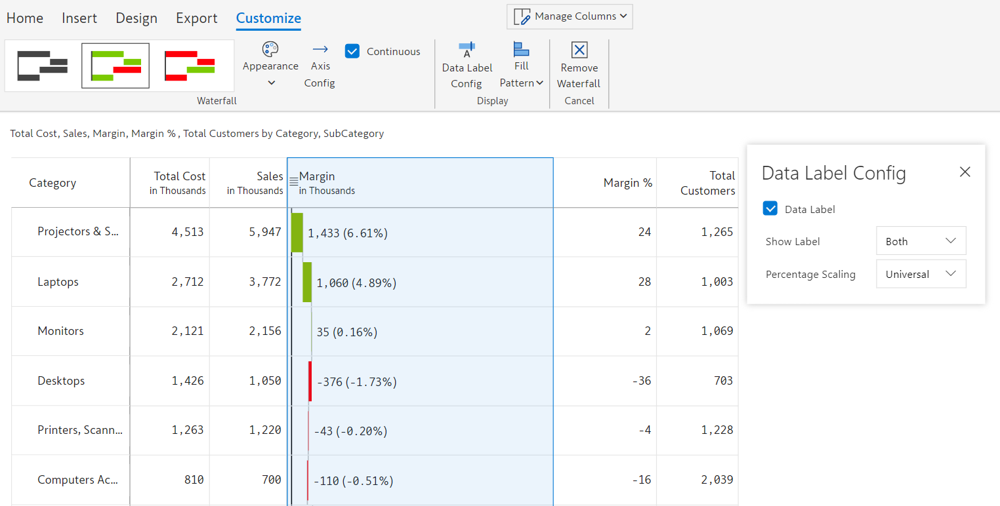
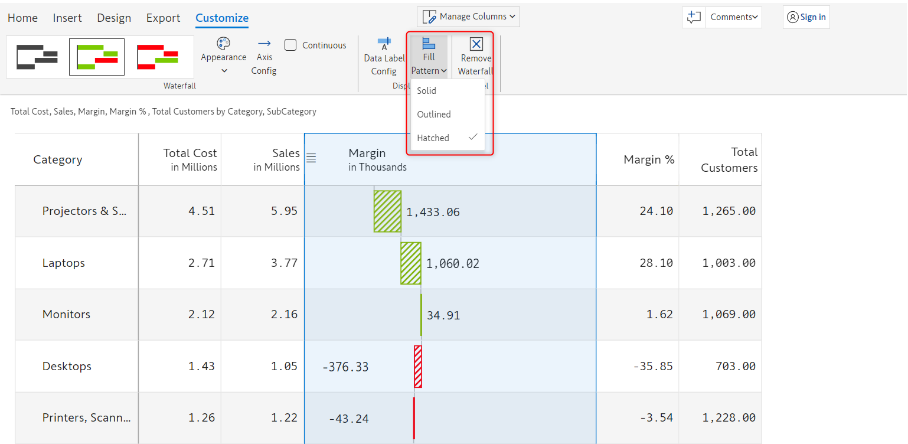

# Waterfall charts

A waterfall chart is a type of chart that is used to display how an initial value is affected by a series of intermediate positive or negative values, leading to a final value. It is often used to show the breakdown of the total change in a value, such as a financial metric like net income or cash flow.&#x20;

Waterfall charts are often used in finance and accounting to show the flow of money in and out of a business, but can also be used in other industries such as manufacturing, sales, and production.

Inforiver offers 3 variations of the waterfall chart: _Solid, Colored,_ and _Invert Colored._

* **Solid waterfall** - All the bars are represented by the same solid color.&#x20;
* **Colored waterfall** - By default, the positive and negative values are represented using green and red bars, but they can be customized.
* **Invert colored waterfall** - This chart type is the exact opposite of the colored waterfall chart. The positive and negative values are represented using red and green bars, but they can be customized.

## 1. Adding the chart

In this example, we will visualize the contribution of the subcategories to the total margin using a waterfall chart.

a) We have added 'SubCategory' in the 'Rows' field and 'Total cost', 'Sales', 'Margin', 'Margin %', and 'Total customers' in the 'Values (AC)' field in the visualization pane.

<figure><figcaption>
Data mapping
</figcaption></figure>

b) Select the column for which you want to insert the waterfall chart. In the following image, the margin column has been selected.

The waterfall chart option gets enabled. From the 'Waterfall chart' drop-down, select the 'Colored waterfall chart'.&#x20;

<figure><figcaption>
Column and chart type selection
</figcaption></figure>

c) The waterfall chart gets inserted as shown below. You can see the 'Customize' tab in the toolbar and the following [customization options](waterfall-charts.md#2.-customization-options).

<figure><figcaption>
Inserting a waterfall chart
</figcaption></figure>

## 2. Customization options

Inserting a waterfall chart will open up the following customization options.

### **i) Waterfall chart type**&#x20;

You can change your current waterfall chart type from this drop-down.

<figure><figcaption>
Waterfall chart type customization
</figcaption></figure>

### **ii) Continuous**&#x20;

Enabling this option will display a continuous waterfall chart across row hierarchies.


The 'Continuous' option is available only if the selected column has a row hierarchy.


To create a row hierarchy, we have added the 'Category' in the 'Rows' field in the Visualization pane.

<figure><figcaption>
Data mapping
</figcaption></figure>

Select the 'Sales' column, and from the 'Waterfall chart' drop-down, select the 'Colored waterfall chart'.  The waterfall chart gets inserted as shown below.

<figure><figcaption>
Waterfall chart insertion with row hierarchy
</figcaption></figure>

The continuous option now becomes available under the 'Customize' tab. Enabling this option will display a continuous waterfall chart as shown in the image below.

<figure><figcaption>
Inseerting a continuous waterfall chart
</figcaption></figure>

### **iii) Axis config**&#x20;

This option lets you configure the axis-related settings. Clicking on this option opens up an 'Axis' modal from which you can choose to&#x20;

* **Show Y-axis** - Enabling this option will display the Y-axis on the chart
* **Show X-axis** - Enabling this option will display the X-axis on the chart
* **Hide ticks** - Enabling this option will hide the tick intervals on the axis


Note that some of these options may not be enabled for you depending on the type of waterfall chart inserted and the properties chosen.


<figure><figcaption>
Watefall axis config configuration
</figcaption></figure>

### **iv) Data label config**&#x20;

This option lets you configure the arrangement and display properties for data labels. The modal has the following properties:

* **Data label** - You can enable or disable this checkbox to show or hide data labels for the chosen column/metrics.&#x20;


The 'Show label' and 'Percentage scaling' options are available only if the 'Data label' option is enabled.


* **Show label** - Inforiver provides the option to display the data labels simply as _labels_, _percentages_, or _both_. In the below example, we have chosen the 'Both' option.
* **Percentage scaling** - Using this option you can configure the scaling of the percentage data label. The available scaling options are
  1. **Universal -** This is the default option and it indicates the percentage contribution of the value to the grand total.
  2. **By level -** Whereas 'By level' indicates the percentage contribution of the value to its parent level or category.


The 'Percentage scaling' option becomes available, only if the 'Show label' value is set to either 'Percentage' or 'Both'.


<figure><figcaption>
Waterfall chart data label configuration
</figcaption></figure>

### **v) Fill pattern**&#x20;

You can customize the fill pattern of the bar to any of these IBCS notations: _Solid, Outlined,_ or _Hatched_.

<figure><figcaption>
Waterfall chart fill pattern
</figcaption></figure>

In this section, we covered waterfall charts. Navigate to the next section to learn more about the bar, lollipop, and pin charts.
