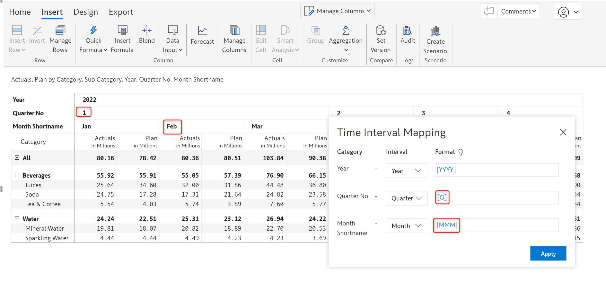

# Forecasting

With Inforiver, you can easily generate a rolling forecast and use methods like period range, average of period range, etc. to initialize the forecast. You can leverage the integrated time intelligence and time extension features as well.&#x20;

## 1. Forecast settings

Inforiver allows you to generate a forecast for up to 5 years, starting from the current year.&#x20;

<figure><figcaption>
Choosing the forecast period
</figcaption></figure>

&#x20;

<figure><figcaption>
Forecast created for 5 years
</figcaption></figure>

#### Configuring the Forecast Time Range

In the Forecast settings dialog box, set the start and end periods. E.g. if we are creating a forecast from July 2023 onwards:

1. To generate a forecast for the rest of the year, choose July 2023 to December 2023.&#x20;
2. To generate a forecast for the next quarter, choose July 2023 to September 2023.
3. &#x20;To generate a forecast for the next year, set the year dropdown to 2024.
4. To generate a forecast for the next 5 years, set the year dropdown to 2028.

<figure><figcaption>
Forecast initialization
</figcaption></figure>

Click on the 'Next' button to configure the forecast.

## 2. Generating a forecast

The Forecast dialog box has the following configurations:

**1. Title**: By default, the forecast measure is named ‘Forecast’. This can be updated to a relevant column name.

**2. Select Forecast Period**: The starting period for which a forecast is being created. By default, this is set to the current month and year. It can be set to any month in the future.

**3. Closed Period:** This is a static message that indicates the date range available in the input dataset. The dataset used in this example has data from January to December 2022.

<figure><figcaption>
Closed period
</figcaption></figure>

**4. Copy from:** The new forecast measure will be created for past or closed periods as well.  The Copy From option allows you to select the series to be used as the data source. If Actuals is selected, then the forecast measure for 2022 will be populated from Actuals. If Plan is selected, then the forecast measure for 2022 will be populated from Plan.&#x20;

<figure><figcaption>
Copy from option
</figcaption></figure>

Forecasts created for closed/past periods would be as shown in the image below. These are greyed out and cannot be edited.  When column subtotals are enabled, the forecast for subtotals will also be greyed out for closed periods.

<figure><figcaption>
Static forecast for 2022 created from Actuals
</figcaption></figure>

**5. Period:** The time frame of the forecast. In this example, we are creating a forecast for a year - from August 2023 to August 2024.

<figure><figcaption>
Forecast period range
</figcaption></figure>

You can also split the forecast period into multiple time frames and use different options for each period. To create a rolling forecast, you need to define the settings for the entire forecast period.&#x20;

To demonstrate this feature, let us consider an example wherein:

* The forecast from August to September 2023 should be based on the Actuals from the previous year i.e. August to September 2022.   &#x20;
* The forecast from October to December 2023 should be based on the average of Actuals from the previous year i.e. January to December 2022.      &#x20;
* The forecast for the next year, 2024(January to August) should be based on the Plan from December 2022.                                                                                                                                                                                                                                                                                  &#x20;

This can be achieved using the configuration shown below.

<figure><figcaption>
Rolling forecast created using multiple period ranges
</figcaption></figure>

The forecast created is shown in the images below.

* The forecast for August to September 2023 has been created from the Actuals from the previous year i.e. August to September 2022.

<figure><figcaption>
First period of rolling forecast with period range as copy method
</figcaption></figure>

* The forecast from October to December 2023 has been created from the average of Actuals from the previous year i.e. average from January to December 2022.      &#x20;

<figure><figcaption>
Second period of rolling forecast with average of period range as copy method
</figcaption></figure>

* The forecast for the next year, 2024(January to August) has been created from the Plan from December 2022.  &#x20;

<figure><figcaption>
Third period of rolling forecast with single period as copy method
</figcaption></figure>

**6. Source series:** Choose the measure which will be the data source for the forecast. To manually enter all the forecasts, select the Blank option.

<figure><figcaption>
Selecting the data source
</figcaption></figure>

**7. Copy Method:** Method used to initialize the forecast. There are 3 methods that can be used to populate the forecast:

&#x20;**a) Period Range:** A range of months will be used to populate the forecast. Consider creating a forecast for the next quarter i.e. October 2023 to December 2023. Any period range of 3 months can be used to initialize the forecast, in this case, we will use data from Q1, 2022 as shown in the images below.

<figure><figcaption>
Period range as copy method
</figcaption></figure>

<figure><figcaption>
Forecast created using period range
</figcaption></figure>

**b) Single Period:** The data for any particular period will be used to initialize the forecast. In this case, the Plan from December 2022 is used to initialize the data for the entire forecast from  August 2023 to August 2024.

<figure><figcaption>
Single period as copy method
</figcaption></figure>

<figure><figcaption>
Forecast created using single period
</figcaption></figure>

**c) Average of Period Range:** The average value of a measure, over a user-defined range of time is calculated and used to initialize the forecast. In this case, the average of Actuals from October to December 2022 will be used to create the entire forecast.

<figure><figcaption>
Average of period range as copy method
</figcaption></figure>

<figure><figcaption>
Forecast created using average of period range
</figcaption></figure>

**8. Period Selection:** This is used to create rolling forecasts and split the forecast period into multiple time frames.&#x20;

## 3. Time intelligence settings

Inforiver's built-in time intelligence automatically detects date formats when the data source does not contain Power BI date formats. In the image below, notice how Inforiver identifies the formats when the quarter is denoted in numbers and months are denoted as short names.

<figure><figcaption></figcaption></figure>

To view the date format or to override it, in the Insert ribbon, click on 'Manage Columns'. In the 'Inserted Columns' side pane, navigate to the Settings tab -> 'Time Interval Mapping'.


Hover over the bulb icon near Format to view the format models supported by Inforiver.


<figure><figcaption>
Time intelligence settings
</figcaption></figure>

## 4. Month-end date rollover

Once the actual monthly data is available for a particular forecasted month, the report needs to reflect the actuals instead of the forecast. Consider the case below, wherein a forecast has been created from August to year-end.

<figure><figcaption></figcaption></figure>

To roll over the forecast start period from August to September, in the Insert ribbon, click on _Manage Measures_. In the 'Inserted Columns' side pane, select the forecast measure and click on the edit icon.

<figure><figcaption>
Editing the forecast measure
</figcaption></figure>

In the Data Input side pane, select September from the _Forecast Period_ dropdown and click on the Update button.

<figure><figcaption></figcaption></figure>

Notice how the Sales and Revenue measures are now available for August and the forecast starts from September onwards.

<figure><figcaption></figcaption></figure>

## 5. Re-forecasting

After creating a forecast, you can easily re-forecast your data using Inforiver. To edit the forecast, click on _Manage Measures_ in the Insert ribbon. In the 'Inserted Columns' side pane,  click on the edit icon against the forecast measure.

<figure><figcaption>
Editing the forecast
</figcaption></figure>

Click on the Update link against the _Open Forecast Values_ option.&#x20;

<figure><figcaption>
Update forecast
</figcaption></figure>

The Update Forecast dialog box opens - you can smoothly re-forecast your data from here.

<figure><figcaption>
Re-forecast configuration
</figcaption></figure>

## 6. Extending the forecast period

Consider that a forecast has been created from September to December 2023. If you need to extend the forecast to 2024, first, the time frame needs to be updated in _Forecast Settings_. Click on _Manage Measures_ in the Insert ribbon and navigate to the Settings tab. Click on the Manage link against _Forecast Settings._

<figure><figcaption>
Extending the forecast period
</figcaption></figure>

After the forecast period has been extended, follow the steps outlined in the [Re-forecasting](forecasting.md#5.-re-forecasting) section to configure the forecast.

<figure><figcaption></figcaption></figure>

## 7. Forecast customizations

Inforiver offers a variety of customizations that can be applied once the forecast is created.&#x20;

#### 1. Forecast grand total

If the column grand total is enabled, you can choose whether the grand total for the forecast measure should be derived from open periods, closed periods, or both. To customize the grand total for forecasts, click on the forecast column gripper and select the desired option from the _Total Display_ section.

<figure><figcaption>
Total Display
</figcaption></figure>

**a) All Periods:** The grand total forecast will be the aggregate of the forecasts for open and closed periods.

<figure><figcaption>
All Periods
</figcaption></figure>

**b) Open Periods:** The grand total forecast will be the aggregate of the forecasts for open periods only.

<figure><figcaption>
Open Periods
</figcaption></figure>

**c) Closed Periods:** The grand total forecast will be the aggregate of the forecasts for closed periods only.

<figure><figcaption>
Closed Periods
</figcaption></figure>

#### 2. Show or hide closed periods

You can choose whether to display the forecasts for closed periods. To mask the forecast for closed periods, click on any forecast that is generated for closed periods, click on the _Show/Hide_ icon, and choose _Hide closed periods._

<figure><figcaption>
Show/Hide forecasts
</figcaption></figure>

The forecast for the closed period is hidden as shown in the image below.&#x20;

<figure><figcaption>
Hide forecast for closed period
</figcaption></figure>

To un-hide the forecasts for closed periods, click on any measure belonging to the closed period, click on the _Show/Hide_ icon, and select _Show closed periods_.
