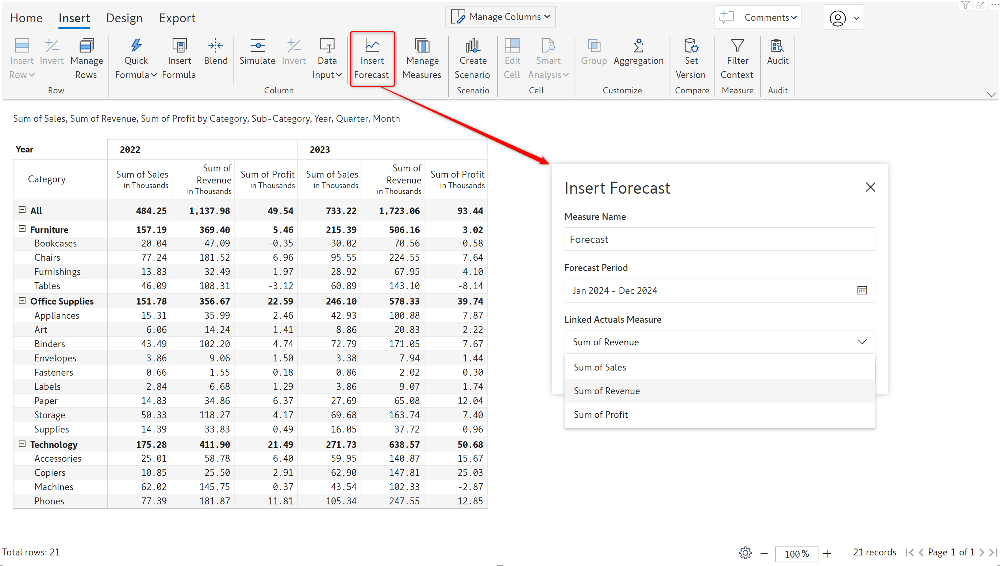
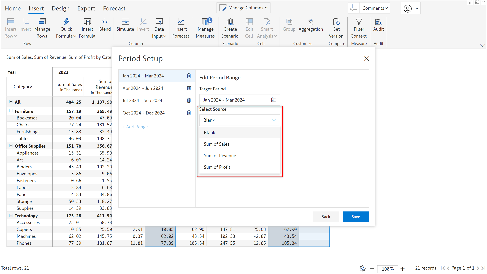

# Forecasting

With Inforiver, you can easily generate a rolling forecast and use methods like period range, average of period range, etc. to initialize the forecast. You can leverage the integrated time intelligence and time extension features to create half-yearly forecasts or fiscal period forecasts. With Inforiver, you can close the forecast once actuals are available, update the forecast, distribute deficits, and extend forecasts.

## 1. Generating a forecast

To create a forecast, click on the Insert Forecast button in the Insert ribbon. The forecast dialog box has the options listed below

**1. Measure name:** By default, the forecast measure is named ‘Forecast’. This can be updated to a relevant column name.

**2. Forecast period:** The time frame for which the forecast is being generated. Inforiver's time intelligence sets the start date to the current month - you can update the range based on your requirements.

**3. Linked actuals measure:** The new forecast measure will be created for past or closed periods as well. The _Linked actuals measure_ option allows you to select the series to be used as the data source. If Sales is selected, then the forecast measure for 2022 and 2023 will be populated from Sales. If Revenue is selected, then the forecast measure for 2022 and 2023 will be populated from Revenue.&#x20;

<figure><figcaption>
Create forecast dialog box
</figcaption></figure>

## 2. Configuring the forecast

Inforiver allows you to create rolling forecasts and choose different methods to populate the forecast values. &#x20;

**1. Target period:** You can split the forecast period into shorter time frames or configure the forecast for the whole period. In this case, we have split the forecast period into 3 parts: January to March, April to June, and July to December.

<figure><figcaption>
Rolling forecast
</figcaption></figure>

You can also configure for the entire period in one shot as shown below.

<figure><figcaption>
Configuration for entire period
</figcaption></figure>

**2. Select source:** You can choose the measure that will be used as the data source for the forecast. To manually enter the forecast values, select the 'Blank' option.

<figure><figcaption>
Forecast data source
</figcaption></figure>

**3. Apply operation:** There are 3 different methods that you can use to generate a forecast:

* **Period range**: The values from a specific period range will be used to initialize the forecast. In this case, we have used the sales from Q4 2023 (Copy period range) to populate the forecast for Q1 2024 (Target period). The duration of the period range should match the duration of the target period. E.g., if the target period is 6 months, then you must select a period range spanning 6 months.

<figure><figcaption>
Period range
</figcaption></figure>

* **Single period:** The values for a specific month will be used to initialize the forecast. In this case, we have used the revenue from December 2022 to populate the forecast for Apr to Jun 2024.

<figure><figcaption>
Single period
</figcaption></figure>

* **Average of period range**: The average of a custom time period will be used to initialize the forecast. In this case, we have used the average revenue from Jan 2022 to Dec 2023 to initialize the forecast.

<figure><figcaption>
Average of period range
</figcaption></figure>

**4. Copy period range:** The time frame for which to copy data from the source measure.

<figure><figcaption>
Period range
</figcaption></figure>

 

<figure><figcaption>
Single month
</figcaption></figure>

 

<figure><figcaption>
Custom time frame
</figcaption></figure>

## 3. Analysing the forecast

Let's look at the forecast generated with the configurations in the earlier sections.

* **Closed period forecasts**

The forecast measure generated for previous or closed periods will be greyed out and cannot be edited. In section 1, we had assigned the Sales measure to populate the forecasts for past periods.

<figure><figcaption>
Forecasts for closed periods
</figcaption></figure>

* **Forecast using period range**&#x20;

We used the Sales measure from Oct to Dec 2023, to populate for forecast from Jan to Mar 2024. For clarity, in this image, we have displayed only Sales and Forecast measures.

<figure><figcaption>
Period range
</figcaption></figure>

* **Forecast using single period**

We used the revenue from December 2022 to create the forecast from April to June 2024. For clarity, in this image, we have displayed only Revenue and Forecast measures.

<figure><figcaption>
Forecast using single period
</figcaption></figure>

* **Forecast using average of period range**

We used the average revenue from Jan 2022 to Dec 2023 to create the forecast from July to December 2024.

<figure><figcaption>
Average of period range
</figcaption></figure>

## 3. Forecast customizations

Inforiver offers customizations that can be applied once the forecast is created.&#x20;

#### 1. Values display

You have the flexibility to retain the forecasted values or use the actuals after closing a forecast. Click on the Values Display button to open the Set Value Display window.

i) Show Values - Forecast

The forecast value is retained even after the actuals are available. This setting enables you to compare the actuals against the predicted values.

<figure><figcaption>
Retain forecast values
</figcaption></figure>

ii) Show Values - Actuals

The forecasted values are overwritten when the period is closed and the actuals become available. The forecast values are highlighted in blue indicating that they are linked to an actuals value - any updates made to the actuals will be reflected in the forecast. To view the underlying actuals measure, navigate to edit forecast > Linked Actuals Measure.

<figure><figcaption>
Overwrite forecast with actuals
</figcaption></figure>

#### 2. Forecast grand total

If the column grand total is enabled, you can choose whether the grand total for the forecast measure should be derived from open periods, closed periods, or both. To customize the grand total for forecasts, click on the forecast column gripper and select the desired option from the _Total Display_ section.

<figure><figcaption>
Total Display
</figcaption></figure>

**a) All Periods:** The grand total forecast will be the aggregate of the forecasts for open and closed periods.

<figure><figcaption>
All Periods
</figcaption></figure>

**b) Open Periods:** The grand total forecast will be the aggregate of the forecasts for open periods only.

<figure><figcaption>
Open Periods
</figcaption></figure>

**c) Closed Periods:** The grand total forecast will be the aggregate of the forecasts for closed periods only.

<figure><figcaption>
Closed Periods
</figcaption></figure>

#### 3. Show or hide closed periods

You can choose whether to display the forecasts for closed periods. To mask the forecast for closed periods, click on any forecast that is generated for closed periods, click on the _Show/Hide_ icon, and choose _Hide closed periods._

<figure><figcaption>
Show/Hide forecasts
</figcaption></figure>

The forecast for the closed period is hidden as shown in the image below.&#x20;

<figure><figcaption>
Hide forecast for closed period
</figcaption></figure>

To un-hide the forecasts for closed periods, click on any measure belonging to the closed period, click on the _Show/Hide_ icon, and select _Show closed periods_.
