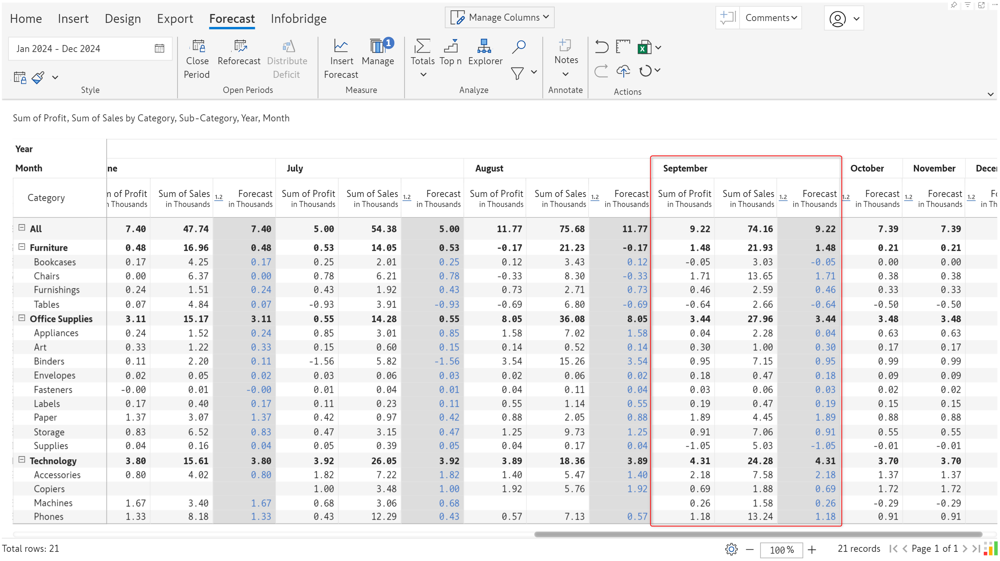

# Forecasting

With Inforiver, you can easily generate a rolling forecast and use methods like period range, average of period range, or apply formulas to initialize the forecast. Leverage the integrated time intelligence and time extension features to create half-yearly forecasts or fiscal period forecasts. In this section, discover how to configure forecasts,  close the forecast once actuals are available, update forecasts, distribute deficits, and extend forecasts.

## 1. Generating a forecast

To create a forecast, click the **Insert Forecast** button in the Insert ribbon. The forecast dialog box allows you to configure forecasts for open(future) and closed(past) periods.

<figure><figcaption>
Forecast configuration for open and closed forecasts
</figcaption></figure>

**1. Measure name:** By default, the forecast measure is named ‘Forecast’. This can be updated to a relevant column name.

**2. Forecast period:** The time frame for which the forecast is being generated. Inforiver's time intelligence sets the start date to the current month - you can update the range based on your requirements.

**3. Closed Period:** The new forecast measure will be created for past or closed periods as well. If you have actuals for 2024 and are generating a forecast for 2025, 2024 will be considered as the closed period. Inforiver provides 2 options to populate closed forecasts:

* **Measure:** The Linked Measure dropdown option allows you to select native measures, data input measures, formula measures, or other forecasts as the source for closed periods. For instance, if you select the _Revenue - formula_ measure, closed periods will have the values from the formula measure.

<figure><figcaption>
Measure option for closed forecasts
</figcaption></figure>

<figure><figcaption>
Closed forecast from formula measure
</figcaption></figure> <figure><figcaption>
Native measures to populate closed forecasts
</figcaption></figure>


There will be differences in the totals and sub-totals when formula measures are used to populate forecasts. This is because the default aggregation method for formula measures is 'Formula' and 'Sum' for forecasts.&#x20;


* **Formula:**  You can write custom formulas and leverage Inforiver's extensive selection of built-in formulas to populate closed forecasts.&#x20;

<figure><figcaption>
Formula based closed forecast
</figcaption></figure>

**4. Open Period:** Inforiver offers a range of options to configure forecasts. You can source forecasts from native measures/visual measures, use formulae, or enter values with the data input option.

* **Measure**

If you already have projections in your data source, you can populate the forecasts for open periods from a native measure with the **Measure** option.

<figure><figcaption>
Using a source measure for forecasts
</figcaption></figure> <figure><figcaption>
Open forecast created from a measure
</figcaption></figure>

You can hide the native measure after creating the forecast to avoid displaying the data twice.

* **Formula**

You can apply formulas to native measures/visual measures to generate forecasts. In this example, we've created a revenue forecast by multiplying 25% of the projected sales(native measure) with the projected quantity(data input measure).

<figure><figcaption>
Populating forecasts from formulas
</figcaption></figure>

* **Data input**

You can specify a default value if you choose to manually input forecast values. The default value can be static, a measure, formula or left blank.

<figure><figcaption>
Default data input options
</figcaption></figure>

a) Static value

The specified static value will be used as a default value when the configured forecast values are null. In the example, the forecast has been created from the ProjectedRevenue native measure which is blank for the _Juices_ category. The static value of 5 million is used in the forecast measure as the default value.

<figure><figcaption>
Static default value for forecasts
</figcaption></figure> <figure><figcaption>
Default static value used in forecasts
</figcaption></figure>

b) Measure

You can use a visual or native measure as the default forecast value when forecasts are blank. In the example, the forecast is based on the ProjectedRevenue native measure which is null for the _Juices_ category. The EnhancedSales data input measure has been used as the default forecast instead of displaying null values.

<figure><figcaption>
Set a measure as default forecast value
</figcaption></figure> <figure><figcaption>
Measure used as a default value
</figcaption></figure>

c) Formula

You can also use a formula as a default value. In this case, we've used 25% of the EnhancedSales data input measure as the default forecast value.

<figure><figcaption>
Formula as default forecast
</figcaption></figure> <figure><figcaption>
Default forecast generated from a formula
</figcaption></figure>

## 2. Configuring the forecast

Inforiver allows you to create rolling forecasts and choose different methods to populate the forecast values. &#x20;


These options are applicable only if you choose **Data Input** for open periods.


**1. Target period:** You can split the forecast period into shorter time frames or configure the forecast for the whole period. In this case, we have split the forecast period into 3 parts: January to March, April to June, and July to December.

<figure><figcaption>
Rolling forecast
</figcaption></figure>

You can also configure for the entire period in one shot as shown below.

<figure><figcaption>
Configuration for entire period
</figcaption></figure>

**2. Select source:** You can choose any of the options listed below to populate the forecast-

* Blank: Enter values manually
* Use a measure
* Upload forecast from a file

<figure><figcaption>
Forecast source options
</figcaption></figure>

If you choose to upload forecast values from a file, Inforiver will generate a template file that you can download. You can fill the forecast values in the template file and upload them to the visual.

<figure><figcaption>
Downloading and entering values in the template file
</figcaption></figure> <figure><figcaption>
Forecast values uploaded from an excel file
</figcaption></figure>

**3. Apply operation:** There are 3 different methods that you can use to generate a forecast:

* **Period range**: The values from a specific period range will be used to initialize the forecast. In this case, we have used the sales from Q4 2023 (Copy period range) to populate the forecast for Q1 2024 (Target period). The duration of the period range should match the duration of the target period. E.g., if the target period is 6 months, then you must select a period range spanning 6 months.

<figure><figcaption>
Period range
</figcaption></figure>

* **Single period:** The values for a specific month will be used to initialize the forecast. In this case, we have used the revenue from December 2022 to populate the forecast for Apr to Jun 2024.

<figure><figcaption>
Single period
</figcaption></figure>

* **Average of period range**: The average of a custom time period will be used to initialize the forecast. In this case, we have used the average revenue from Jan 2022 to Dec 2023 to initialize the forecast.

<figure><figcaption>
Average of period range
</figcaption></figure>

**4. Copy period range:** The time frame for which to copy data from the source measure.

<figure><figcaption>
Period range
</figcaption></figure> <figure><figcaption>
Single month
</figcaption></figure> <figure><figcaption>
Custom time frame
</figcaption></figure>

## 3. Analysing the forecast

Let's look at the forecast generated with the configurations in the earlier sections.

* **Closed period forecasts**

The forecast measure generated for previous or closed periods will be greyed out and cannot be edited. Refer to section 1, [generating a forecast](forecasting.md#id-1.-generating-a-forecast) to learn more about configuring closed periods.

<figure><figcaption>
Forecasts for closed periods
</figcaption></figure>

* **Forecast using period range**&#x20;

In the example, we've used the Sales measure from Oct to Dec 2023, to populate for forecast from Jan to Mar 2024.&#x20;

<figure><figcaption>
Period range
</figcaption></figure>

* **Forecast using single period**

We've used the revenue from December 2022 to create the forecast from April to June 2024.&#x20;

<figure><figcaption>
Forecast using single period
</figcaption></figure>

* **Forecast using average of period range**

We've used the average revenue from Jan 2022 to Dec 2023 to create the forecast from July to December 2024.

<figure><figcaption>
Average of period range
</figcaption></figure>

## 3. Forecast customizations

Inforiver offers customizations that can be applied once the forecast is created.&#x20;

#### 3.1. Action for closed periods

You have the flexibility to retain the forecasted values or use the actuals after closing a forecast. Navigate to Manage Forecast > Click the edit button against the forecast measure > Action for closed periods section.

<figure><figcaption></figcaption></figure>

a) Overwrite forecasts (default)

The forecasted values are overwritten when the period is closed and the actuals become available. The forecast values are highlighted in blue indicating that they are linked to an actuals value - any updates made to the actuals will be reflected in the forecast. To view the underlying actuals measure, navigate to edit forecast > Linked Actuals Measure.

We've created a forecast from September to December. When the actuals become available for September and the period is closed, the forecasted values are replaced by the actuals.

<figure><figcaption>
Forecast created from Sep - Dec
</figcaption></figure> <figure><figcaption>
September forecast overwritten with actuals
</figcaption></figure>

b) Retain forecasts

The forecasted values are retained even after the actuals are available. This setting enables you to compare the actuals against the predicted values.

<figure><figcaption>
Forecast generated from Sep - Dec
</figcaption></figure> <figure><figcaption>
Sep forecast retained after period close
</figcaption></figure>

#### 3.2. Aggregate forecast grand total

If the column grand total is enabled, you can choose whether the grand total for the forecast measure should be derived from open periods, closed periods, or both. To customize the grand total for forecasts, click on the forecast column gripper and select the desired option from the **Aggregate total** section.

<figure><figcaption>
Aggregate total for forecasts
</figcaption></figure>

**a) All Periods:** The grand total forecast will be the aggregate of the forecasts for open and closed periods.

<figure><figcaption>
All periods aggregated forecast
</figcaption></figure>

**b) Open Periods:** The grand total forecast will be the aggregate of the forecasts for open periods only. The open periods in the example are 2025 Q1 and Q2, hence these will be used to calculate the grand total forecast.&#x20;

<figure><figcaption>
Grand total aggregation for open periods
</figcaption></figure>

The subtotal forecasts for 2023 and 2024 go blank when the Open Period option is selected. This is because 2023 and 2024 only have closed periods.

<figure><figcaption>
Closed forecast periods for 2024
</figcaption></figure>

**c) Closed Periods:** The grand total forecast will be the aggregate of the forecasts for closed periods only. In this example, the closed forecasts for 2023 and 2024 are used to calculate the grand total forecast. The subtotal forecast for 2025 is blank as 2025 only has open forecasts. The fields highlighted in red are the closed forecasts, and the field highlighted in green is the forecast grand total.

<figure><figcaption>
Closed period aggregation for grand total forecast
</figcaption></figure>

#### 3.3. Forecast subtotals

Similar to grand total forecasts, you can choose the aggregation method for forecast subtotals. The same 'All', 'Open Periods', and 'Closed Periods' options apply to forecast subtotals.

**a) All Periods:** The subtotals for the forecast measure will be the aggregate of the forecasts for open and closed periods. In the example, the fields highlighted in red are the forecast subtotals, the fields in blue are the closed periods and the fields in green are the open periods.

<figure><figcaption>
Open and closed forecasts used in calculating forecast sub totals
</figcaption></figure>

**b) Open Periods:** The forecast subtotals will be the aggregate of the forecasts for open periods only. The forecast subtotal for 2024 is blank as 2024 does not have any open forecasts.

<figure><figcaption></figcaption></figure>

**c) Closed Periods:** The forecast subtotals will be the aggregate of the forecasts for closed periods only. The fields highlighted in red are the forecast subtotals and the fields highlighted in green are the closed forecasts.&#x20;

<figure><figcaption></figcaption></figure>

#### 3.4. Show or hide closed periods

You can choose whether to display the forecasts for closed periods. To mask the forecast for closed periods, click on any forecast that is generated for closed periods, click on the _Show/Hide_ icon, and choose _Hide closed periods._

<figure><figcaption>
Show/Hide forecasts
</figcaption></figure>

The forecast for the closed period is hidden as shown in the image below.&#x20;

<figure><figcaption>
Hide forecast for closed period
</figcaption></figure>

To un-hide the forecasts for closed periods, click on any measure belonging to the closed period, click on the _Show/Hide_ icon, and select _Show closed periods_.
