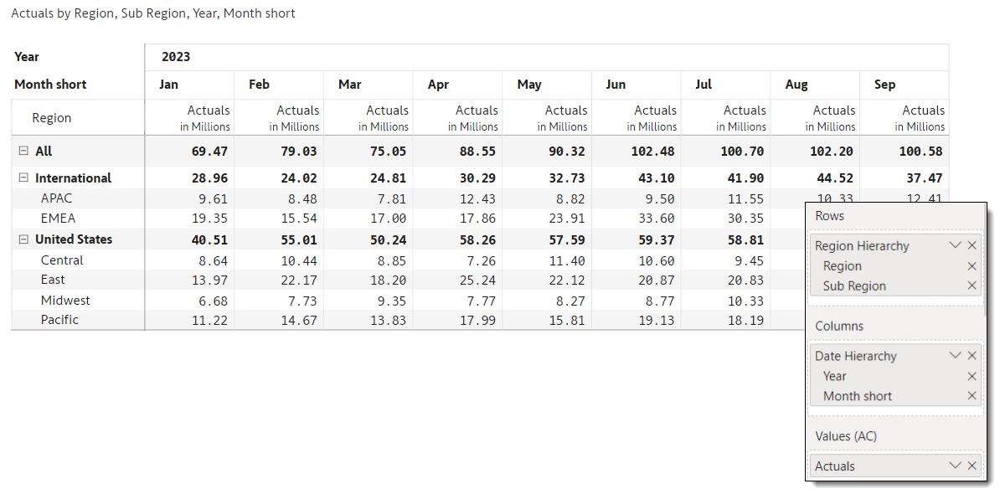
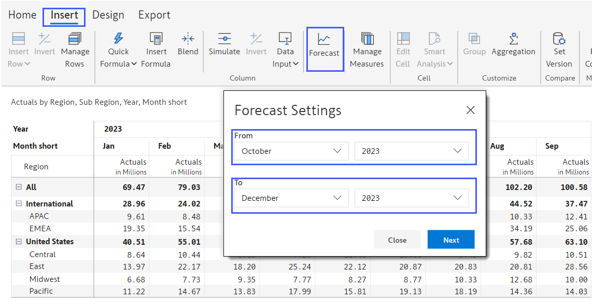
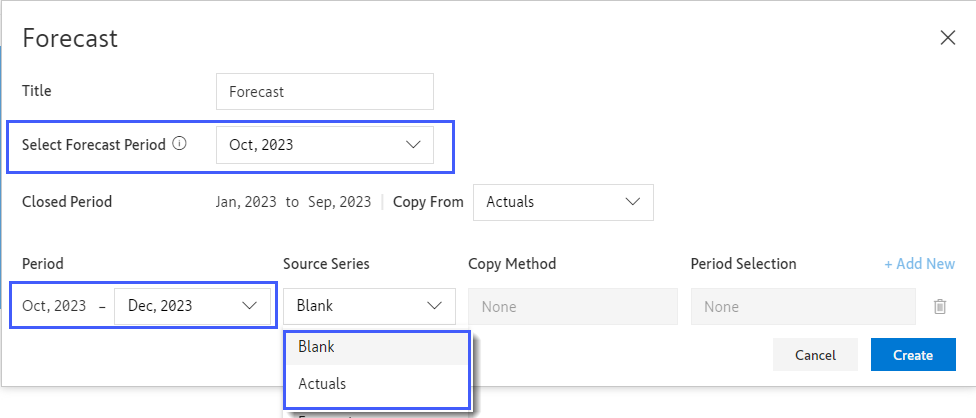
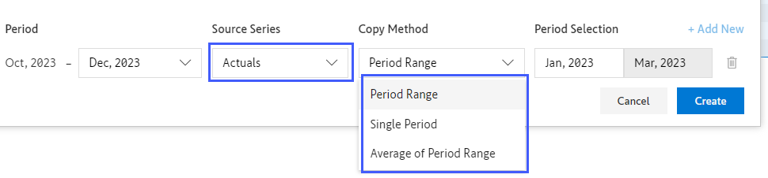

# Adding Forecasts for Periods unavailable in the model

Consider the scenario where you need to add forecasts for future periods in the sales/forecast report in Power BI. Let us assume this report sources its data from a source like SQL Server or Azure.&#x20;

Traditionally, you would reach out to the IT team or the SQL developers which would take time ranging from a few hours to a few days. But you can do it in a much faster way using Inforiver. Let us illustrate this with an example.&#x20;

ACME Corp has a sales report with performance data from Jan 2023 to Sep 2023.&#x20;

<figure><figcaption>
ACME Performance data report
</figcaption></figure>

Now let us assume the management wants to add a forecast for future periods from Oct 2023 to Dec 2023. However, these values are missing in the Power BI query & data model. &#x20;

Inforiver allows you to seamlessly add future periods to your report. Furthermore, once the month is available in the query/data model, Inforiver ensures that there is no conflict between the two. In addition, you can also smoothly perform end-of-period closure, which updates the forecast values with actuals for the closed period.

Let us explore the steps to add the future periods from Oct 2023 to Dec 2023 periods to our report.&#x20;

1. Click on **Insert -> Forecast** and the following prompt will pop up. Mention the periods for which you need to add the forecast. Inforiver allows you to generate a forecast for up to 5 years, starting from the current year. Click **Next** once you are done.

<figure><figcaption>
Insert Forecast
</figcaption></figure>

2. You will be shown a new popup window. Here we can mention how we want to populate the forecast for future periods.

<figure><figcaption>
Forecast
</figcaption></figure>

**Title:** By default, the forecast measure is named ‘Forecast’. &#x20;

**Select Forecast Period:** The starting period for which a forecast is being created. By default, this is set to the current month and year. It can be set to any month in the future. Your report will insert columns starting from this period.&#x20;

**Closed Period:** Since we want to forecast from Oct 2023, Inforiver understands that the period from Jan to Sep 2023 has already elapsed/closed. You can designate the series from which you want to copy the data for these closed periods. In our case, it is the measure ‘Actuals’.&#x20;

**Period:** In the last line, we mention that we want to insert the periods from Oct to Dec 2023, and we want to leave them blank.&#x20;

By default, several methods are available to pre-populate forecasts for future periods, but in this case, we will leave them blank.

Note that it is also possible to add another line in **Period** and state that we want to create additional fields for Jan 2024 to Jun 2024, and auto-populate these fields from another measure, say, _Budget 2024_.&#x20;

**Copy Method:** Method used to initialize the forecast. Since we chose to leave the fields blank, you will not see any methods by default. But if you temporarily switch the source series to Actuals, you will see these three methods.&#x20;

<figure><figcaption>
Forecast - Copy Methods
</figcaption></figure>

* **Period Range:** A range of months in the original series that will be used to populate the forecast. For example, we can copy data from Jan to Mar and use it for Oct to Dec.&#x20;
* **Single Period:** The data for any period will be used to initialize the forecast. E.g., We can take Jan 2023 data and copy it to all months from Oct to Dec.&#x20;
* **Average of Period Range:** The average value of a measure, over a user-defined range of time is calculated and used to initialize the forecast for Oct to Dec.

3. Click the **Create** button.&#x20;
4. Once you click **Create**, you will notice a second series ‘Forecast’, which has an exact copy of the values for the existing periods Jan to Sep. Three new blank forecast periods from Oct to Dec are also added at the end.

<figure><figcaption>
2023 Actuals and Forecast
</figcaption></figure>

5. Let us start entering our forecasts now. Double-click the value for Oct for the _ALL_ region. A formula bar appears above the table. Type in ‘105m’ in the formula bar.

<figure><figcaption></figcaption></figure>
