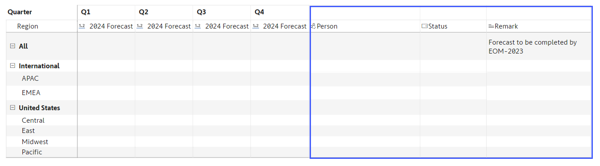
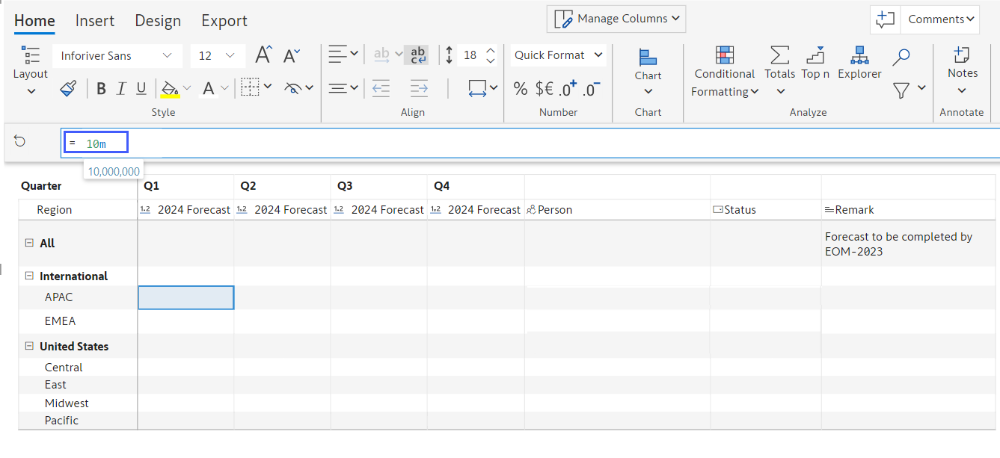

# Forecast using a Blank Template

A common requirement for organizations is to forecast using a blank template in Power BI, just as we would do with Microsoft Excel. Data may be entered by a single individual, or by many individuals across the organization.&#x20;

Let us explore how we can set this up quickly in Power BI using Inforiver.&#x20;

In our case, ACME Inc. wants to create sales forecasts for all four quarters of the year 2024 for each geography. These are the steps involved.&#x20;

1. Launch Inforiver Matrix visual.&#x20;

<figure><figcaption>
Launch Inforiver
</figcaption></figure>

2. Assign _Region_ & _Sub Region_ categories to rows and _Quarters_ to columns. You will have a blank table structure.

<figure><figcaption>
Creating a blank report
</figcaption></figure>

3. We will now create a data input field (a forecast measure) so that users can type in their values. To do this, click on **Insert -> Data Input -> Number** (since it is a numeric field type) **-> Insert a new empty series.**&#x20;

<figure><figcaption>
Create Data Input fields
</figcaption></figure>

4. Name the column _2024 Forecast_ and click on **Create**.&#x20;

<figure><figcaption>
Name the forecast columns
</figcaption></figure>

5. You will get a blank template with four columns. You can also add additional fields of other types (text, multi-select, date, etc.) using the same Data Input menu shown earlier.

<figure><figcaption>
Blank Template with 4 forecast columns
</figcaption></figure>

6. Let us go ahead & add these fields:

* a 'Person' column for inputting users' names from the organization. The list of names comes from the Office365 directory.
* a 'Status' text drop-down field, and
* a 'Remark' column for entering multi-line comments.&#x20;

<figure><figcaption>
Add other fields
</figcaption></figure>

7. Let us start entering our forecasts now. Double-click the value for _Q1_ for the _APAC_ region. A formula bar appears above the table. Type in ‘10m’ in the formula bar.

<figure><figcaption>
Enter forecast values
</figcaption></figure>

8. Press Enter, and the _APAC_ values automatically roll up to the _International_ region and _All_ (company-level total). This makes hierarchical budgeting easier without having to write formulas at each parent level.

<figure><figcaption>
Automatic roll-up to the top levels
</figcaption></figure>

9. Similarly, you can go ahead by filling out values for the other granular regions. Assign the people & status fields to each row.

<figure><figcaption>
Assign people and status
</figcaption></figure>

Just like we entered the values, other users in the organization also can enter the values for their respective regions.&#x20;

This is how a sales forecast can be done using Inforiver with a blank template in Power BI.

&#x20;
