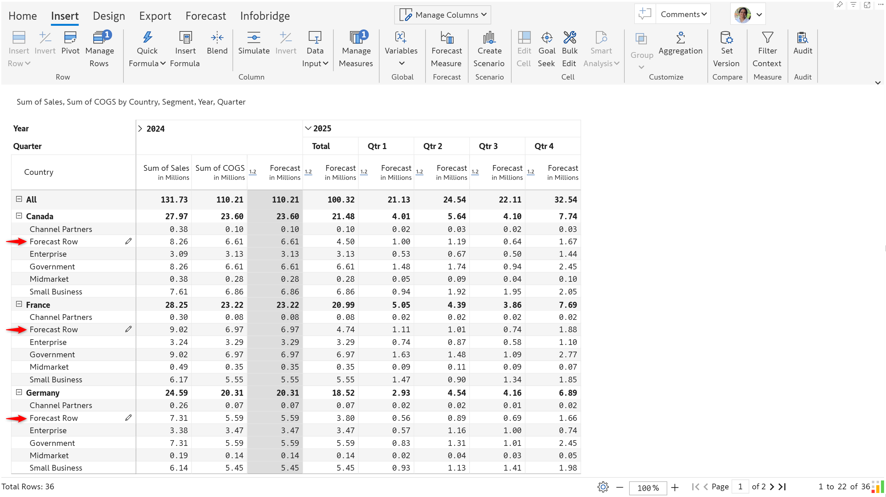
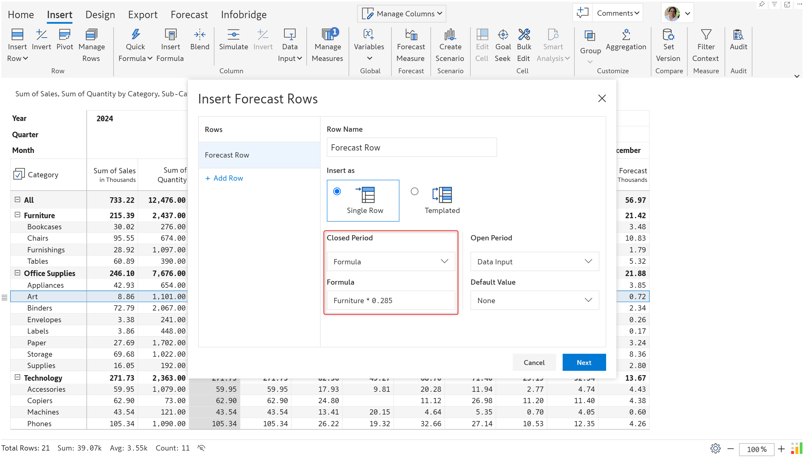
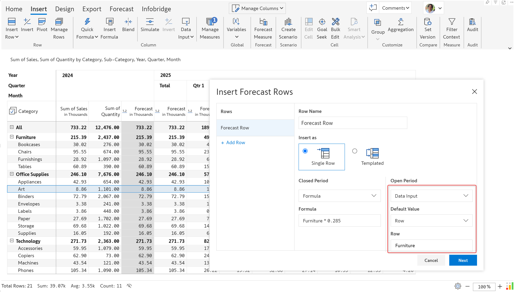
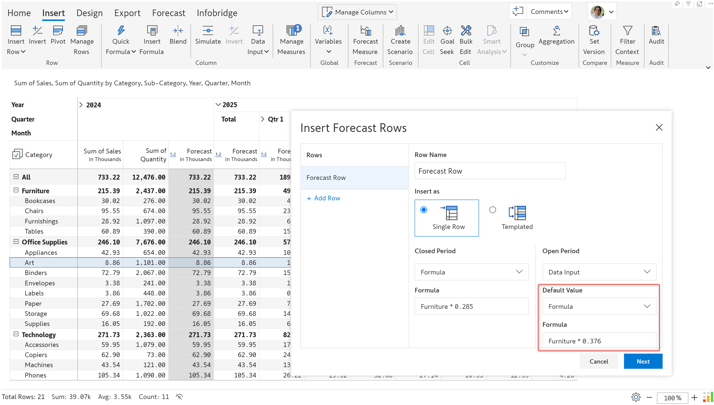
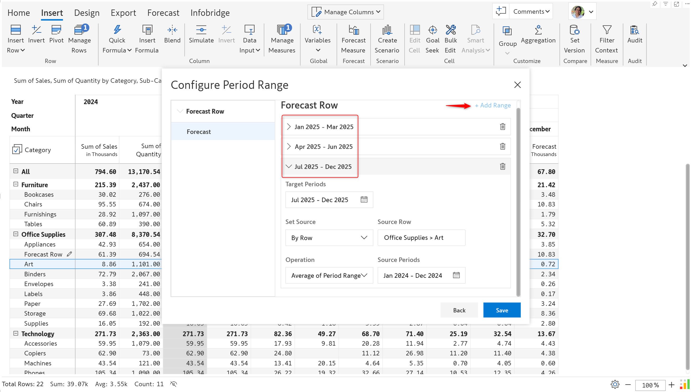
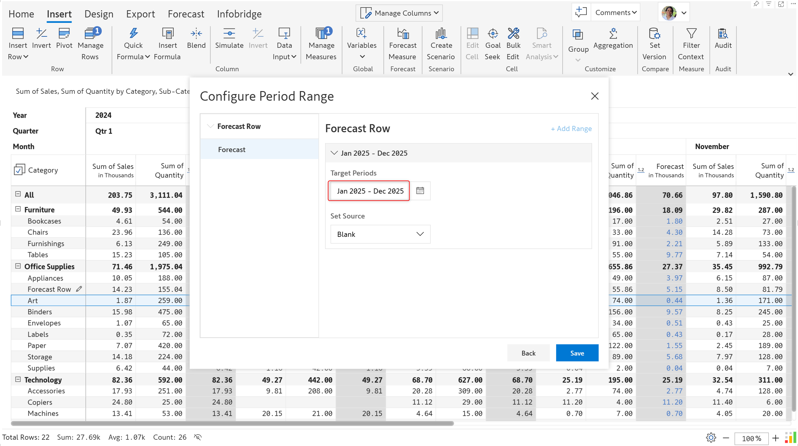
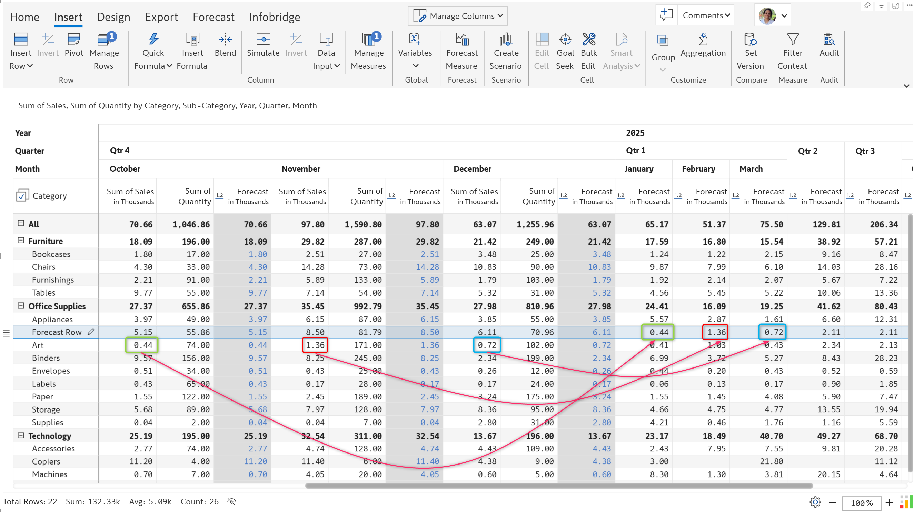
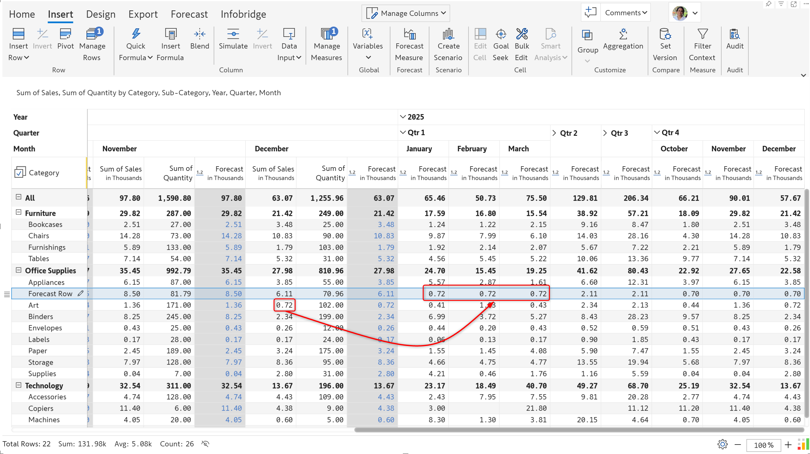
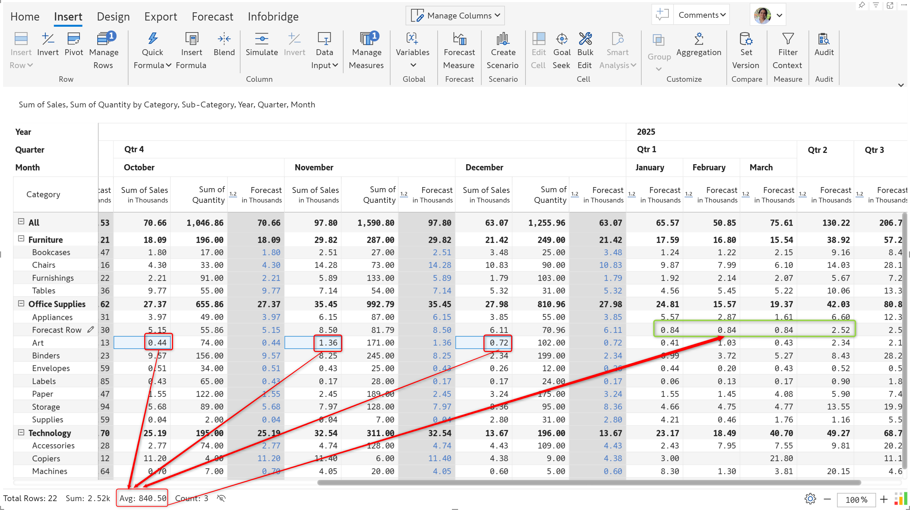

# Row level forecast

Create row-level forecasts to predict outcomes at a detailed level, such as based on the region or product line. After creating a regular forecast, you can create row-level forecasts by selecting a row and choosing the **Forecast Row** option from the Insert Row menu.

<figure><figcaption>
Forecast row option
</figcaption></figure>

### 1. Generating a forecast

The options shown in the screenshot need to be configured to generate a row forecast.

<figure><figcaption>
Options for generating a row forecast
</figcaption></figure>

**1.1. Row name:** The row category label that will hold forecasted values.

**1.2. Insert as:** Choose to insert a single forecast row or replicate the forecast row across all levels of the hierarchy with the Templated option.


Select the Templated option when the row categories repeat across all levels of the hierarchy.


<figure><figcaption>
Single forecast row
</figcaption></figure> <figure><figcaption>
Templated row forecast
</figcaption></figure>

**1.4. Closed period:** The forecast row for earlier or closed periods can be populated by referencing the values from another row or by entering a formula.

<figure><figcaption>
Closed period forecast from linked row
</figcaption></figure> <figure><figcaption>
Closed period forecast based on formula
</figcaption></figure>

**1.5. Open period:** The forecasts for future or open periods can be populated in 3 ways

* **Linked row:** Refer to the values from another row.

<figure><figcaption>
Open forecasts based on linked row
</figcaption></figure>

* **Formula**: Enter a formula to populate open forecasts.

<figure><figcaption>
Open forecasts based on a formula
</figcaption></figure>

* **Data input:** Manually enter forecast values. When you choose the data input option, you can specify default values for the forecast. Opt for a static value, reference another row, or specify a formula.

<figure><figcaption>
Static default value
</figcaption></figure> <figure><figcaption>
Default value based on another row
</figcaption></figure> <figure><figcaption>
Default value based on a formula
</figcaption></figure>

**2.1. Target periods:** The forecast time frame is configured when you [create a forecast measure](../forecasting.md#id-1.-generating-a-forecast). You can configure the entire row forecast with a single time range or split the forecast period into multiple time frames. Use the **Add Range** link to create additional forecast ranges.

<figure><figcaption>
Forecast split across time ranges
</figcaption></figure> <figure><figcaption>
Single configuration for the entire forecast period
</figcaption></figure>

When you split the forecast time range, you must create time ranges spanning the entire forecasting period. For example, if your forecasting period is Jan 2025 - Dec 2025, you must cover this entire time period when you split it. Inforiver will display a red error icon and will not allow you to create the forecast until all the time ranges are configured.

<figure><figcaption>
Splitting the forecast time frame
</figcaption></figure>

**2.2. Set source:** You can opt for a blank forecast to manually enter values or refer to another row.

<figure><figcaption>
Configure a blank forecast or use the values from another row
</figcaption></figure>

**2.3. Source row:** When you choose the **By Row** option in the previous step, you need to select the row whose values will populate the forecast.

<figure><figcaption>
Selecting the row category
</figcaption></figure>

**2.4. Operation:** You can create forecasts using the following options:

* **Period range:** The forecast values will be copied from the range specified. In this case, we are sourcing the forecast for Jan 2025 to Mar 2025 from Oct 2024 to Dec 2024.

<figure><figcaption>
Period range config
</figcaption></figure> <figure><figcaption>
Period range forecast
</figcaption></figure>

* **Single period:** The values from the selected period are used to populate the forecast.

<figure><figcaption>
Single period config
</figcaption></figure> <figure><figcaption>
Single period forecast
</figcaption></figure>

* **Average of period range:** Use the average of the selected period range to populate the forecast.

<figure><figcaption>
Average of period range config
</figcaption></figure> <figure><figcaption>
Average of period range forecast
</figcaption></figure>

