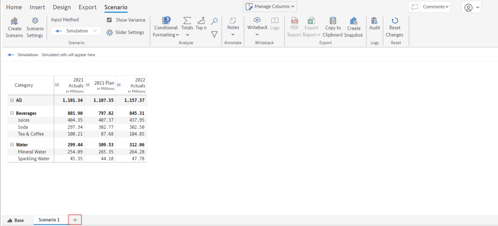
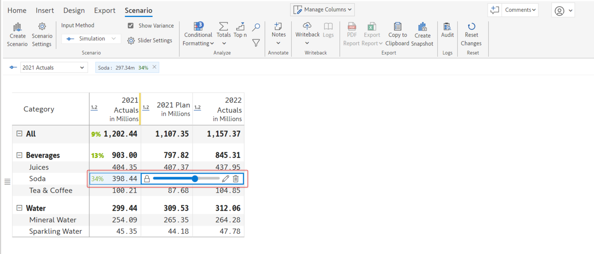

# Scenarios (Enterprise only)

Inforiver Enterprise offers the ability to create new scenarios in edit and read modes based on an existing series for ad-hoc analysis. Once a scenario is created, you can either simulate or perform allocations on the native measures.

Scenarios are interactive and can be edited unless it’s explicitly locked. They can be created in both reading and edit mode and can be shared with other users. You can writeback all or specific scenarios and enable automatic writeback if required.

## 1. Create a scenario


To create a scenario you need to log in with your Microsoft 365 account


You can create a new scenario by clicking the 'Create scenario' button under the 'Insert' tab of the Inforiver toolbar.

<figure><figcaption>
Create scenario option
</figcaption></figure>

Clicking this option will open up a 'Create scenario' modal. This modal has a general tab and a permissions tab.


The general and permission settings can be edited later after the creation


### i) General

Under the 'General' tab, you can configure the general scenario options and properties. You will find the following two options under this tab:

<figure><figcaption></figcaption></figure>

**Scenario name** - In this input field, you can specify the name of the scenario

**Include series in scenario** -This field by default has all the metrics added. You can however add or exclude the series you want in your scenario.

**Start period and End period** - Here you can specify the starting and ending periods of the scenario

### ii) Permission

Under the 'Permission' tab, you can configure the scenario permissions.&#x20;

<figure><figcaption></figcaption></figure>

In the **Who can share the scenario** section, you can see the following two options:

**i) All users within your company domain** - If this option is selected, then all the users within your company domain will be able to share the created scenario

**ii) Specific users within your company domain** - Selecting this option will allow only the specified users to share the created scenario. If this option is selected, the 'Add users' input field becomes available. You can specify the email id of the people who can share this scenario in this input field.

<figure><figcaption></figcaption></figure>

Once all the permissions and settings are configured, click 'Create' to create a scenario.

## 2. Create a scenario in reading view mode

Creating a scenario in reading view mode follows the same procedure as the edit mode.&#x20;

But there is one additional step, you need to enable the 'Scenario tab' in the 'Allowed User Controls' modal. You can learn more about configuring the allowed user controls modal [here](https://docs.inforiver.com/working-with-inforiver/3.-basic-interactions/actions/toolbar-options#6.-set-reading-view-access).

<figure><figcaption>
Enable scenario tab in reading view mode
</figcaption></figure>

## 3. Configure scenario

If a new scenario is successfully created, you will see a 'Scenario' tab in the Inforiver toolbar.

<figure><figcaption>
Scenario tab
</figcaption></figure>

The scenario tab has the following options to configure the scenario-related settings:

### i) Create scenario

This option lets you create a new scenario. Clicking on this option will open up the 'Create scenario' modal. You can learn more about how to create a scenario [here](scenarios-enterprise-only.md#1.-create-a-scenario).

<figure><figcaption>
Create scenario option
</figcaption></figure>

Alternatively, you can click the '+' icon next to your current scenario tab to create a new scenario.

<figure><figcaption>
Create scenario icon option
</figcaption></figure>

### ii) Scenario settings

This option lets you edit the previously configured scenario settings. Clicking this option will open up the 'Edit scenario' modal.

<figure><figcaption>
Scenario settings option
</figcaption></figure>

In this modal, you can configure the general and permission settings.

<figure><figcaption>
Edit scenario modal
</figcaption></figure>

If you want to lock your scenario, enable the 'Lock scenario' checkbox. A locked scenario cannot be edited.

<figure><figcaption>
Lock scenario option
</figcaption></figure>

### iii) Input method&#x20;

Inforiver offers two types of input methods: simulation and distribution.

<figure><figcaption>
Input method option
</figcaption></figure>

#### a) Simulation

If you choose the simulation input method, each cell will have a [simulation slider](../4.-adding-business-logic-and-formulae/what-if-analysis-and-simulations.md#ii-simulation-slider). You can calibrate the slider to adjust the value and simulate changes. Once simulations is performed, you can track them below the toolbar.

<figure><figcaption>
Simulation option
</figcaption></figure>

#### b) Distribution

Using this method you can [distribute](../4.-adding-business-logic-and-formulae/budgeting-and-allocations.md) the value across descendants.

<figure><figcaption>
Distribution option
</figcaption></figure>

### iv) Show variance

If you enable this option, you will see the percentage of variance to the left of the data metrics.

<figure><figcaption>
Show variance option
</figcaption></figure>

### v) Slider settings

If you click the 'Slider settings' option, the 'Variance settings' modal will open up.

<figure><figcaption>
Variance settings modal
</figcaption></figure>

This modal has the following options:

a) **Series** - Displays the name of the series in the scenario

b) **Increase is good** - This toggle is enabled by default. If this is turned on, then the percentage increase will be displayed in green. If this option is disabled, then the increase in value or percentage will be displayed in red.

<figure><figcaption></figcaption></figure>

c) **Value range** - In this field, you can configure the maximum value of the range. The default is 100%.

### vi) Copy to base scenario

You may perform simulations on different scenarios before arriving at the most optimal option. Any simulations on Data Input measures in a scenario can be updated to the base scenario using the Copy to Base option.

In the below scenario, the measure 2023 Forecast is created by[ adding a new measure](../4.-adding-business-logic-and-formulae/insert-manual-input-columns/insert-manual-input-columns.md#1.-create-a-column) to the report. The simulations on 2023 Forecast in Scenario2 will be reflected in report after selecting the Copy to Base option.

<figure><figcaption>
Additional options
</figcaption></figure>

On selecting Copy to Base, a dialog box opens up which contains the list of columns that will be exported.

<figure><figcaption>
Copy to Base Modal
</figcaption></figure>

&#x20;On clicking on the Proceed button, the simulations in the scenario for 2023 Forecast have now been updated in the report.

<figure><figcaption>
Report with values set up in a scenario
</figcaption></figure>

### vii) Edit/duplicate/delete

To edit, delete or duplicate a scenario - click on the additional options menu icon that appears on hovering over the name of the scenario and select the relevant option.

<figure><figcaption>
Copy to Base
</figcaption></figure>

&#x20;In the next section, we'll look at [budgeting and allocations](../4.-adding-business-logic-and-formulae/budgeting-and-allocations.md).
