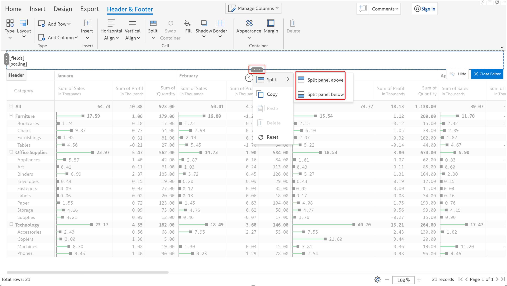
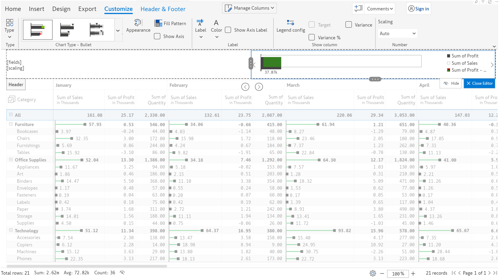
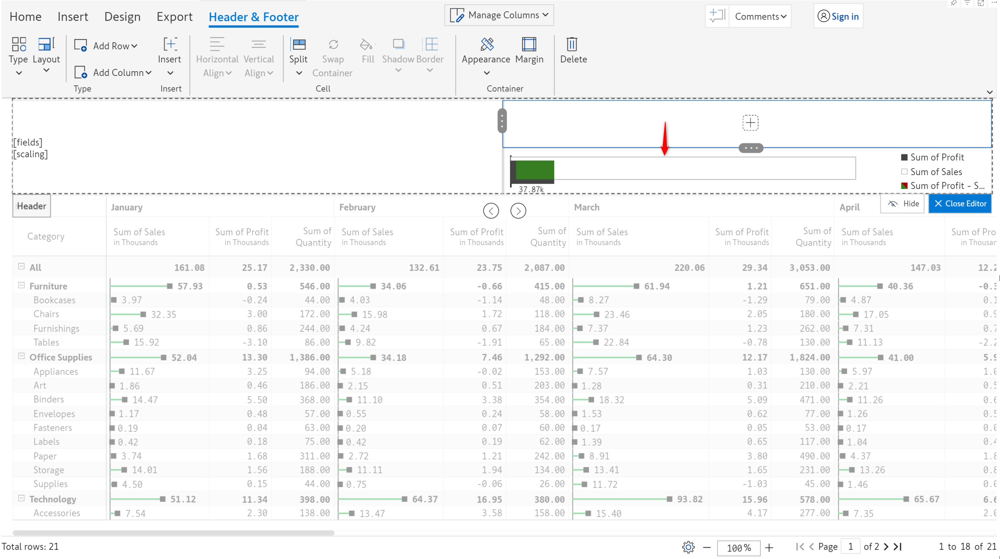
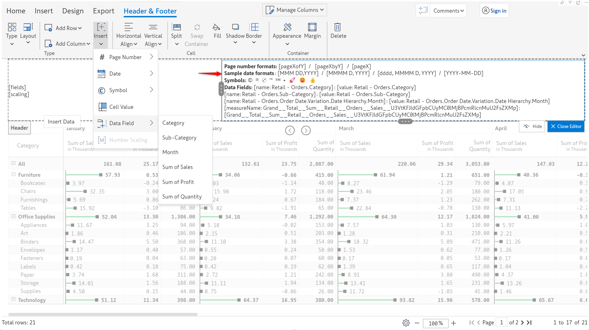
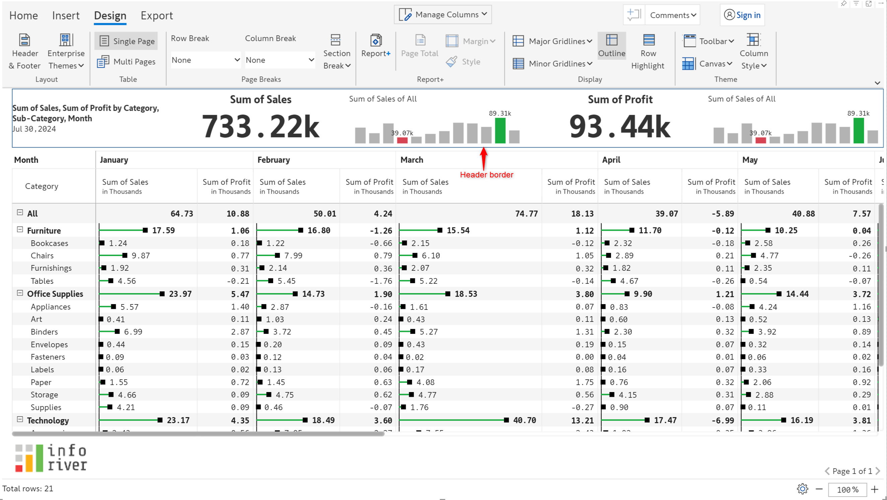

# Header & footer

The header and footer in business reports provide a consistent way to identify the content, promote the company's brand, and ensure that important information is easily accessible. Inforiver offers powerful header & footer customization capabilities and can be used to show charts, KPIs, images, and text.

Below is a sample report created using Inforiver. You can see a header with a KPI card, report title, and a donut chart. The footer contains the company logo and page number.

<figure><figcaption>
Customized header and footer
</figcaption></figure>

The header & footer module is organized as follows:

1. [Introduction](header-and-footer.md#1.-interface) - Overview of the toolbar, header & footer sections, presets, basic interactions, and basic customization options&#x20;
2. [Text](header-and-footer/text.md) - Adding formatted text and using presets like page number, data fields
3. [Images](header-and-footer/images.md) - Adding images from local files and organizational workspace
4. [Charts](header-and-footer/charts.md) - Types of charts and customization options
5. [KPI cards](header-and-footer/kpi-cards.md) - KPI presets and customization options

## 1. Interface

Let's first take a look at the header/footer interface.

**STEP 1**: Click on **Header & Footer** in the Design tab. Alternatively, hover over the header and select **Edit** from the hamburger menu.

<figure><figcaption>
Header and footer option
</figcaption></figure>

**STEP 2:** The **Header & Footer** ribbon is enabled. You can see there is a default header that shows the fields added and the scaling.

The blue box is called the _container_. Currently, there is only one cell in the container with the default fields and scaling. Containers can be split into many cells and used to create elements like [Text](header-and-footer/text.md), [Image](header-and-footer/images.md), [Chart](header-and-footer/charts.md), and [KPI](header-and-footer/kpi-cards.md). We'll be covering container customizations in later sections.

<figure><figcaption>
Header and footer ribbon
</figcaption></figure>

&#x20;**Hiding the header**

Select the Hide Header option from the context menu if you do not wish to display the header. You can display it again at any time by selecting the Show Header option from the context menu.

<figure><figcaption>
Hide header option
</figcaption></figure>

&#x20;**Resetting the header**

You can remove customizations and restore the default header by selecting the **Reset** option from the header context menu.

## 2. Creating and customizing cells

The header/footer containers can be split into cells and customized further. Let's first look at creating and managing cells.&#x20;

**STEP 1:** Go to the edit mode by clicking the **Edit** in the context menu. You can also edit the header by clicking the **Header & Footer** button in the Design ribbon.

<figure><figcaption>
Editing the header
</figcaption></figure>


In this section, we have used the example of headers but all of these properties apply to footers as well.&#x20;


**STEP 2:** Notice that there are two controls - one on the side and one at the top of the container.&#x20;

<figure><figcaption>
Controls to split the container
</figcaption></figure>

Clicking on the control on the side will give options to split the container vertically. To split the container horizontally, click on the control at the bottom.

<figure><figcaption>
Split vertically
</figcaption></figure>

 

<figure><figcaption>
Split horizontally
</figcaption></figure>

On selecting the _Split panel to the right_ option, notice that a new cell is inserted to the right of the existing content.

<figure><figcaption>
New cell inserted
</figcaption></figure>

**STEP 3:** The container height can be adjusted by hovering on the bottom border and dragging the handle. The width can be adjusted by dragging the handle that is enabled on hovering over the cell border.

<figure><figcaption>
Adjusting the container height
</figcaption></figure>

 

<figure><figcaption></figcaption></figure>

**STEP 4:** Click the plus icon to insert elements like Text, Image, Chart, and KPI which are covered in subsequent sections.

<figure><figcaption>
Insert element
</figcaption></figure>

**STEP 5:** When you click on the + icon, you will be prompted to either replace the contents of the current container or insert a new container.

If you choose the _**Replace the selected Container**_ option, the chosen element (chart, text, KPI, images) will be inserted into that container.

<figure><figcaption>
Replace selected container
</figcaption></figure>

 

<figure><figcaption>
Chart inserted into the chosen container
</figcaption></figure>

You can also choose to insert a new container to the right/left/top/bottom of the existing container. In the second image, notice how the chart is inserted in a new container below the currently selected container.

<figure><figcaption>
Insert new container option
</figcaption></figure>

 

<figure><figcaption>
New container insrted below selected container
</figcaption></figure>

**STEP 6:** After inserting an element, you can use the container controls to copy/paste the contents of a cell. You can also reset or delete a cell.

<figure><figcaption>
Additional options
</figcaption></figure>

## 3. Inserting dates/symbols/page numbers/measure values

Use the **Insert** dropdown menu to add the predefined text elements listed below:

* **Page Numbers**: Supported formats 'Page X of Y', 'Page X/Y', 'Page X'. You can use the page numbers in the header to traverse the report.
* **Date**: Select from the different supported formats
* **Symbols**: Insert symbols denoting trademark or copyright or choose an emoji.
* **Data Field:** Select any dimension or measure. The dimension values and measure totals are displayed in the header.

<figure><figcaption>
Types of elements
</figcaption></figure>

 

<figure><figcaption>
Inserting pre-defined text elements in the header
</figcaption></figure>

The image below shows various predefined text elements inserted in the header.

<figure><figcaption>
Page numbers/ dates/ symbols and data fields inserted
</figcaption></figure>

## 4. Presets

Before looking at creating header/footer elements from scratch, let's see how to leverage presets to insert header/footer in a single click.

### 4.1. Header preset

**STEP 1:** In the **Header & Foote**r tab, expand the Type dropdown menu and select **Presets > Header**. A side panel opens up as shown below.  Choose any of the presets and click 'Proceed' in the warning message.

<figure><figcaption>
Header presets
</figcaption></figure>

**STEP 2:** You can see that the header has been updated. These can be further customized but for now, let's go ahead with the preset. Click on Close editor to apply the preset.

<figure><figcaption>
Applying a header preset
</figcaption></figure>

If you choose a KPI preset, any selections made in the [KPI explorer](../3.-basic-interactions/explore-and-filter-data/explorer.md) will be reflected in the header as well.

<figure><figcaption>
KPI explorer selection reflected in presets
</figcaption></figure>

### 4.2. Footer preset

Inforiver also offers a number of footer presets with page numbers, report titles, logos, etc.&#x20;

**STEP 1:** To display the footer, select Show Footer from the header context menu. The default footer displays the current date.

<figure><figcaption>
Footer enabled
</figcaption></figure>

**STEP 2:**  You can open footer presets either from the footer context menu or navigate to the **Header & Footer** ribbon > Expand the **Type** dropdown > Select **Footer** from the Presets section. A side panel opens with a list of the available presets. Select a preset and click Proceed in the warning pop-up. Click Close Editor to apply the changes.

<figure><figcaption>
Footer presets
</figcaption></figure>

**STEP 3:** The footer displays the page number by default. You can disable the Inforiver pagination using the Pagination toggle from the context menu.

<figure><figcaption>
Inforiver pagination and footer pagination
</figcaption></figure>

**Hiding the footer**

To hide the footer, select the Hide Footer option from the context menu.

## 5. Cell and container customizations

All cells regardless of the type (Text, Image, etc.) can be formatted using the **Cell** and **Margin** sections of the Header & Footer toolbar. The header/footer containers can be formatted using the **Container** section.


Multiple cells can be selected using Ctrl + Click and formatting can be done in one shot. In the Basic customization section, we have used the example of headers but all of these properties apply to footers as well.&#x20;


### 5.1. Cell

Using the options in this section, you can align the contents, apply fill, border or shadows, and more.

<figure><figcaption>
Cell customization options
</figcaption></figure>

a) Horizontal/Vertical align - Contents in a cell can be aligned horizontally and vertically as shown below.

<figure><figcaption>
Alignment options
</figcaption></figure>

b) In addition to using the handles, you also have an option in the toolbar to split the container or cells.&#x20;

<figure><figcaption>
Split cell/container
</figcaption></figure>

c) On selecting two cells, you can swap them by using the 'Swap container' option.&#x20;

<figure><figcaption>
Swap cells
</figcaption></figure>

d) Fill - Fill color can be applied to one or more cells by using the color picker.&#x20;

<figure><figcaption>
Fill color for cells
</figcaption></figure>

e) Shadows can be applied to cells as shown below.

<figure><figcaption>
Shadow for cells
</figcaption></figure>

f) Borders - Borders can be applied for cells, you can set the weight, corner radius and choose a color.&#x20;

<figure><figcaption>
Custom borders
</figcaption></figure>

### 5.2. Container

The following options are available for the header/footer containers - Appearance and Margin.

<figure><figcaption>
Appearance and margin
</figcaption></figure>

**a) Styles**: You can apply a border to the container by selecting the Appearance>Styles option. You can specify the border color and thickness from the Header Appearance dialog box.

<figure><figcaption>
Header border
</figcaption></figure>

 

<figure><figcaption>
Border applied to header
</figcaption></figure>

**b) Container inner controls:** The container controls are removed if this option is enabled.

<figure><figcaption>
Container controls
</figcaption></figure>

**d)** **Ruler:** You can see rulers on the top and left of the container. It shows the x and y coordinates for any point within the container.

<figure><figcaption>
Ruler
</figcaption></figure>

**e) Position**: You can change the position of the header and place it on the right or left side.

<figure><figcaption></figcaption></figure>

**f) Margin:** Top, bottom, right, and left margins can be applied to cells as shown in the below image.

<figure><figcaption></figcaption></figure>

In the next section, we'll be covering adding formatted [text](header-and-footer/text.md) in the header/footer.
