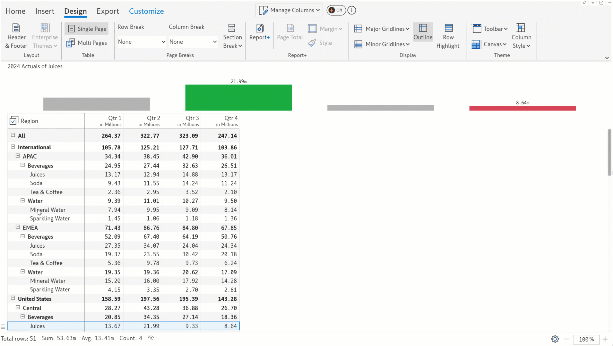
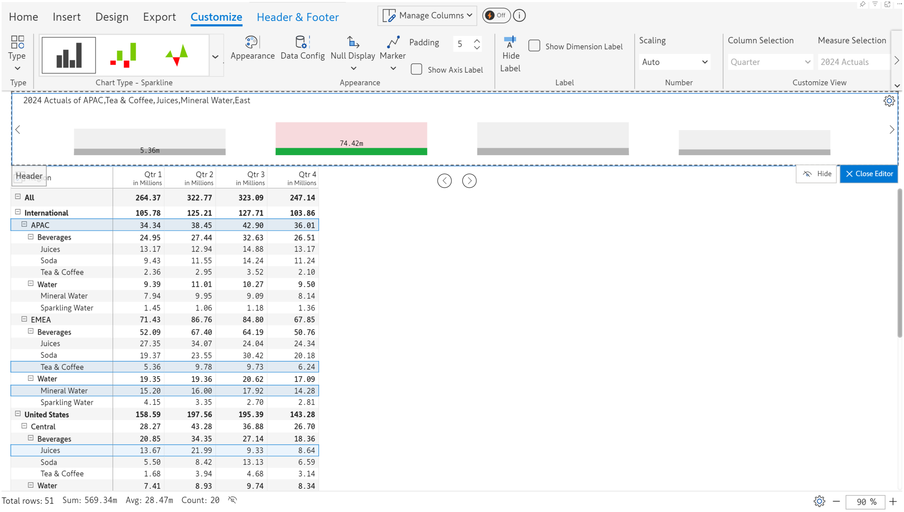
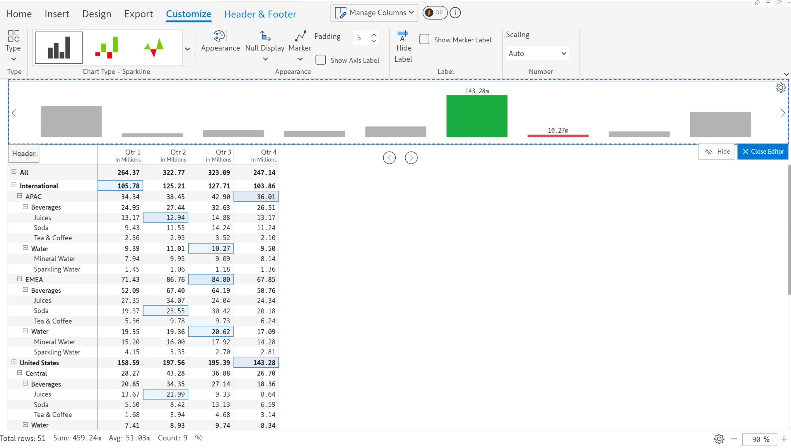

# Charts

In the header and footer, you can add all the inline charts such as sparklines, bullets, range plots, dot plots, and other unique charts such as donut charts and progress bars. Let's take a detailed look.&#x20;

## 1. Adding the chart

**STEP 1:** Click on **Header & Footer** option in the Design tab. Choose **Chart** from the Type dropdown.&#x20;

<figure><figcaption>
Inserting a chart
</figcaption></figure>

**STEP 2:** You can choose whether to replace the current container or insert the chart into a new container that is to the right/left/top/bottom of the current container. Let's insert a chart to the right of the existing cell.&#x20;

<figure><figcaption>
Inserting a new container
</figcaption></figure>

**STEP 4:** A bullet chart gets inserted by default as we have 3 measures. If you have a single measure, a bar chart is inserted.

<figure><figcaption>
Chart inserted
</figcaption></figure>

**STEP 5:** The Customize ribbon is enabled when a chart is inserted. We've changed the chart to a donut chart. [Learn more about header chart customizations](charts.md#id-4.-customization-options).

<figure><figcaption>
Customization options
</figcaption></figure>

## 2. Data selection

Note that by default, the table is greyed out as shown in the image.

<figure><figcaption>
Table is greyed out
</figcaption></figure>

On hovering over the chart, the data selection button appears.&#x20;

<figure><figcaption>
Data selection option
</figcaption></figure>

Click on the change data symbol to open the 'Data Selection' dialog box. The data source used to render the chart can be set using the methods listed below:

&#x20; \-  Using data from rows

&#x20; \- Using data from columns

&#x20; \- Manually selecting the cells required for the chart

### **2.1.  Data from rows**

**STEP 1:** To render the chart using row data, click the Row button. You can manually select the row categories that will contribute to rendering the chart.


Click on the 'Clear' link to reset and remove all the selected rows


<figure><figcaption>
Row category selection
</figcaption></figure>

**STEP 2**: After clicking OK, notice that the rows used as the data source for the chart have been highlighted.

<figure><figcaption>
Chart rendered using row selection
</figcaption></figure>

### **2.2.  Data from columns**

**STEP 1:** To render the chart using column data, click the Column button.

<figure><figcaption>
Column data selection option
</figcaption></figure>

**STEP 2:** Use the checkboxes to select the column dimensions and select measures from the dropdown. These dimensions and measures will be used to render the chart.&#x20;


Click on 'Clear' to reset and remove the columns that have been selected.


<figure><figcaption>
Selecting column dimensions and measures
</figcaption></figure>

We've also opted to change the chart type to a bullet. Notice that the columns used as data source for the chart have been highlighted.

<figure><figcaption></figcaption></figure>

### 2.3. **Manual data selection**


You can refer to visual measures, formulae, forecasts, simulations, and data inputs in header charts and KPIs.


**STEP 1:** To render the chart using manual data selection, click the Manual button.

You have 3 options for manually selecting the data for header charts:&#x20;

* **Dynamic**: You can select rows from the table to populate the chart on the fly. The chart is rendered dynamically as the selection changes.&#x20;

<figure><figcaption>
Dynamic data selection option
</figcaption></figure> <figure><figcaption></figcaption></figure>

* **Partial select:** The selected rows are shown as a portion of the grand total row in the chart, essentially the grand total and the contribution of the selected rows.&#x20;

<figure><figcaption>
Partial select option
</figcaption></figure> <figure><figcaption>
Chart rendered based on partial selection
</figcaption></figure>

* **Random selection:** You can manually select individual cells that will be used to drive the chart. Each selection will be rendered as a separate bar.

<figure><figcaption>
Random selection
</figcaption></figure> <figure><figcaption>
Random cell selection
</figcaption></figure>

## 3. Chart types

There are a number of chart types like Donut, Sparkline, Bullet, etc. that can be inserted in the header. Let's see how to add or change them.&#x20;

* **Changing the chart type**&#x20;

&#x20;If your report has a single measure, a bar chart is inserted in the header by default. For two measures or more, a bullet chart is the default chart. This can be changed from the Data Selection dialog box.


Some chart variants are not shown here but can be accessed from the toolbar.


<figure><figcaption>
Chart type options
</figcaption></figure>

We've changed the bullet chart to a donut.

<figure><figcaption>
Chart type changed to donut
</figcaption></figure>

* **Browsing chart types**

Use the arrow buttons on either end of the header to browse the supported chart types and select the one best suited to visualize your data.

<figure><figcaption>
Browsing chart types
</figcaption></figure>

* **View and select charts from the toolbar**

You can also view and select all the supported chart types and their variants from the toolbar as shown in the image below.

<figure><figcaption>
Selecting the chart from the toolbar
</figcaption></figure>

* **Progress bar charts**

If two data points are selected, you can also use variants of the progress bar such as conditional bar, angular bar, and donut bar.

<figure><figcaption>
Progress bar 
</figcaption></figure>

## 4. Customization options

Most customization options are already covered in the [working with charts](../../6.-working-with-charts.md) section. The customization options unique to header charts are covered here.&#x20;

### 4.1. All chart types

#### Legend config

By default, the legend is shown on the right of the chart, you can change the position to the left or turn it off. Click the Legend config button in the Customize ribbon to change the legend.&#x20;

<figure><figcaption>
Legend config for header charts
</figcaption></figure>

When the legend is turned off, the chart will be rendered as shown in the image below.

<figure><figcaption>
Legend disabled
</figcaption></figure>

### 4.2. Styling donut chart

The appearance of the donut chart can be customized by clicking on the **Appearance** option. You can select the color for each arc, set the arc size, and apply a gradient.

<figure><figcaption>
Appearance customizations
</figcaption></figure>

* When a **gradient** is applied, you can select the gradient color, and the chart gets updated as shown.

<figure><figcaption>
Gradient applied
</figcaption></figure>

* When more than 5 categories are selected, the '**Enable others**' option is activated. Even though six regions were selected, only five are displayed in the chart. When the 'Enable others' property is set, you can see a segment in the donut called 'Others' which visualizes the sum of the values apart from the top 5 categories. That is, if there are 10 categories added, the last 5 categories will be consolidated and shown as 'Others'.

<figure><figcaption>
Enable others
</figcaption></figure>

* The name 'Others' can be modified by clicking the 'Pencil' icon and entering a relevant name in the text field.

<figure><figcaption>
Customizing the 'Others' category
</figcaption></figure>

* &#x20;The **arc size** can be customized using the 'Arc size' dropdown. The available options are Small, Medium, Large, and Extra large.

<figure><figcaption>
Changing the arc size
</figcaption></figure>

### 4.3. Styling progress bars

Progress bar appearance can be customized as shown below. You can define positive and negative colors using a color picker.

<figure><figcaption>
Setting the color scheme for progress bars
</figcaption></figure>

### 4.4. Styling sparklines

In the sparkline customization toolbar, explanations for [Appearance](../../6.-working-with-charts/sparkline-charts.md#viii-appearance), [Null display](../../6.-working-with-charts/sparkline-charts.md#vi-null-display), [Marker](../../6.-working-with-charts/sparkline-charts.md#ii-marker), and [Show label](../../6.-working-with-charts/sparkline-charts.md#viii-show-label) are covered in the [Working with charts](../../6.-working-with-charts.md) section.

Let's look at the **Data config** option.

i) Select the row grand total and choose the sparkline chart type with the area spline variant. You can see the sparkline chart in the header as shown below.&#x20;

<figure><figcaption>
Sparkline on selecting a row
</figcaption></figure>

ii) Click **Data config**. In the dialog box, you can see that all the measures are selected. Let's display only the Unit Price measure in the header. Uncheck the other checkboxes. Select a different color using the color picker if needed. Notice how the chart gets updated.&#x20;

<figure><figcaption>
Selecting measures and setting the chart color
</figcaption></figure>

In the next section, we'll be covering adding [KPI cards](kpi-cards.md).
