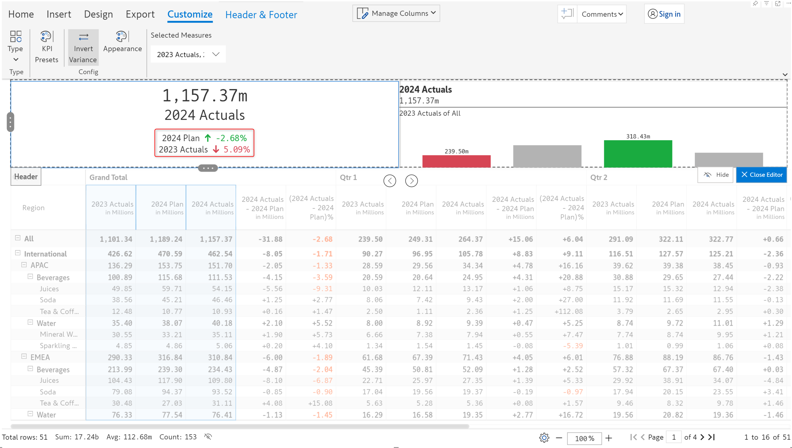

# KPI cards

In an earlier section, we covered steps to insert a [KPI card](../../2.-displaying-information/add-basic-inline-charts.md#7.-kpi-cards) using the KPI presets.&#x20;

## 1. Adding a KPI card

The following KPI card was created earlier. Let's now create another KPI card from scratch.&#x20;

<figure><figcaption>
KPI card inserted using preset
</figcaption></figure>

**STEP 1:** Hover over the header and go to edit mode by clicking the **Edit** option in the context menu.

<figure><figcaption>
Editing the header
</figcaption></figure>

**STEP 2:** The **Header & Footer** tab is enabled. Let's remove the default header and choose KPI from the **Type** dropdown.

<figure><figcaption>
KPI header
</figcaption></figure>

**STEP 3:** You will be prompted on whether to replace the container or insert another container. For now, let's replace the container.

<figure><figcaption>
Inserting a KPI container
</figcaption></figure>

**STEP 4**: A simple KPI card gets inserted as shown below. You can also choose from a range of built-in KPI presets. Inforiver provides simple, variance, and combo KPI presets.

<figure><figcaption>
Inserting a KPI card and using presets
</figcaption></figure>

## 2. Customization options

There are a number of customization options available in the toolbar once a KPI card is inserted.

### 2.1. KPI presets

As discussed [earlier](../../2.-displaying-information/add-basic-inline-charts.md#7.-kpi-cards), there are a number of KPI presets - Simple, Variance, and Combo that can be used to quickly create KPI cards. These KPI cards can be further customized using the below options.

<figure><figcaption>
Variance presets
</figcaption></figure>

### 2.2. Invert variance

In cases where positive variance has a negative impact, you can invert the sign using the **Invert variance** option. In the below image, 2023 Actuals has a variance of 5.09% which is indicated by a green arrow. On clicking Invert variance, you can see that the arrow changes to red and the 2024 Plan variance turns green.

<figure><figcaption>
Invert variance option
</figcaption></figure> <figure><figcaption>
Variance inverted
</figcaption></figure>

### 2.3. Appearance

The appearance and styling of KPI cards can be customized by clicking on the Appearance button in the Customize ribbon.

a) Color - The colors for positive and negative values can be chosen using a color picker.

<figure><figcaption>
Setting the color
</figcaption></figure>

b) By default, the up/down arrows are used as variance icons . These can be customized as shown below. You can also upload custom icons if required.

<figure><figcaption>
Variance icons
</figcaption></figure>

### 2.4. Data selection

By default, the grand total value of the first measure is shown in the KPI card, this can be easily customized. Refer to the [data selection section](charts.md#2.-data-selection) for more options.&#x20;

<figure><figcaption></figcaption></figure>

### 2.5. Ungroup KPI

KPI presets can be further customized using this feature. From the header cell settings, select the ungroup KPI option.


Ungrouping cannot be undone, the KPI preset elements will remain separate once ungrouping is applied


<figure><figcaption>
Ungroup KPI option
</figcaption></figure>

We can now select each element in the KPI preset and apply a custom style from the floating toolbar. Note that the floating toolbar will appear only when selecting the element.

<figure><figcaption>
Styling KPI card elements
</figcaption></figure>

Notice how the font and color have been updated for each element in the KPI card.

<figure><figcaption>
Ungrouping KPI presets
</figcaption></figure>

The toolbar for customizing charts is loaded when the chart element is selected.

<figure><figcaption>
Chart styling
</figcaption></figure>

Styling has been applied to each element.

<figure><figcaption></figcaption></figure>

You have successfully learned to add KPI cards using presets as well as from scratch.&#x20;

In the next section, we'll be covering advanced report layouts using the [Report+](../report-layouts-report+.md) feature.
