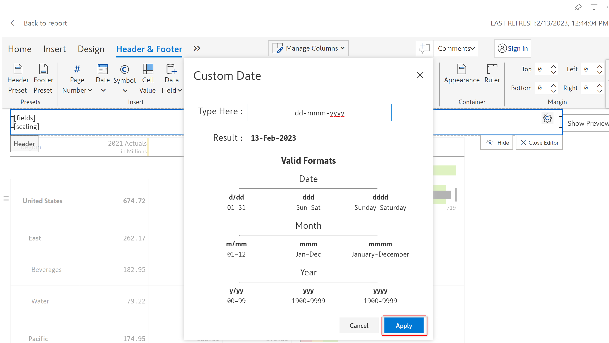

# Text

In this section, we'll look at adding text to the header and footer. You can insert page numbers, dates, symbols, cell values and data fields in addition to formatted text.&#x20;

## 1. Add & format text

a) Let's start with the default header. Click on 'Header & footer'.

<figure><figcaption>
Default header
</figcaption></figure>

b) The default header is of type 'Text' as can be seen by clicking on the 'Settings' icon and 'Type'.&#x20;

<figure><figcaption>
Text element
</figcaption></figure>

c) Let's delete the existing content and type a title for the report as shown.

<figure><figcaption>
Entering the report title
</figcaption></figure>

d) As you select the text, you can see a floating toolbar with formatting options.&#x20;

<figure><figcaption>
Formatting options
</figcaption></figure>

e) Let's apply some formatting.

<figure><figcaption>
Text formatting
</figcaption></figure>

f) Let's now split the container and add a date on the left.

<figure><figcaption>
Splitting the container
</figcaption></figure>

g) Click on the 'Date' option and choose a format.

<figure><figcaption>
Inserting a date
</figcaption></figure>

h) The date format gets inserted as shown. Let's see how the header looks in the reading mode. Click on 'Close editor'.

<figure><figcaption>
Date format applied
</figcaption></figure>

i) The header as seen in the reading view is shown below. Let's look at the other text customization options.

<figure><figcaption>
Updated header
</figcaption></figure>

## 2. Customization options

The 'Insert' and 'Format' sections of the 'Header & footer' toolbar are applicable only for the text elements. Let's look at them one by one.

<figure><figcaption>
Insert &#x26; Format options
</figcaption></figure>

You can insert the following elements in a text cell.

### i) Page number&#x20;

There are three formats for page numbers as shown in the image.

<figure><figcaption>
Page number
</figcaption></figure>

### ii) Date&#x20;

The available date formats are shown in the below image. The date in the header will get displayed in the selected format.

<figure><figcaption>
Date formats
</figcaption></figure>

You can either choose from the pre-defined date formats or you can also create your custom date form. To create a custom date format, click on the 'Custom' option from the drop-down. This will open up the 'Custom date' modal.

<figure><figcaption>
Custom date type formats
</figcaption></figure>

You can enter your date format in the 'Type here' input field. The 'Valid format' displays the list of all the valid date formats you can enter.&#x20;

Click 'Apply' to apply the entered format.

<figure><figcaption>
Apply custom date
</figcaption></figure>

### iii) Symbol&#x20;

Symbols such as copyright, trademark, phone etc. can be included as shown.

<figure><figcaption>
Symbols
</figcaption></figure>

### iv) Cell value&#x20;

You can insert cell values in the header/footer. You can notice that generally, the report is greyed out. Click on 'Cell value'.

<figure><figcaption>
Cell value
</figcaption></figure>

The report is no longer greyed out. You can see the 'Select dataset' option and a checkmark as highlighted in the cell that you are trying to insert the value. Select a cell from the report.

<figure><figcaption>
Selecting a value
</figcaption></figure>

The cell placeholder gets displayed as shown and the report is again greyed out. Click on 'Close editor'.

<figure><figcaption>
Cell value
</figcaption></figure>

In the read mode, you can see the value selected in the report.

<figure><figcaption>
Cell value in read mode
</figcaption></figure>

### v) Data field

You can insert the row & category members and measures in the header/footer. On clicking the 'Data field' option, you can see a list of all the categories, data source measures and calculations made in Inforiver.&#x20;

<figure><figcaption>
Data field
</figcaption></figure>

Let's select 'Region'. You can see that the name and the value placeholders are added as shown in the below image.

<figure><figcaption>
Row members
</figcaption></figure>

Let's add the 2021 Actuals. You can see the placeholder as shown.

<figure><figcaption>
Measure
</figcaption></figure>

Let's go to the read mode. You can see the row that we selected - Region and the two region values. The 2021 Actuals grand total value is displayed along with the measure name.&#x20;

<figure><figcaption>
Data fields in read mode
</figcaption></figure>

### vi) Number scaling

In case 'Uniform' number scaling is applied in the report, the scaling can be inserted in the header/footer.&#x20;

<figure><figcaption>
Number scaling
</figcaption></figure>

To apply 'Uniform' format, in the 'Home' tab, select 'Uniform' from the 'Quick format' dropdown.

<figure><figcaption>
Uniform number format
</figcaption></figure>

The 'Number scaling' option gets enabled. Clicking on that inserts a '\[scaling]' placeholder as shown.

<figure><figcaption>
Placeholder inserted
</figcaption></figure>

In the read mode, you can see the scaling as shown below.

<figure><figcaption>
Number scaling in read mode
</figcaption></figure>

### vii) Superscript/subscript

Text can be formatted as superscript/subscript using the options in the 'Format' section.

<figure><figcaption>
Superscript
</figcaption></figure>

Note that the other formatting options such as Bold, Italic, Font color, and Font size are available in the floating toolbar upon selecting the text.

<figure><figcaption>
Formatting options
</figcaption></figure>

In the next section, we'll be covering [adding images](images.md) in the header/footer.
