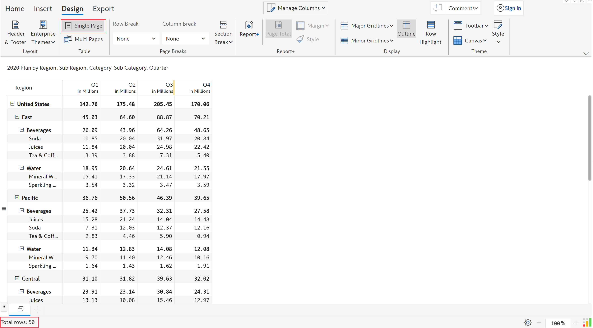
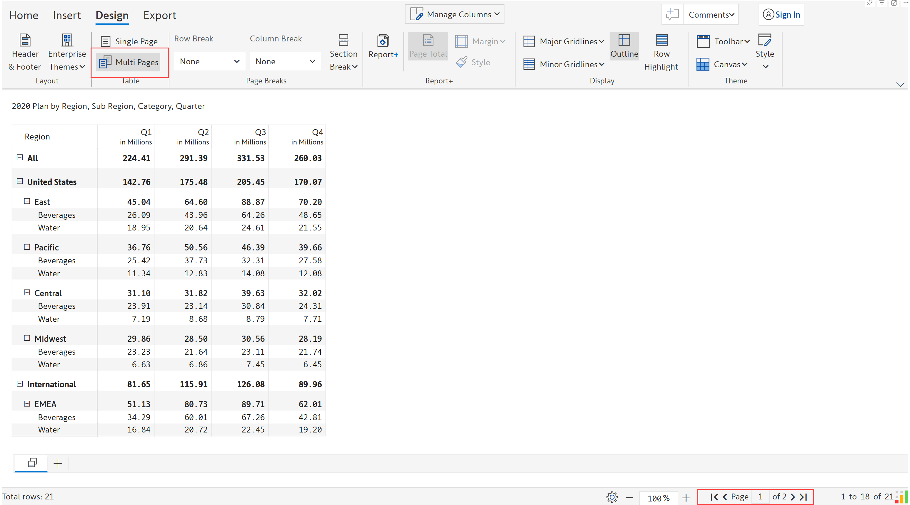
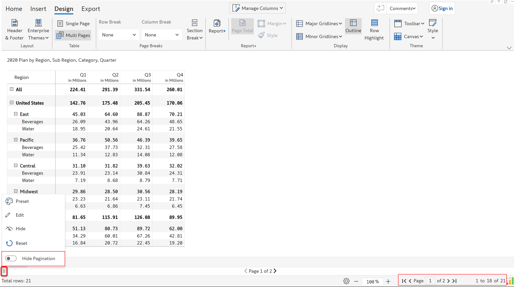
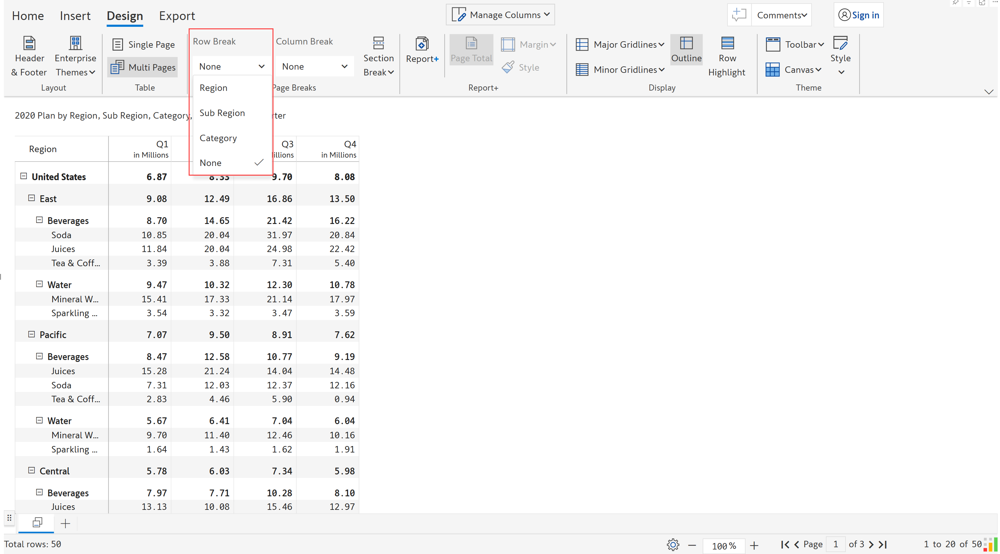
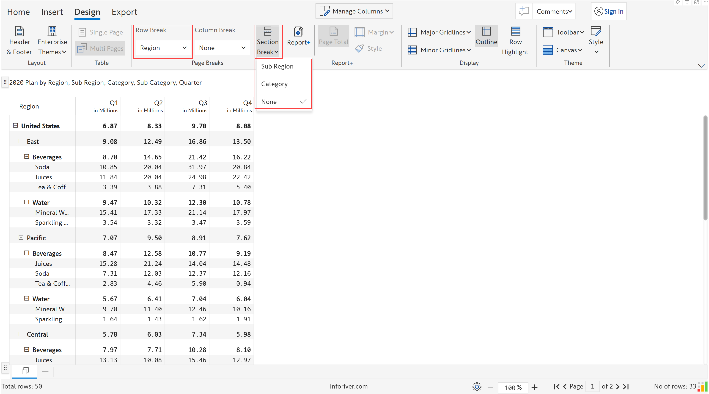
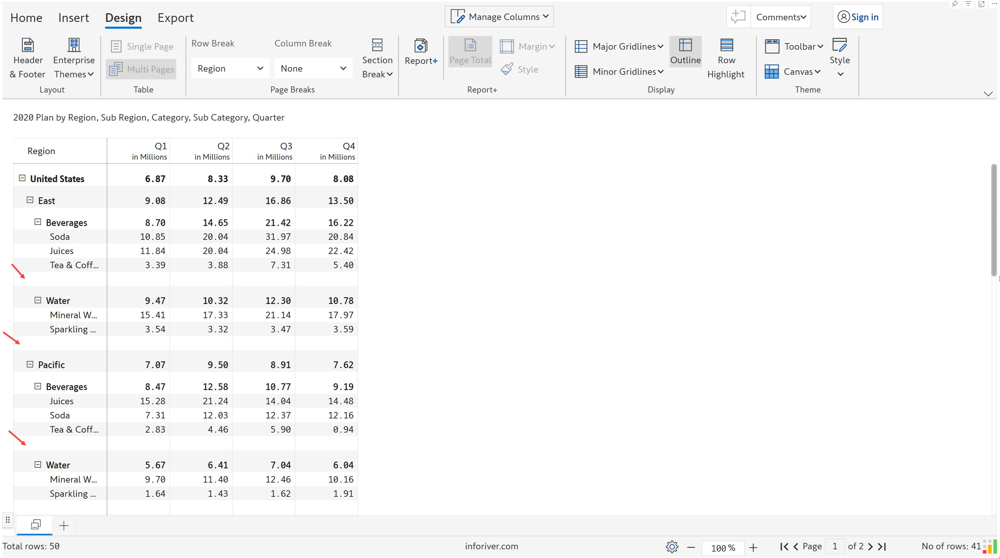

# Pagination

Pagination refers to the organization of content into pages, usually with page numbers, in order to make it easier to read and navigate through the document. This also allows for easy printing and distribution of the report.

In this section, let's discuss the single & multi-page options, pagination controls and page breaks.

### 1. Number of pages

a) In the 'Design' tab of the toolbar, you can find two options - ‘Single page’ and ‘Multi pages’.

<figure><figcaption>
Single and multiple pages
</figcaption></figure>

### i) Single page

'Single page' displays all the rows on a single page with a scroll, if needed. In the below image, you can see '50' rows are displayed on a single page.

<figure><figcaption>
Single page
</figcaption></figure>

### ii) Multiple pages

By using the 'Multi pages' option, you can automatically display the rows that fit on a single page and split the report into multiple pages. In the below example, you can see that the table gets split into two pages.

<figure><figcaption>
Multi pages
</figcaption></figure>

### **iii) Pagination controls**

When using the 'Multi pages' option, the following details are displayed in the status bar - Total rows, scrolling options to the first, last, previous and next page and count of rows displayed on the page.&#x20;

<figure><figcaption>
Pagination controls
</figcaption></figure>

You can also turn off pagination from the footer. Click on the six-dots icon as highlighted in the image. In the footer context menu, you can see the 'Hide pagination' option. You can see that the option is turned off and the report has two pages.&#x20;

<figure><figcaption>
Pagination option in footer
</figcaption></figure>

If you turn on the 'Hide pagination' toggle, pagination is removed and you can see all the rows displayed in the same page along with a scroll.

<figure><figcaption>
Hide pagination
</figcaption></figure>

### 2. Page breaks

Instead of the default option of splitting a report by the number of rows that fit on a single page, you can split based on the row/column hierarchies. To achieve this, you can use row, column and section breaks.

They are useful when you want to control the layout of the report, especially when there are multiple row and column hierarchies. They are available under the 'Design' tab of the toolbar in the 'Page breaks' section.&#x20;

Let's look at the three options one by one.

<figure><figcaption>
Page breaks
</figcaption></figure>

### (i) Row break

The 'Row break' option allows you to add a break based on a row hierarchy. To enable the ‘Row break’ option, you need to have at least 2 levels of row hierarchy. All the row hierarchies are listed in the dropdown.&#x20;

<figure><figcaption>
Row break
</figcaption></figure>

Let's insert a row break for ‘Category’. Select 'Category' from the drop-down.

<figure><figcaption>
Category row break 
</figcaption></figure>

You can now see each category for a region and sub-region on a separate page.

<figure><figcaption>
Pagination based on row break
</figcaption></figure>

### (ii) Column break

The 'Column break' option allows you to add a break based on column hierarchy. To enable the ‘Column break’ option, you need to add at least one field in 'Columns'.&#x20;

Let's insert a column break for ‘Quarter’. Select 'Quarter' from the drop-down.

<figure><figcaption>
Column break
</figcaption></figure>

Each quarter is shown on a different page. Since there is no row break applied, the rows are split such that they fit on a page.

<figure><figcaption>
Result
</figcaption></figure>

### (iii) Section break

The 'Section break' option allows you to split the table into different portions on the same page. The section break is enabled only if&#x20;

* there are more than two row hierarchies and&#x20;
* row break is not applied based on the lowest row hierarchy

<figure><figcaption>
Section break
</figcaption></figure>

Let's insert a section break for ‘Category’. Select 'Category' from the drop-down.

<figure><figcaption>
Category section break
</figcaption></figure>

A blank row is inserted above each category as shown.

<figure><figcaption>
Result
</figcaption></figure>


To remove the row/column/section breaks, you can select the ‘None’ option from the respective drop-down.


In the next section, we'll look at adding a [header and footer](header-and-footer.md) to the report.
